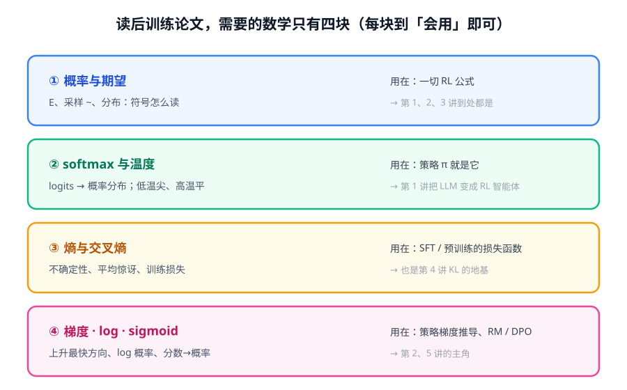
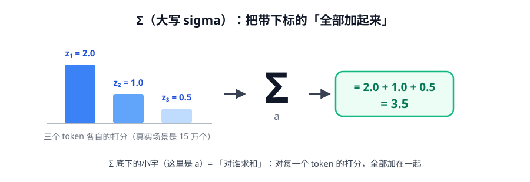
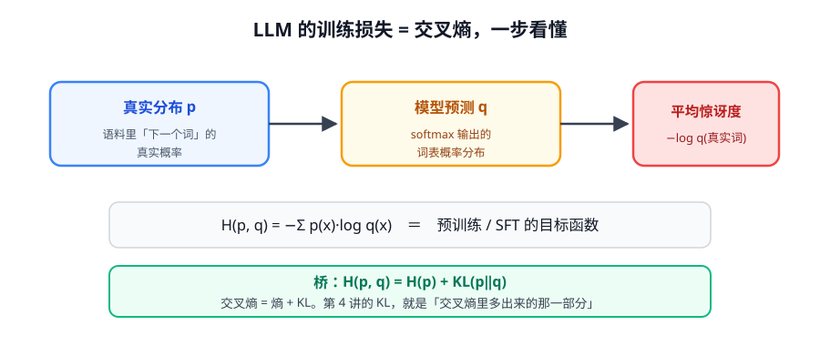
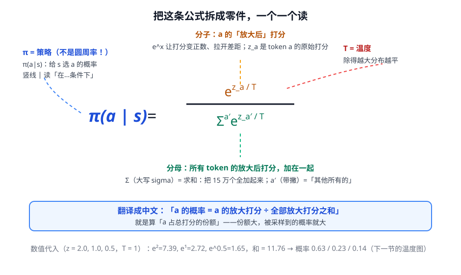
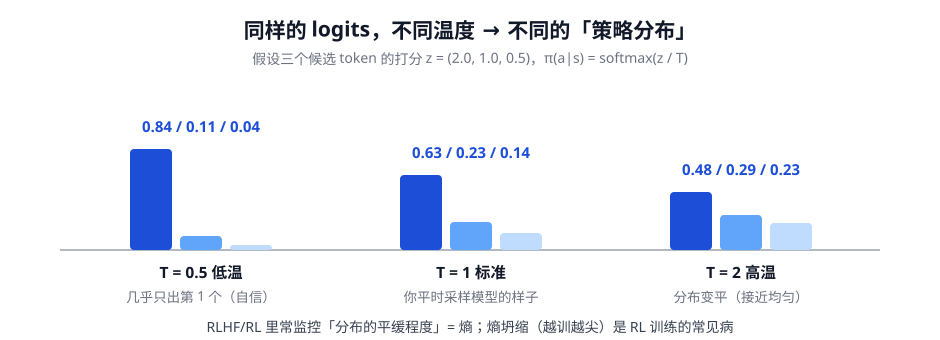

# 第 0 讲 · 数学基础：常见符号 + 四个核心概念

> [!NOTE]
> ⏱ 60 分钟 ｜ 前置：高中数学 ｜ 下一讲：[01 · MDP](../01-mdp/index.md)
> 🔤 之后任何一讲卡在符号 → [符号速查表](../symbol-reference.md)（本讲学完当字典用）
>
> 学完你能回答：**Σ、下标、π、θ 这些符号是什么？E、softmax、交叉熵怎么理解？一条公式怎么「读」？**

---

## 0. 这讲怎么学：先认字母表，再拼单词

后训练论文的公式，翻来覆去就是十几个符号的排列组合。本讲顺序：**先认识符号**（第 1-4 节）→ 再学核心概念（第 5-6、8 节）→ 最后拿一条真实公式**实战拼装**（第 7 节）。

## 1. 变量、下标、上标：数学的「拼音」

| 长相 | 名字 | 怎么读 | 意思 |
|---|---|---|---|
| $x$ | 变量 | 「某个量」 | 占位符，类似代码里的变量名 |
| $x_t$ | 下标 | 「第 t 个 x」 | 编号：$a_1, a_2, \dots$ = 第 1、2 步的动作 |
| $a'$ | 带撇（prime） | 「a prime」 | **另一个/其他的** a；$\sum_{a'}$ = 对「其他所有选择」求和 |
| $x^2$ | 上标 | 乘方 | $x^2 = x \cdot x$ |
| $e^x$ | 指数 | e 的 x 次方 | 见第 4 节 |

> [!TIP]
> 一句话记住：**下标是编号，上标是乘方**。分清这个，$z_a$（token a 的打分）和 $e^{z_a}$（e 的 $z_a$ 次方）就不会看混。

## 2. 希腊字母：本课程的「固定演员表」

论文用希腊字母当代号，**每个字母在本课程里有固定身份**——认脸即可，不用会念：

| 符号 | 惯用名 | 固定角色 | 出场 |
|---|---|---|---|
| $\pi$ | pi | **策略 policy**（你的 LLM）⚠️ 不是圆周率 3.14 | $\pi(a\mid s)$ |
| $\theta$ | theta | **模型参数**（被训练的东西）| $\pi_\theta$ = 参数为 θ 的策略 |
| $\Sigma$ | sigma 大写 | **求和**：全部加起来 | 第 3 节 |
| $\sigma$ | sigma 小写 | **sigmoid**：分数 → 概率 ⚠️ 和 Σ 是两个东西 | 第 4 节、第 5 讲 |
| $\gamma$ | gamma | 折扣因子（未来的奖励打几折，0.99~1）| 第 1 讲 |
| $\lambda$ | lambda | GAE 信任旋钮（0~1）| 第 2 讲 |
| $\beta$ | beta | **KL 罚的税率** | 第 3、4 讲 |
| $\epsilon$ | epsilon | clip 容差（常 0.2）| 第 3 讲 |
| $\nabla$ | nabla | **梯度**：上升最快的方向 | 第 8 节、第 2 讲 |

## 3. Σ 求和：最重要的一个操作

$$\sum_{a} z_a \;=\; z_{a_1} + z_{a_2} + \cdots + z_{a_{150000}}$$

- 读法：「把每个 token 的打分**全部加起来**」
- Σ 底下的小字（这里是 $a$）=「对谁求和」；上面有时带上限，意思不变
- 代入数字练一次：z = (2.0, 1.0, 0.5) → $\sum_a z_a = 2.0 + 1.0 + 0.5 = 3.5$

## 4. 三个「变形器」：e^x、log、σ

| 工具 | 长相 | 作用 | 一句话 |
|---|---|---|---|
| 指数 | $e^x$（e ≈ 2.718）| 负数/正数 → 全变正数，且拉开差距 | **放大器**：2 和 5 → 7.4 和 148 |
| 对数 | $\log x$ | 指数的逆操作；乘法变加法 | **压缩器**：概率要取 log 才好算 |
| sigmoid | $\sigma(x) = \dfrac{1}{1+e^{-x}}$ | 任意分数 → (0,1) 的概率 | **概率化**：σ(0)=0.5，σ(2)≈0.88 |

## 5. 期望与采样：读懂 E[·]

| 符号 | 读作 | 意思 |
|---|---|---|
| $x \sim p$ | x 采自分布 p | 从 p 里抽一个样本 |
| $\mathbb{E}_{x\sim p}[f(x)]$ | f 在 p 下的期望 | 按概率加权的平均：$\sum_x p(x) f(x)$ |
| $\tau \sim \pi_\theta$ | 轨迹采自策略 | 跑一局游戏 |

> [!TIP]
> 工程上，期望 = **采样近似**：抽 N 条求平均。「rollout 一批回复」的数学身份就是蒙特卡洛估计这个期望——这也是 LLM RL 贵的原因：期望的精度靠算力买。

## 6. 熵与交叉熵：训练损失的本体

| 量 | 公式 | 直觉 |
|---|---|---|
| 熵 $H(p)$ | $-\sum_x p(x)\log p(x)$ | 分布固有的不确定性 |
| 交叉熵 $H(p,q)$ | $-\sum_x p(x)\log q(x)$ | 用 q 编码 p 的平均惊讶 → **训练损失** |
| KL 散度 | $D_{KL}(p\,\|\,q) = H(p,q) - H(p)$ | 交叉熵里多出来的部分 → 第 4 讲主角 |

预训练和 SFT 的损失都是交叉熵：p = 语料里真实的下一个词，q = 模型预测。

## 7. 实战拼装：读懂 softmax 公式

零件全部认识了，把这条公式拼起来（你的 LLM 由此变成「策略」）：

| 零件 | 读法 | 意思 |
|---|---|---|
| $\pi(a\mid s)$ | 「在状态 s 下，动作 a 的概率」 | 竖线 $\mid$ =「在…条件下」 |
| $z_a$ | 「z 下标 a」 | token a 的原始打分（logit） |
| $e^{z_a/T}$ | 「e 的 ($z_a$ ÷ T) 次方」 | 放大后的打分；T = 温度，越大越平 |
| $\sum_{a'}$ | 「对其他所有 token 求和」 | $a'$ = 其他的 a |

**中文翻译**：a 的概率 = a 的放大打分 ÷ 全部放大打分之和 = **算 a 占的份额**。

数值代入（z = 2.0, 1.0, 0.5，T = 1）：$e^2{=}7.39$，$e^1{=}2.72$，$e^{0.5}{=}1.65$，和 = 11.76 → 概率 0.63 / 0.23 / 0.14：

> [!IMPORTANT]
> **公式阅读三步法**：① 先看结构——等号左边是目标，右边最外层是「加 / 乘 / 除 / 平均」哪一种；② 把每个符号换成中文；③ 代一个具体数字算一遍。90% 的后训练公式都是这几个零件的组合。

## 8. 梯度：最后一个零件（第 2 讲的主角）

$\nabla_\theta J$：函数 J 对参数 θ 的梯度 =「θ 往哪边微调一点，J 上升最快」。
**训练 = 沿梯度走**：优化损失是往下走（梯度下降），最大化回报是往上走（梯度上升）。

策略梯度里到处是 $\log \pi$，因为它有个好性质（log-derivative trick，第 2 讲展开）：

$$\nabla_\theta \log \pi_\theta(a) = \frac{\nabla_\theta \pi_\theta(a)}{\pi_\theta(a)}$$

## 9. 自测（点开前先自己答）

① 下标和上标各是什么意思？$z_a$ 和 $e^{z_a}$ 差在哪？

下标是编号（a 那一个），上标是乘方。$z_a$ 是 token a 的打分本身；$e^{z_a}$ 是以它为指数的放大值（≈54.6 当 z_a=4 时）。

② Σ 和 σ 是同一个东西吗？各自干什么？

不是。Σ 大写 = 求和（全部加起来）；σ 小写 = sigmoid 函数（分数压成 0~1 的概率）。

③ $\mathbb{E}_{\tau\sim\pi_\theta}[G(\tau)]$ 翻译成人话？代码怎么估？

按当前策略玩很多局、回报的平均值。代码：采样 N 条轨迹，奖励求平均。

④ 为什么训练用交叉熵而不是最小化 KL(p‖q)？差在哪？

差一个常数 H(p)（与模型无关）。最小化交叉熵 ≡ 最小化 KL，但交叉熵不用算数据自身的熵。

⑤ 把 σ(r(x,y_w) − r(x,y_l)) 翻译成中文。

「y_w 比 y_l 好的概率 = sigmoid(两者奖励的差)」。分数差过 sigmoid 变成概率——第 5 讲 BT 模型的核心。

## 10. 原始资料

见 [raw/RESOURCES.md](raw/RESOURCES.md)。符号速查：[symbol-reference.md](../symbol-reference.md)。
