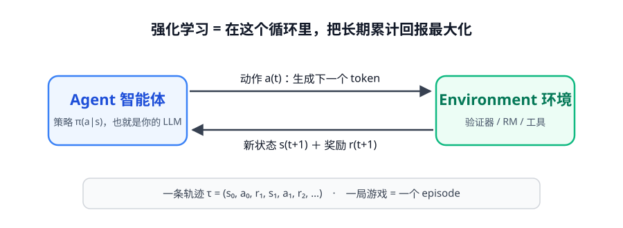
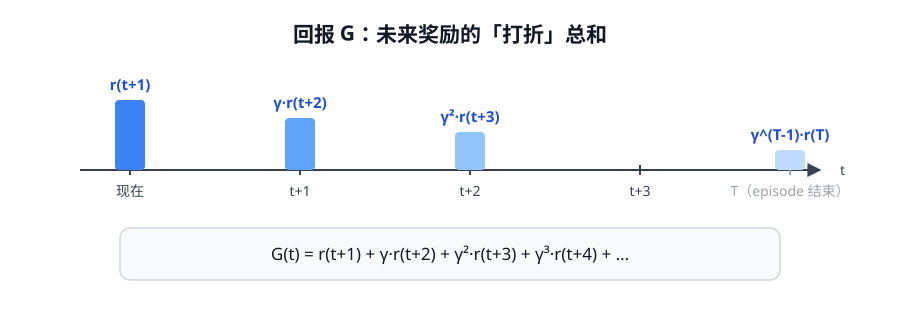
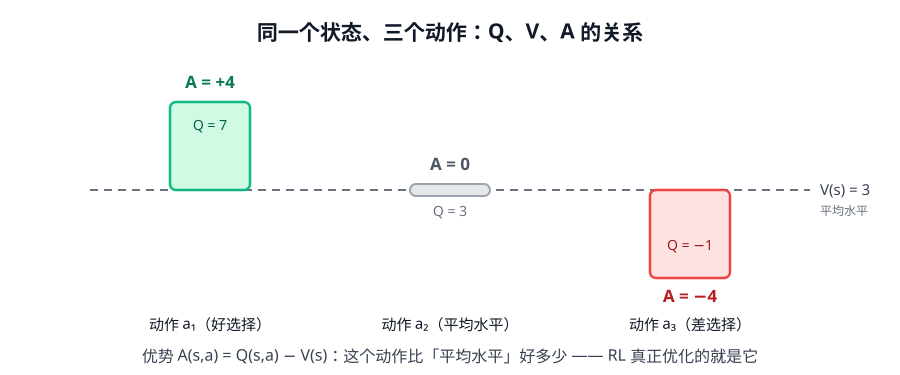
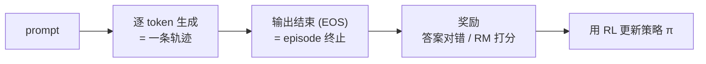

# 第 1 讲 · MDP：给「交互」建一个数学模型

> [!NOTE]
> ⏱ 30 分钟 ｜ 前置：无 ｜ 下一讲：[02 · 策略梯度](../02-policy-gradient/index.md)
> 🔤 卡在符号？→ [符号速查表](../symbol-reference.md)
>
> 学完你能回答：**强化学习到底在优化什么？V、Q、A 三个符号分别是什么？**

---

## 1. 一张图看懂

**一句话**：强化学习 = 让 Agent 在「行动 → 得反馈」的循环里，学会让**长期累计回报**最大。

## 2. MDP 的五个组件

| 组件 | 符号 | LLM 场景里是什么 |
|---|---|---|
| 状态 State | $s$ | prompt + 已经生成的全部 token |
| 动作 Action | $a$ | 下一个 token |
| 转移 Transition | $P(s'\mid s,a)$ | 把新 token 拼进上下文（**确定性的**） |
| 奖励 Reward | $r$ | RLVR：答案对了 +1；或 RM 打分 |
| 折扣因子 | $\gamma$ | 一般 0.99~1（生成不长时 ≈1） |

> [!TIP]
> **LLM 做 RL 的先天特点**：转移是确定的（就是字符串拼接），但动作空间有十几万个 token。
> 所以「学环境模型」没意义，**直接优化策略的「策略梯度」方法成为主流**——这正是下一讲。

## 3. 回报：为什么要打折

$$G_t \;=\; r_{t+1} + \gamma\, r_{t+2} + \gamma^2\, r_{t+3} + \cdots$$

$\gamma$ 的两个作用：**数学上**让无穷级数收敛；**语义上**「近期的奖励更值钱」。

## 4. 三把尺子：V / Q / A

| 符号 | 名字 | 一句话 |
|---|---|---|
| $V^\pi(s)$ | 状态价值 | 从 s 出发按 π 走到底，期望回报多少 |
| $Q^\pi(s,a)$ | 动作价值 | 在 s 先做 a 再按 π 走，期望回报多少 |
| $A^\pi(s,a)$ | **优势** | 这个动作比平均水平好多少：$A = Q - V$ |

> [!IMPORTANT]
> **A 是整个后训练 RL 的主角。** PPO、GRPO 优化的都是它：
> 「这个 token 比期望好 → 推高它的概率」。记住这张图，后面全是它的变体。

## 5. Bellman 方程：价值的递推定义

$$V^\pi(s) \;=\; \mathbb{E}_{a\sim\pi}\Big[\, r + \gamma\, V^\pi(s') \,\Big]$$

「现在的价值 = 一步奖励 + 打折的未来价值」。
所有 value-based 方法（Q-learning / DQN / RLHF 里的 critic）都从这个式子长出来。

## 6. 映射回 LLM

- **SFT** = 模仿人类给定的动作序列（behavior cloning）
- **RL** = 用自己的经验 + 奖励信号改进策略
- 这就是后训练两条路线的分叉点，也是第 6 讲全景图的伏笔

## 7. 自测（点开前先自己答）

① 为什么 LLM 的 RL 里，转移函数没什么好学的？

动作是「拼接 token」，转移就是确定性的字符串拼接；不确定性只存在于奖励端（人/RM 的评分）。

② V、Q、A 谁包含谁？用一句话说 A 的直觉。

A(s,a) = Q(s,a) − V(s)。直觉：「在 s 这一步做 a，比让 π 自己随机选，好多少」。

③ γ=0.9、奖励在第 10 步才给，折算到现在大约剩多少？

0.9⁹ ≈ 0.39。所以长程稀疏奖励任务里 γ 通常取 0.99+，甚至直接当 1。

## 8. 原始资料

见 [raw/RESOURCES.md](raw/RESOURCES.md)（含 Sutton & Barto 章节定位与 Spinning Up 精读指引）。
