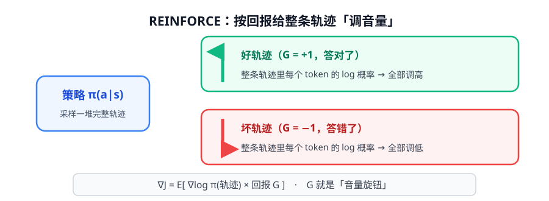
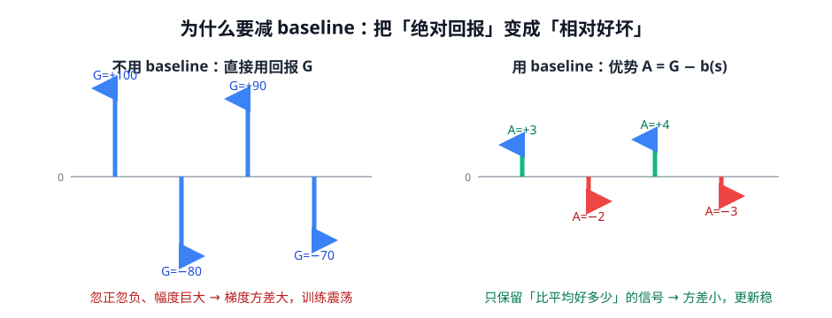

# 第 2 讲 · 策略梯度：直接对「生成行为」求梯度

> [!NOTE]
> ⏱ 40 分钟 ｜ 前置：[第 1 讲 MDP](../01-mdp/index.md) ｜ 下一讲：[03 · PPO](../03-ppo/index.md)
> 🔤 卡在符号？→ [符号速查表](../symbol-reference.md)
>
> 学完你能回答：**为什么不用 Q-learning 式方法训 LLM？REINFORCE 的公式每一项是什么？为什么要减 baseline？**

---

## 1. 为什么是策略梯度（而不是价值迭代）

LLM 的动作空间 = 全部词表（~15 万）。

- 价值方法要先给**每个动作**估 Q 值 → 词表上算不起
- 策略方法直接对 $\pi_\theta(a\mid s)$ 求梯度 → 天然适配「采样一个 token」的生成过程

**一句话**：LLM 本身就是一个可微分的策略网络 $\pi_\theta$，直接对它做梯度上升就行。

## 2. REINFORCE：按回报调音量

$$\nabla_\theta J(\theta) \;=\; \mathbb{E}_{\tau\sim\pi_\theta}\Big[\; \sum_t \nabla_\theta \log \pi_\theta(a_t\mid s_t)\;\cdot\; G_t \;\Big]$$

逐项看：

| 项 | 含义 | 直觉 |
|---|---|---|
| $\nabla_\theta \log \pi_\theta(a_t\mid s_t)$ | 对数概率的梯度 | 「往哪个方向调，这个 token 更可能出现」 |
| $G_t$ | 这条轨迹的回报 | 「调多大力气」的方向盘：好轨迹用力推，坏轨迹用力拉 |
| $\mathbb{E}_{\tau\sim\pi_\theta}$ | 按当前策略采样 | 所以必须**用自己的输出**来训练自己 |

这和 SFT 的损失形式几乎一样（都是 $-\log \pi$），**唯一区别**：SFT 每个 token 都推高，策略梯度按 $G_t$ 有推有拉。

## 3. 核心痛点：方差爆炸

$G_t$ 的绝对值动辄 ±100，而且同一批采样忽正忽负 → 梯度信号被「运气」淹没。

**解法**：减一个 baseline $b(s)$（不减不行，加了免费）：

$$\nabla_\theta J \;=\; \mathbb{E}\Big[\; \sum_t \nabla_\theta \log \pi_\theta(a_t\mid s_t)\;\cdot\;\underbrace{(G_t - b(s_t))}_{\text{优势 } A_t}\;\Big]$$

- $b(s) = V(s)$（学一个 critic 来估）→ 得到 **Actor-Critic** 架构（PPO 用）
- $b(s)$ = 同组其他样本的平均回报 → **RLOO**（无需 critic，GRPO 的祖先）

> [!IMPORTANT]
> 减 baseline **不改变梯度的期望，只减小方差**。这是面试最爱问的点。

## 4. GAE：advantage 的实用估计器（30 秒版）

工程上不用蒙特卡洛的 $G_t$ 算 A（方差还是太大），而用 TD 残差递推：

$$\delta_t = r_t + \gamma V(s_{t+1}) - V(s_t), \qquad \hat{A}_t = \delta_t + \gamma\lambda\,\hat{A}_{t+1}$$

- $\lambda$ 是「信任 critic 多深」的旋钮：$\lambda=0$ 全信 critic（低方差高偏差），$\lambda=1$ 等价蒙特卡洛（高方差低偏差）

## 5. 映射回 LLM：你已经会读 GRPO 了

把本讲公式逐词翻译成 LLM 语言：

| 本讲符号 | LLM 里是 |
|---|---|
| 轨迹 $\tau$ | 一条完整回复（多个 token） |
| $\log \pi_\theta(a_t\mid s_t)$ | 每个 token 的 log 概率 |
| $G_t$ | 整条回复的奖励（RLVR 答案分 / RM 分） |
| baseline $b$ | RLOO：组内其他回复的平均分 → **GRPO 的组内归一化** |

> [!TIP]
> 第 4 阶段要学的 GRPO，本质就是「**REINFORCE + 组平均 baseline + PPO 的 clip**」三件套。
> 这一讲看懂，后面全是组装。

## 6. 自测

① REINFORCE 和 SFT 的损失形式几乎一样，差在哪？

SFT 对目标序列每个 token 一律推高（−logπ）；REINFORCE 用回报 G 加权：好轨迹推高、坏轨迹拉低。

② 为什么减 baseline 不改变期望？

b(s) 与动作 a 无关：E_{a~π}[∇log π(a|s)·b(s)] = b·∇Σπ = 0（概率归一化，log 概率梯度在分布内求和为零）。

③ λ=0 和 λ=1 的 GAE 分别等价于什么？各自的偏差/方差特点？

λ=0：A≈δ_t（TD，低方差、依赖 critic 准不准→偏差）；λ=1：A≈G_t−V(s)（蒙特卡洛，无偏、高方差）。

## 7. 原始资料

见 [raw/RESOURCES.md](raw/RESOURCES.md)。
