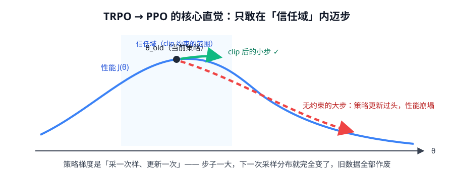
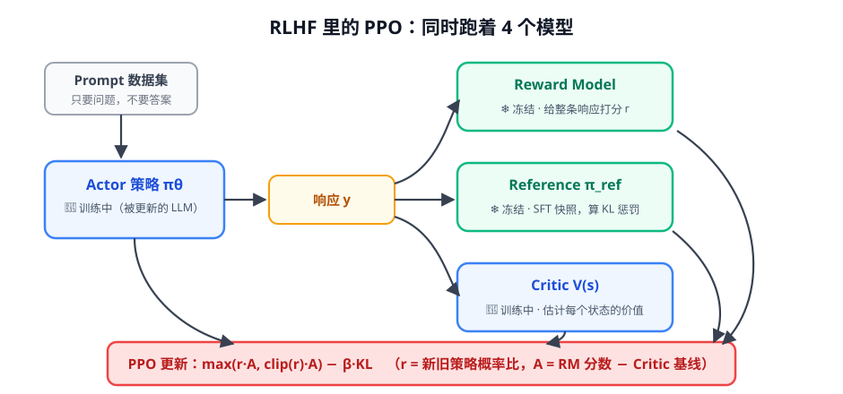

# 第 3 讲 · PPO：给策略更新装上限位器

> [!NOTE]
> ⏱ 45 分钟 ｜ 前置：[第 2 讲 策略梯度](../02-policy-gradient/index.md) ｜ 下一讲：[04 · KL 散度](../04-kl-divergence/index.md)
> 🔤 卡在符号？→ [符号速查表](../symbol-reference.md)
>
> 学完你能回答：**PPO 的 clip 每一项防什么？RLHF 里 PPO 为什么要 4 个模型？on-policy 意味着什么代价？**

---

## 1. 问题：步子一大就翻车

策略梯度是「**采一批数据 → 算梯度 → 更新**」的循环。
更新一旦过大，新策略和产生数据的旧策略分布完全不同 → 这批数据立刻作废，训练崩掉。

两代解法，同一个思想（**限制每次更新别离旧策略太远**）：

| 方法 | 约束方式 | 状态 |
|---|---|---|
| TRPO（2015） | KL 约束 + 二阶优化（共轭梯度） | 理论漂亮，实现重 |
| **PPO（2017）** | 一阶近似：**clip 目标函数** | 简单能打，工业标准 |

## 2. PPO-Clip：一分钟读懂目标函数

定义概率比（新旧策略对同一动作的态度变化）：

$$r_t(\theta) = \frac{\pi_\theta(a_t\mid s_t)}{\pi_{\theta_{old}}(a_t\mid s_t)}$$

目标函数：

$$L^{CLIP}(\theta) = \mathbb{E}_t\Big[\; \min\big(\; r_t(\theta)\,\hat{A}_t,\;\; \text{clip}(r_t(\theta),\, 1-\epsilon,\, 1+\epsilon)\,\hat{A}_t \;\big)\Big]$$

| 情况 | clip 起的作用 |
|---|---|
| $\hat{A}_t > 0$（好动作） | 想推高概率，但 $r_t$ 到 $1{+}\epsilon$ 就**封顶**：不许无限自信 |
| $\hat{A}_t < 0$（坏动作） | 想压低概率，但 $r_t$ 到 $1{-}\epsilon$ 就**兜底**：不许一棒子打死 |

> [!IMPORTANT]
> min = 「悲观的那个」：无论推高还是压低，**一旦离开了信任域，梯度消失（不再受益）**。
> 这就是「上限位器」。ε 常取 0.2（ ±20% 之内随便改）。

**两个工程细节**（读代码时会遇到）：
1. 实现里通常**再叠加一项 KL 惩罚**（对参考策略或旧策略），双保险
2. advantage 先做 **batch 内归一化**（减均值除标准差）——不做训练必炸

## 3. RLHF 里的 PPO：四模型大合唱

| 模型 | 状态 | 作用 | 备注 |
|---|---|---|---|
| Actor πθ | 🔵 训练 | 生成响应 | 就是你最终拿到的模型 |
| Reference π_ref | ❄️ 冻结 | 提供 KL 惩罚，防止跑偏 | SFT 后的快照 |
| Reward Model | ❄️ 冻结 | 给整条响应打分 | 偏好数据训出来的 |
| Critic V(s) | 🔵 训练 | 估每个状态的价值 → 算 advantage | PPO 特有的开销 |

> [!TIP]
> **为什么 GRPO 会赢**：它把 Critic 扔了（组内平均当 baseline），4 个模型变 3 个 → 显存减半。
> 这是第 4 阶段 GRPO 一节的核心预告。

## 4. On-policy：PPO 的性格

- **On-policy**（PPO/GRPO）：数据必须来自当前策略，**用一次就扔** → 采样开销巨大，这是 LLM RL 贵的根源
- **Off-policy**（DQN / DPO 家族）：可以复用旧数据（DPO 干脆用离线偏好数据集）
- LLM 生态的现状：**训练用 on-policy 系，离线数据走 DPO**——两条路线互补（第 2 阶段细讲）

## 5. 自测

① A>0 时 clip 在哪一侧起作用？A&lt;0 呢？

A>0：上限 1+ε（封顶，不许过度推高）；A&lt;0：下限 1−ε（兜底，不许过度压低）。两个方向都是「离开信任域就没梯度」。

② min 里两项什么时候不相等？min 的意义是什么？

r 超出 [1−ε, 1+ε] 时 clip 项被截平。min 取「不超额的那个收益」，相当于把目标在边界外变成平坦 → 无梯度激励，防止过度更新。

③ 为什么 RLHF-PPO 显存压力巨大？GRPO 砍掉了哪个模型？

4 个模型同时在显存里（2 个训练 + 2 个推理）。GRPO 砍 Critic，用组内相对分数当 advantage。

## 6. 原始资料

见 [raw/RESOURCES.md](raw/RESOURCES.md)。
