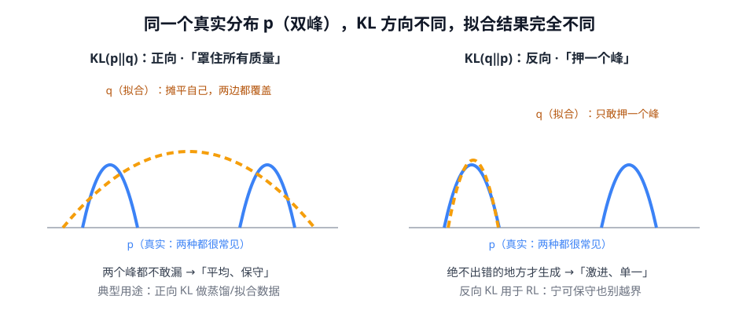
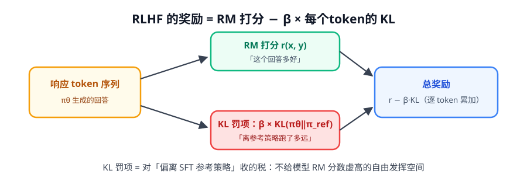

# 第 4 讲 · KL 散度：约束「别跑偏」的尺子

> [!NOTE]
> ⏱ 30 分钟 ｜ 前置：[第 3 讲 PPO](../03-ppo/index.md) ｜ 下一讲：[05 · Bradley-Terry](../05-bradley-terry/index.md)
> 🔤 卡在符号？→ [符号速查表](../symbol-reference.md)
>
> 学完你能回答：**KL 为什么不对称？RLHF 里的 KL 惩罚是哪个方向？k3 估计器是什么、为什么用它？**

---

## 1. 定义与非对称性

$$D_{KL}(p \,\|\, q) \;=\; \mathbb{E}_{x\sim p}\Big[\log \frac{p(x)}{q(x)}\Big]$$

- 含义：用 q 近似 p 时「损失了多少信息」；≥ 0，**当且仅当 p = q 时为 0**
- **不对称**：$D_{KL}(p\|q) \neq D_{KL}(q\|p)$ —— 方向选错，行为天差地别

| 方向 | 通俗行为 | 典型用途 |
|---|---|---|
| $D_{KL}(p\|q)$（正向） | q 不敢漏掉 p 的任何一块 → **保守、平均** | 蒸馏 / 拟合数据分布 |
| $D_{KL}(q\|p)$（反向） | q 只在 p 的高概率区活动 → **激进、单一** | 强化学习里约束策略 |

## 2. RLHF / RL 里的角色：给「跑偏」收税

$$\text{每个 token 的奖励} \;=\; r_{RM}(x, y_{\le t}) \;-\; \beta \cdot \underbrace{D_{KL}\big(\pi_\theta(\cdot\mid s_t)\,\|\,\pi_{ref}(\cdot\mid s_t)\big)}_{\text{对这个 token 的偏离收税}}$$

三个为什么：

| 问题 | 答案 |
|---|---|
| 为什么需要 KL？ | RM 只见过有限分布，模型容易找到「RM 打分虚高但实际糟糕」的漏洞 → **reward hacking**；KL 把模型拴在 SFT 附近 |
| 为什么是这个方向 $D_{KL}(\pi_\theta\|\pi_{ref})$？ | 期望取在 **πθ 的采样**下——我们关心「自己生成的内容」上偏离多少，而不是参考分布的每一处 |
| β 怎么选？ | β 大 → 保守不敢学；β 小 → reward hacking。现代做法常对 KL 目标值做**自适应控制**（如 target-KL） |

## 3. k3 估计器：怎么便宜地算 KL

精确算 KL 需要对整个词表求和（15 万维 × 每 token）——太贵。用采样估计，但朴素估计 $\log\frac{\pi_\theta}{\pi_{ref}}$ 方差大，常用 **k3**（无偏、低方差、只需两个 log 概率）：

$$D_{KL}(\pi_\theta\|\pi_{ref}) \;=\; \mathbb{E}_{x\sim\pi_\theta}\big[\, r - \log r - 1 \,\big], \qquad r = \frac{\pi_\theta(x)}{\pi_{ref}(x)} = e^{\,\log \pi_\theta - \log \pi_{ref}}$$

> [!TIP]
> 读代码时看到 `logp - ref_logp - exp(logp - ref_logp) + 1`（或 k3 字样），就是它。
> TRL / verl / OpenRLHF 里全部是这套。

## 4. 在本课程里的出场清单

KL 是贯穿后训练的「配角」：

1. **PPO**：token 级 KL 罚项（本讲第 2 节）
2. **DPO**：推导中的 KL 约束被「解」进了闭式解（下一讲预告）
3. **GRPO**：损失里的 KL 正则项（第 4 阶段）
4. **推理模型评估**：KLD 与参考模型的偏离度是常用监控指标

## 5. 自测

① KL=0 意味着什么？KL 有上界吗？

当且仅当两个分布完全相同。无上界——q 在 p 支撑集外（p(x)>0, q(x)=0）时发散到 ∞。

② RLHF 的 KL 惩罚为什么不写成 KL(π_ref‖π_θ)？

期望方向反了的话，要在 π_ref 采样下估计——但我们的 rollout 来自 π_θ；而且语义上要惩罚的是「自己在生成的内容上偏离」，正向会把约束错加到参考分布的每一处。

③ k3 相比直接用 log r 估计 KL 的优势？

log r 是有偏/高方差的朴素估计；k3 = r − log r − 1 在 x~π_θ 下是无偏的，且对大偏差样本二次封顶，方差小得多。

## 6. 原始资料

见 [raw/RESOURCES.md](raw/RESOURCES.md)。
