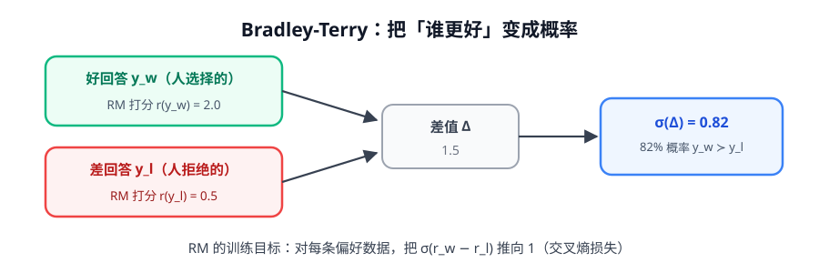

# 第 5 讲 · Bradley-Terry：把「谁更好」变成数学

> [!NOTE]
> ⏱ 25 分钟 ｜ 前置：无（可与第 4 讲互换顺序） ｜ 下一站：[06 · LLM 训练全景](../06-llm-training-panorama/index.md)，然后进入 [后训练主线](../../01-post-training/README.md)
> 🔤 卡在符号？→ [符号速查表](../symbol-reference.md)
>
> 学完你能回答：**偏好对数据长什么样？RM 的损失函数怎么写？DPO 和 RM 共享什么数学地基？**

---

## 1. 问题：人类给不了绝对分，只给得了相对比较

「这个回答 7.3 分」——没人答得出来。
「A 比 B 好」——人人都会。

所以偏好数据长这样：

```json
{ "prompt": "…", "chosen": "回答A", "rejected": "回答B" }
```

 Bradley-Terry（BT）模型（1952）就是「比较数据」的标准数学化。

## 2. BT 模型：分数差 → 概率



$$P(y_w \succ y_l \mid x) \;=\; \sigma\big(r(x, y_w) - r(x, y_l)\big) \;=\; \frac{e^{r_w}}{e^{r_w} + e^{r_l}}$$

> [!NOTE]
> 注意：**只有「分数差」有意义**，分数的绝对值没有意义（整体 +100 概率不变）。
> 这就是为什么后面 DPO 推导里能「把 reward 消掉」——记住这一点，第 2 阶段 DPO 一讲直接复用。

## 3. RM 的训练：一步到位的损失函数

对每条偏好数据，最大化「人类选中的那个」被排在前面的概率 → 交叉熵：

$$\mathcal{L}_{RM} \;=\; -\log \sigma\big(r(x, y_w) - r(x, y_l)\big)$$

实现 = 一个 LLM + 一个标量头，选 sigmoid/BT 损失。就这么多。

| 要点 | 说明 |
|---|---|
| 数据形态 | (prompt, chosen, rejected) 三元组，几十 K 到几百 K 条 |
| 打分方式 | 判别式：整条回复一个标量（第 2 阶段会讲 PRM/GenRM 变体） |
| 已知毛病 | 长度偏置（偏爱长回答）、可传递性假设、分布外打分不可靠 |

## 4. 两个隐含假设（都是坑）

1. **可传递性**：A>B 且 B>C ⟹ A>C。人类偏好并不严格满足 → BT 是「有损压缩」
2. **只学相对序**：RM 不知道「绝对好坏」，两个都差的回答也能分出高下 → RL 优化它会「矬子里拔将军」，越推越野

> [!IMPORTANT]
> 这两个假设直接通向两个大主题：**reward hacking**（第 1 阶段重点）与 **RLVR**（可验证奖励，绕开学出来的 RM）。

## 5. 往前看一步：DPO 从哪里开始

DPO 的全部魔法 = 把 RLHF 目标用 BT 改写后，**闭式解出 reward 代回去**，得到：

$$\mathcal{L}_{DPO} = -\log \sigma\Big(\beta \big[\log\tfrac{\pi_\theta(y_w|x)}{\pi_{ref}(y_w|x)} - \log\tfrac{\pi_\theta(y_l|x)}{\pi_{ref}(y_l|x)}\big]\Big)$$

结构上和 $\mathcal{L}_{RM}$ **一模一样**，只是「reward」换成了「policy 相对 reference 的 log 概率比」。

> [!TIP]
> 本讲 + 第 4 讲（KL）就是 DPO 推导的全部前置。到第 2 阶段时你只需要补 10 行代数。

## 6. 自测

<details markdown="1"><summary>① 为什么 RM 分数可以整体加一个常数？</summary>
BT 只依赖分数差 σ(rw−rl)，加减常数差值不变。这也是 DPO 推导中能「消去 reward 的配分函数」的原因。
</details>

<details markdown="1"><summary>② 「两个都差的回答也能分出高下」会导出什么训练事故？</summary>
模型把「差中优」越推越高（reward hacking 的一种）；RL 优化 RM 分数时会放大这种虚假改善，所以要 KL 拴住或改用可验证奖励。
</details>

<details markdown="1"><summary>③ BT 损失和逻辑回归的损失是什么关系？</summary>
同构：把「分数差」当特征，就是逻辑回归的负交叉熵。所以 RM 训练稳定性、校准问题都能借逻辑回归的直觉。
</details>

## 7. 原始资料

见 [raw/RESOURCES.md](raw/RESOURCES.md)。
