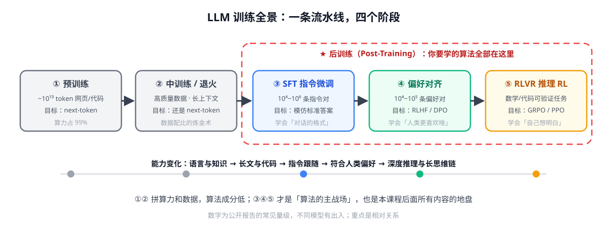
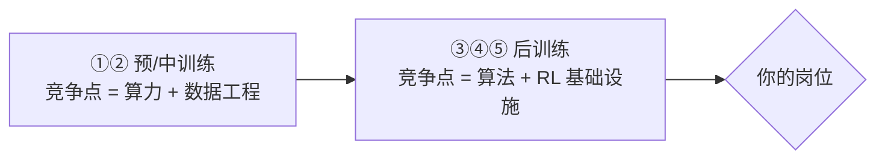

# 第 6 讲 · LLM 训练全景：你在地图的哪里

> [!NOTE]
> ⏱ 25 分钟 ｜ 前置：建议先过前 5 讲 ｜ 下一站：[01-post-training · 后训练主线](../../01-post-training/README.md)
> 🔤 卡在符号？→ [符号速查表](../symbol-reference.md)
>
> 学完你能回答：**pretrain/SFT/RLHF/RLVR 各自的数据量级与目标函数？为什么「算法的主战场」在后训练？**

---

## 1. 一张全景图

## 2. 四个阶段速查表

| 阶段 | 数据 | 目标函数 | 学到什么 | 失败模式 |
|---|---|---|---|---|
| ① 预训练 | ~10¹³ token 网页/书/代码 | next-token 交叉熵 | 语言、知识、代码基础 | 数据污染、偏见 |
| ② 中训练/退火 | 高质量精选 + 长文本 | 还是 next-token | 长上下文、领域强化 | 配比玄学 |
| ③ SFT | 10⁴~10⁶ 条指令对 | 模仿：$-\log \pi(y^*\mid x)$ | 对话格式、指令跟随 | 学格式不学推理、exposure bias |
| ④ 对齐/RL | 10⁴~10⁵ 偏好对；可验证任务 | RLHF/DPO；RLVR+GRPO | 偏好、推理、agentic 行为 | reward hacking、熵坍缩 |

> [!NOTE]
> 量级是公开报告的常见范围，重点是**相对关系**：预训练烧 99% 算力但算法集中在「数据工程」；
> 后训练数据小 6~9 个数量级，却密集使用了本课程全部算法。

## 3. 为什么「算法的主战场」在后训练

- 预训练是「大厂重炮」，个人/团队很难差异化
- 后训练成本小 3~6 个数量级，**算法改进能直接兑换成产品质量**——R1 证明了一个 RL 配方可以让开源权重模型脱胎换骨
- Agent 算法（agentic RL）更是只在后训练阶段发生

## 4. 前 5 讲在全景图上的落位

| 学过的 | 用在哪 |
|---|---|
| 第 1-3 讲（MDP/PG/PPO） | 阶段 ④ 的 RL 主线：RLHF-PPO → GRPO → agentic RL |
| 第 4 讲（KL） | 阶段 ④ 所有 RL 方法的「防跑偏」配件 |
| 第 5 讲（BT） | 阶段 ④ 的偏好数据建模：RM / DPO 家族 |

> [!TIP]
> 你已经集齐了进入后训练主线的全部地基。**出口测试**：回 [ROADMAP](../../ROADMAP.md) 做 Phase 0 自测（白板推导 REINFORCE→PPO），通过即可开拔。

## 5. 自测

① SFT 和 RL 的本质区别，用「数据来源」一句话说清。

SFT 学人类写的固定答案（别人的动作）；RL 学自己采样出的轨迹并用奖励筛选（自己的动作）。这也解释了为什么 RL 能超越示范者上限而 SFT 不能。

② 为什么 RLVR 出现后，数学/代码成为 RL 主战场而「写作」没有？

数学/代码有廉价可靠的验证器（答案匹配、单测），奖励无需学出来的 RM → 没有 reward hacking 的上限问题；写作缺乏客观验证器。

③ 中训练和 SFT 都用「高质量数据」，区别在哪？

损失形式不同：中训练还是 next-token（自由文本），SFT 是结构化的指令-回答对（只对回答算 loss），且服务于「改变交互行为」而非「注入知识」。

## 6. 原始资料

见 [raw/RESOURCES.md](raw/RESOURCES.md)。
