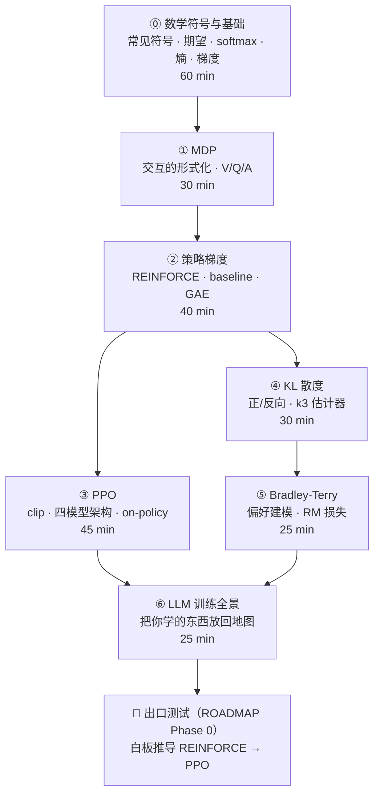

# 00 · 地基课程（Phase 0）

> **7 讲图文教程，全部可直接阅读**——每一讲都是「图 > 表 > 公式 > 文字」的顺序组织，单讲 25-45 分钟。
> 与 [ROADMAP Phase 0](../ROADMAP.md) 清单逐条对应（对照表见下方）。
> 目标：读到能顺畅读懂后训练论文的正文 + 附录，通过出口测试。

## 课程地图（按序学习）



③ 和 ④⑤ 可以并行；⓪→①→② 是硬依赖，其他按上图顺序最顺。

## 目录

| 讲 | 目录 | 你将学会 | 对应 ROADMAP 清单 |
|---|---|---|---|
| ⓪ | [00-math-prerequisites](00-math-prerequisites/index.md) | 常见符号（下标/希腊字母/Σ/log）、期望与采样、熵与交叉熵、softmax 逐符号解读、梯度 | 数学基础补丁（含符号课） |
| ① | [01-mdp](01-mdp/index.md) | RL 在优化什么；V/Q/A 三把尺子 | RL 形式化 |
| ② | [02-policy-gradient](02-policy-gradient/index.md) | 策略梯度公式逐项理解；为什么减 baseline | 策略梯度 |
| ③ | [03-ppo](03-ppo/index.md) | clip 目标函数；RLHF 四模型架构；on-policy 代价 | PPO + clipped surrogate |
| ④ | [04-kl-divergence](04-kl-divergence/index.md) | KL 方向性；RLHF 的 KL 罚；k3 估计器 | 数学补丁（KL） |
| ⑤ | [05-bradley-terry](05-bradley-terry/index.md) | 偏好对数据 → RM 损失；DPO 的地基 | 数学补丁（BT） |
| ⑥ | [06-llm-training-panorama](06-llm-training-panorama/index.md) | 四阶段全景；你学的算法落位在哪 | LLM 训练全景图 |

> [!NOTE]
> On-policy vs off-policy 不单设一讲，在 [第 3 讲第 4 节](03-ppo/index.md) 内讲掉（ROADMAP 里它原本也不是独立条目）。

## 每讲的结构（全库统一的内容模式）

```
01-mdp/
├── index.md      # 整理后的学习内容（插图 + 表格 + 公式卡片 + 自测）
├── assets/       # 本讲 SVG 插图（原始矢量文件，可改）
└── raw/          # 原始资料索引：出处链接 + 精读定位 + 「教科书→代码」的鸿沟提示
```

**建议节奏**：先只读 index.md 顺着图走 → 读公式卡住先查[符号速查表](symbol-reference.md) → 还不懂才去 raw/ 查原文 → 每讲末尾的自测全部通过再翻篇。

## 出口测试（对应 ROADMAP Phase 0）

- [ ] 白板推导：REINFORCE 为什么方差大 → baseline 怎么减方差 → PPO 为什么 clip
- [ ] 解释：RLHF 奖励里的 KL 罚是哪个方向、为什么
- [ ] 画出：RLHF-PPO 的四模型架构，并说出 GRPO 砍掉了谁
- [ ] 写出：BT 损失函数，并说出「只有分数差有意义」会引出什么后果
- [ ] 读一遍 InstructGPT 的损失定义，确认没有不认识的符号

测试通过 → 进入 [01-post-training](../01-post-training/README.md)（后续各讲会按本模块同样的「index + raw + 图解」模式逐讲填充）。
