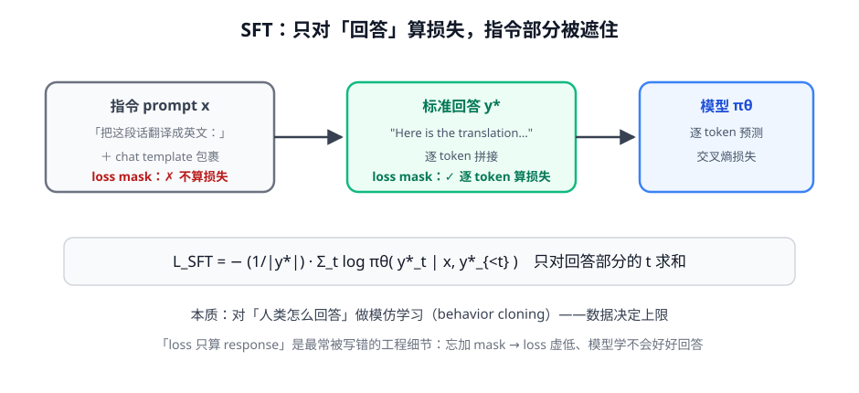
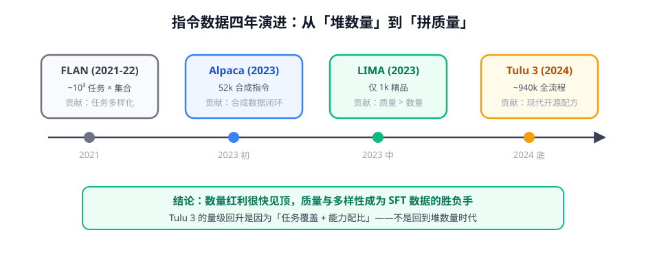

# 第 1 讲 · 指令微调：把 base model 变成助手

> [!NOTE]
> ⏱ 40 分钟 ｜ 前置：[地基 · 第 6 讲 训练全景](../../../00-foundations/06-llm-training-panorama/index.md) ｜ 下一讲：[02 · 数据工程](../02-data-engineering/index.md)
> 🔤 卡在符号？→ [符号速查表](../../../00-foundations/symbol-reference.md)
>
> 学完你能回答：**SFT 的损失函数长什么样？为什么 loss 只算回答部分？SFT 学到什么、学不到什么？**

---

## 1. 一张图看懂



**一句话**：SFT = 拿「(指令, 标准回答)」成对数据，对回答做模仿学习。

## 2. 损失函数逐项读

$$\mathcal{L}_{SFT} \;=\; -\frac{1}{|y^*|} \sum_{t} \log \pi_\theta\big(y^*_t \mid x,\; y^*_{<t}\big)$$

| 符号 | 读法 | 意思 |
|---|---|---|
| $x$ | 指令 | 用户输入（含 chat template） |
| $y^*_t$ | 标准回答的第 t 个 token | 人类写的答案 |
| $y^*_{<t}$ | 前缀 | 生成到第 t 个 token 时已看到的内容 |
| $\sum_t$ | 对回答的每个 token 求和 | **只对回答部分求和**（prompt 被遮住） |

> [!IMPORTANT]
> 这就是地基课讲的交叉熵 $H(p, q)$：这里 p = 人类回答（one-hot），q = 模型预测。
> 与预训练唯一的本质区别：**损失范围从「全部文本」缩到「回答部分」**。

## 3. chat template：最容易被忽视的正确性细节

```json
{"instruction": "把这段话翻译成英文", "input": "今天天气很好", "response": "The weather is nice today."}
```

- 训练时模板把三条字段拼成模型实际看到的对话格式；**推理时必须用同一个模板**
- 模板用错 = 训练/推理分布不一致 → 轻则效果差，重则复读、胡言
- 工程护栏：管线里模板单点维护 + 每次发版前 diff 检查

## 4. 四年演进：从堆数量到拼质量



| 里程碑 | 规模 | 记住的点 |
|---|---|---|
| FLAN | ~10³ 类任务 | 任务多样化是第一红利 |
| Alpaca | 52k 合成 | self-instruct 让人人都能做 SFT |
| LIMA | 1k 精品 | **质量 > 数量**（1000 条认真写的就够） |
| Tulu 3 | ~940k | 现代配方：覆盖 × 配比 × 全流程（SFT+DPO+RLVR） |

## 5. 对你的工作意味着什么

- **SFT 是业务冷启动的标准动作**：把领域问答/工单/最佳实践整理成指令对，1-5 万条就能明显塑形行为
- 但要清楚边界：SFT 只能教「见过的行为模式」，教不会「超越示范者的判断」——那是偏好对齐（下一模块）和 RL（第 4 模块）的事
- 遇到「模型回答格式不对、不遵循指令」→ 先怀疑数据和 template，再怀疑训练超参

## 6. 自测

<details markdown="1"><summary>① SFT 损失和预训练损失的异同？</summary>
同：都是交叉熵（next-token 预测）。异：SFT 只对回答部分算损失、数据是对话结构而非自由文本。
</details>

<details markdown="1"><summary>② 为什么忘加 prompt mask 会让效果变差？</summary>
模型花容量去学「生成用户指令」这个不可能的任务，且 loss 虚低掩盖问题；回答部分的梯度占比被稀释。
</details>

<details markdown="1"><summary>③ LIMA「1k 足够」的边界条件是什么？</summary>
base model 本身够强（预训练里已有该能力，SFT 只负责「唤起」）；数据由人精心撰写、覆盖目标行为。基础弱的模型或新能力，1k 不够。
</details>

<details markdown="1"><summary>④ 把这条损失翻译成中文：−log π(回答 | 指令)</summary>
「让模型在看到指令后，生成人类标准回答的概率尽可能大」——即最大化示范回答的似然。
</details>

## 7. 原始资料

见 [raw/RESOURCES.md](raw/RESOURCES.md)。
