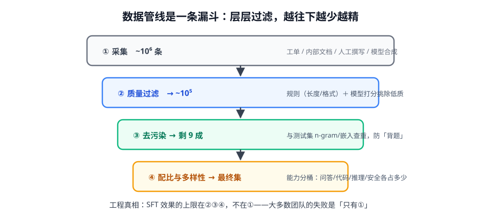
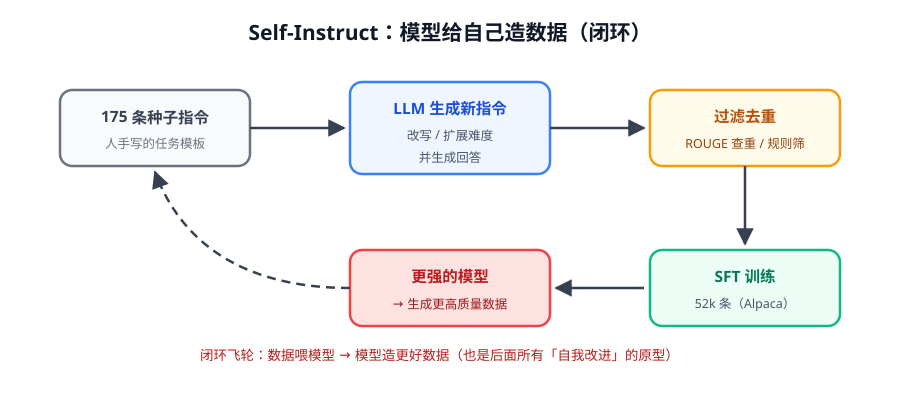

# 第 2 讲 · 数据工程：SFT 的上限在这里

> [!NOTE]
> ⏱ 35 分钟 ｜ 前置：[第 1 讲 指令微调](../01-instruction-tuning/index.md) ｜ 下一讲：[03 · LoRA 与 PEFT](../03-lora-peft/index.md)
> 🔤 卡在符号？→ [符号速查表](../../../00-foundations/symbol-reference.md)
>
> 学完你能回答：**质量三件套是什么？合成数据的闭环怎么转起来？去污染为什么必须做？**

---

## 1. 一张图看懂：漏斗

**一句话**：SFT 数据管线 = 采集 → 质量过滤 → 去污染 → 配比。**效果上限在过滤端，不在采集端。**

## 2. 质量三件套

| 环节 | 做什么 | 常用手段 | 不做的后果 |
|---|---|---|---|
| 质量过滤 | 挑出「好回答」 | 规则（长度/格式/重复率）+ 强模型打分排序 | 低质噪声淹没信号 |
| 去污染 | 剔除与评测集重合的样本 | n-gram / 嵌入相似度查重 | 评测虚高，上线现原形 |
| 配比与多样性 | 控制能力桶占比 | 问答/代码/推理/安全分桶配比 | 单能力过拟合、其他能力退化 |

> [!TIP]
> LIMA 的教训值得贴在墙上：**1k 条精心撰写 > 5 万条随手爬**。高质量数据的核心是「回答展示的是你想要的行为，而不是仅仅正确」。

## 3. 合成数据：自我改进的原型

- 起点只要几百条人工种子 → 模型自我改写、扩难度 → 过滤 → 训练 → 更强的模型造更好的数据
- **收益**：成本比人工低 1-2 个数量级；**风险**：误差自举（模型偏见被固化、退化循环）
- 工程护栏：每轮合成后人工抽检 100 条 + 用「旧数据回灌」防分布漂移

> [!IMPORTANT]
> 这个「生成 → 过滤 → 训练 → 更强生成」的飞轮，就是后面 **STaR、Self-Rewarding、自我改进闭环**（第 5 模块、Agent 模块）的共同原型。在这里看懂，后面全是变奏。

## 4. 对你的工作意味着什么

- 业务冷启动配方：**人工精写 500-2000 条种子 → 模型扩充到 2-5 万 → 过滤去污染 → 分桶配比**
- 评测集先于数据集建好并锁住（去污染的对象就是它），否则一切优化不可信
- 每一版数据集打 tag 存档：出问题时能回滚「是数据变了还是训练变了」

## 5. 自测

① 去污染防的是什么作弊？

评测集泄漏：训练数据里混入测试题，模型「背题」→ 离线指标虚高、真实能力没变。

② 合成数据的两个主要风险与护栏？

误差自举（偏见固化、退化）与分布漂移。护栏：人工抽检、强模型过滤、旧数据回灌、版本化。

③ 配比为什么重要？举一个失衡的后果。

模型容量按数据分布分配；代码占 80% 会让对话/安全能力退化（灾难性遗忘倾向）。配比 = 能力的预算表。

## 6. 原始资料

见 [raw/RESOURCES.md](raw/RESOURCES.md)。
