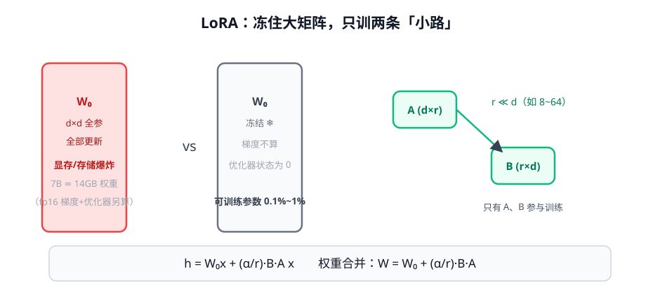

# 第 3 讲 · LoRA 与 QLoRA：穷人的全参微调

> [!NOTE]
> ⏱ 30 分钟 ｜ 前置：[第 1 讲 指令微调](../01-instruction-tuning/index.md) ｜ 下一讲：[04 · SFT 实战](../04-sft-practice/index.md)
> 🔤 卡在符号？→ [符号速查表](../../../00-foundations/symbol-reference.md)
>
> 学完你能回答：**LoRA 的公式里每一项是什么？r 怎么选？QLoRA 靠什么把 65B 塞进单卡？**

---

## 1. 一张图看懂

**一句话**：微调的「改变量」是低秩的 → 冻住原权重 $W_0$，只训一对小矩阵 $A, B$。

## 2. 公式逐项读

$$h \;=\; W_0 x \;+\; \frac{\alpha}{r}\, B\, A\, x$$

| 符号 | 读法 | 意思 |
|---|---|---|
| $W_0$ | 原权重矩阵 | 冻结，不训 |
| $A\ (d{\times}r)$, $B\ (r{\times}d)$ | 两条小路 | 可训练；$r \ll d$（8~64），「低秩」 |
| $\frac{\alpha}{r}$ | 缩放系数 | α 是超参，控制改变量的强度（常取 α = 2r） |
| $h$ | 输出 | 训练完可合并回 $W_0$，推理零开销 |

> [!IMPORTANT]
> 为什么敢这么省：直觉上，微调要改变的行为是「低秩」的——几千条数据撑不起对亿级参数的独立调整。
> 这也是经验事实：r=16~64 的 LoRA 在多数 SFT 任务上逼近全参。

## 3. 实践参数表

| 选择 | 建议 | 说明 |
|---|---|---|
| r | 8 起步，任务难/数据多 → 32~64 | 收益边际递减 |
| α | 2r 起步 | 有效缩放 α/r ≈ 2 |
| 加在哪些层 | 注意力的 q,k,v,o 起步；够不着再全加 | mlp 层加全收益略升 |
| 学习率 | 比全参大 5-10 倍（如 1e-4 ~ 2e-4） | 只训很少参数 |

**QLoRA 三件套**（把大模型塞进小卡）：**4-bit 量化存 W₀**（NF4）+ **LoRA 只训小矩阵**（bf16）+ **paged optimizer**（防显存峰值 OOM）。代价：训练慢 20-40%。

## 4. 对你的工作意味着什么

- 显存速算：7B 模型 LoRA 微调，24GB 单卡可跑（QLoRA 16GB）；全参 7B 要 ~120GB 级
- 多业务场景的杀手锏：一个 base + 每业务一个几十 MB 的 LoRA 适配器，按需热插拔
- 但注意：RL 阶段（第 4 模块）用 LoRA 会有额外复杂度（ref 模型与策略共享基座）——SFT 用 LoRA 起步，RL 再评估

## 5. 自测

① 把 h = W₀x + (α/r)BAx 翻译成中文。

「输出 = 原有权重的结果 + 一对低秩小矩阵产生的修正量（缩放后）」——大改用小改的叠加表达。

② 为什么 LoRA 学习率要比全参大？

可训练参数少、且 B 初始为 0 导致初始梯度小；信号弱所以步子要大。

③ QLoRA 的「量化」量化的是什么？训的还是存的？

只量化被冻结的 W₀（存储/前向用 4bit），梯度与优化器只涉及 bf16 的 A、B。

## 6. 原始资料

见 [raw/RESOURCES.md](raw/RESOURCES.md)。
