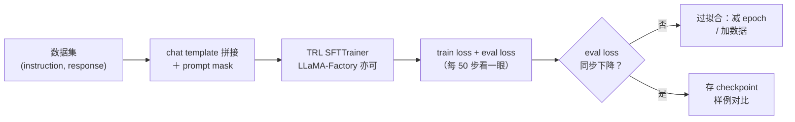
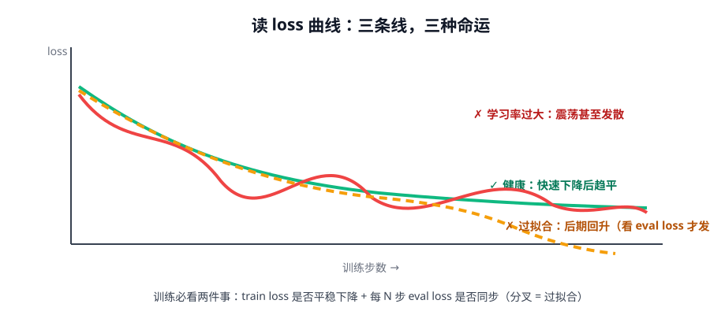

# 第 4 讲 · SFT 实战：跑通 P1

> [!NOTE]
> ⏱ 45 分钟（动手）｜ 前置：前三讲 ｜ 下一站：[02 · 偏好对齐模块](../../02-preference-alignment/README.md)
> 🔤 卡在符号？→ [符号速查表](../../../00-foundations/symbol-reference.md)
>
> 这一讲是操作手册：把前三讲变成你手里跑得通的实验（对应 [03-practice P1](../../../03-practice/README.md)）。

---

## 1. 训练循环（mermaid）

## 2. 步骤与参数起点

| 步骤 | 内容 | 起点 |
|---|---|---|
| 模型 | Qwen2.5-0.5B / 1.5B | 单卡 24GB 内 |
| 数据 | Alpaca 子集 5k 条 或业务种子 | 先小后大 |
| 训练 | LoRA r=16, lr=1e-4, epoch 2-3 | batch 尽量大 |
| 评估 | eval loss + 人工看 20 条生成 | 数指标 + 肉眼 |

## 3. 三条 loss 曲线，三种命运

## 4. 已知坑位清单（按踩坑频率排序）

| 坑 | 症状 | 解法 |
|---|---|---|
| 忘加 prompt mask | loss 虚低、回答学不会 | 检查 `assistant_only_loss` / 数据 collator |
| 训练/推理 template 不一致 | 上线效果远差于离线 | 模板单点维护，发版 diff |
| 学习率过大 | loss 震荡、灾难性遗忘 | 降 lr、加 warmup |
| 数据重复导致背诵 | 生成复读训练集 | 训练前去重、epoch ≤ 3 |
| 只看 train loss | 过拟合发现太晚 | 固定 eval 集，每 N 步评 |

## 5. 验收清单（P1 完成标准）

- [ ] 训练曲线图（train + eval）已存档
- [ ] 训练前后各 10 条生成对比（人工打勾：格式/正确性/语气）
- [ ] 一句话结论：「这批数据教会了模型 ___，没教会 ___」
- [ ] 实验记录写入 `03-practice/notebooks/p1-sft/README.md`（五段格式见 03-practice）

## 6. 自测

① eval loss 降但生成质量差，先查什么？

先查 eval 集与真实任务分布是否一致，再查 template。指标对≠产品对。

② 什么时候该停掉 LoRA 上全参？

数据 ≥ 数十万条、或 LoRA 打到 r=128 仍欠拟合、或任务要求改变模型的核心能力（而非行为风格）。

## 7. 原始资料

见 [raw/RESOURCES.md](raw/RESOURCES.md)。
