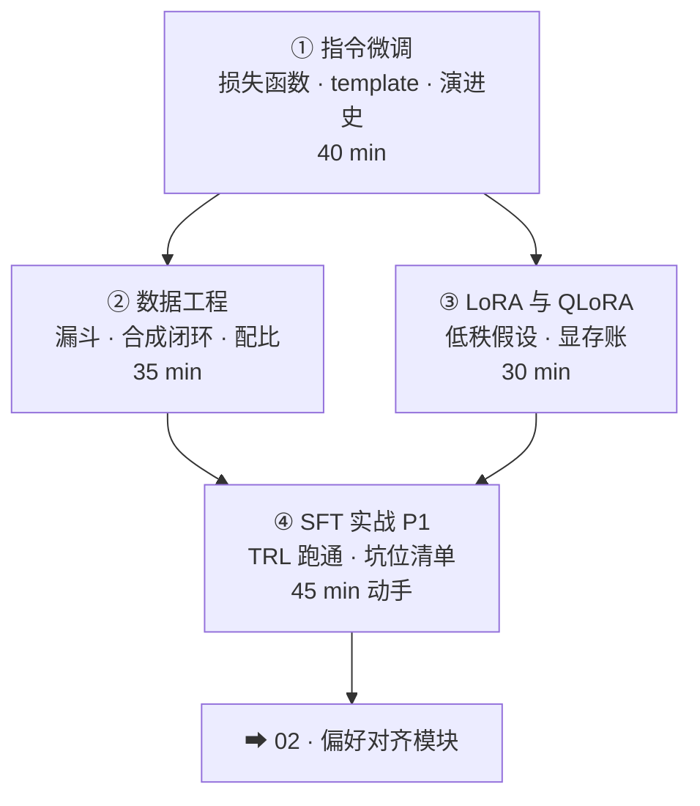

# 01-1 · SFT 与数据工程（Post-Training 第一站）

> 对应 [ROADMAP Phase 1](../../ROADMAP.md) Week 1-2。四讲：指令微调 → 数据工程 → LoRA → 实战。
> 核心命题：**SFT 是模仿学习，数据决定上限；这是后面一切对齐与 RL 的载体。**

## 课程地图

## 讲次表

| 讲 | 目录 | 你将学会 | 对应论文 |
|---|---|---|---|
| ① | [01-instruction-tuning](01-instruction-tuning/index.md) | SFT 损失逐项读；template 坑；四年演进 | FLAN · LIMA · Tulu 3 |
| ② | [02-data-engineering](02-data-engineering/index.md) | 质量三件套；合成数据闭环飞轮 | LIMA · Self-Instruct · Tulu 3 |
| ③ | [03-lora-peft](03-lora-peft/index.md) | LoRA 公式逐项；r/α 选择；QLoRA 三件套 | LoRA · QLoRA |
| ④ | [04-sft-practice](04-sft-practice/index.md) | 跑通 P1；读 loss 曲线；坑位清单 | （工具文档为主） |

## 出口测试

- [ ] 白板写出 SFT 损失并解释「为什么只对回答算损失」
- [ ] 画出你的业务数据漏斗（①→④ 各环节用什么手段）
- [ ] 算一笔显存账：7B 模型全参 vs LoRA vs QLoRA
- [ ] P1 实验记录完成（[03-practice](../../03-practice/README.md) 五段格式）

通过 → [02-preference-alignment 课程地图](../02-preference-alignment/README.md)
