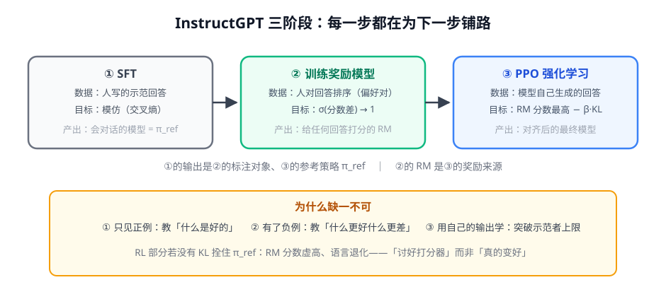

# 第 1 讲 · RLHF 三阶段：经典范式的骨架

> [!NOTE]
> ⏱ 35 分钟 ｜ 前置：[地基 · 第 3 讲 PPO](../../../00-foundations/03-ppo/index.md)、[地基 · 第 5 讲 BT](../../../00-foundations/05-bradley-terry/index.md) ｜ 下一讲：[02 · DPO 推导](../02-dpo-derivation/index.md)
> 🔤 卡在符号？→ [符号速查表](../../../00-foundations/symbol-reference.md)
>
> 学完你能回答：**三阶段各自不可替代在哪？为什么只有 SFT 到不了「对齐」？**

---

## 1. 一张图看懂

## 2. 为什么只有 SFT 不够

| SFT 的盲区 | 说明 | 对齐需要 |
|---|---|---|
| 只见正例 | 人类示范只包含「好回答」 | 需要负例：知道什么**更差** |
| 模仿 ≠ 判断 | 模型学不到「为什么这样好」 | 需要可优化的偏好信号 |
| 上限 = 示范者 | 模型不可能超过写示范的人 | 需要用自己的输出探索 |

> [!IMPORTANT]
> 这三条盲区分别被三阶段补上：②引入负例（偏好对）、②把「好」变成可优化的分数（RM）、③让模型在自己的输出上学习。
> 「用自己的输出学习」是 RL 的灵魂——也是第 4 模块 RLVR 的一切。

## 3. KL 在三阶段里的位置

- ③ 的目标：$\max_\pi\; \mathbb{E}\,[\,r_{RM}(x, y)\,] - \beta\, D_{KL}(\pi_\theta \,\|\, \pi_{ref})$
- $\pi_{ref}$ = ① 的产物（SFT 快照）：**没有①，KL 就没有锚点**
- 直觉：RM 分数是「诱惑」，KL 是「缰绳」——缰绳的另一头必须拴在一个会好好说话的模型上

## 4. 对你的工作意味着什么

- 三阶段是**概念骨架**而非必须照抄的流程：现代实践常把①压缩（用强 base）或把②③换成 DPO/RLVR
- 判断你的任务走哪条路：有偏好标注/能定义好坏 → 偏好路线（本模块）；能自动验证对错 → RLVR 路线（第 4 模块）；只有示范数据 → 老实 SFT（上一模块）
- InstructGPT 至今值得精读的原因：它把「人类偏好怎么变成训练信号」的每个决策都写透了

## 5. 自测

① 三阶段的数据形态分别是什么？

① (指令, 人类示范回答)；② (指令, 好回答, 差回答) 偏好对；③ 只有指令，回答由模型自己生成。

② 为什么 KL 的锚点必须是 SFT 模型而不是 base model？

base 模型不会对话，用它当参考等于允许模型退化成「不会对话但 RM 分高」的形状；锚点应是「行为已正确、只差偏好」的模型。

③ 把 RLHF 目标翻译成中文。

「生成 RM 打分尽量高的回答，同时整体行为不许偏离 SFT 参考策略太远（偏离要交 β 的税）」。

## 6. 原始资料

见 [raw/RESOURCES.md](raw/RESOURCES.md)。
