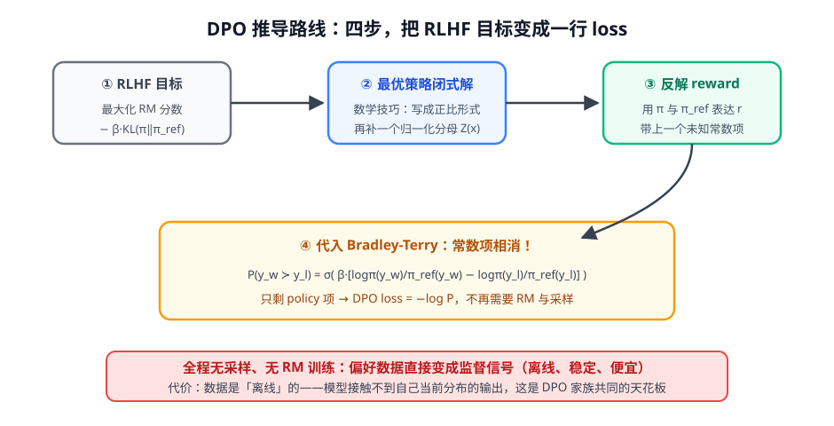

# 第 2 讲 · DPO 推导：把 RLHF 压成一行 loss ★

> [!NOTE]
> ⏱ 50 分钟 ｜ 前置：[第 1 讲 三阶段](../01-rlhf-three-stages/index.md)、[地基 · 第 5 讲 BT](../../../00-foundations/05-bradley-terry/index.md) ｜ 下一讲：[03 · DPO 变体家族](../03-dpo-family/index.md)
> 🔤 卡在符号？→ [符号速查表](../../../00-foundations/symbol-reference.md)
>
> 这是全课程数学浓度最高的一讲。逐节啃，每一步只引入一个新动作。

---

## 0. 推导路线图

目标：把「RM + 采样 + PPO」的在线流程，变成「偏好数据上的一行监督损失」。

## 1. 第一步：写下 RLHF 目标

$$\max_\pi\;\; \mathbb{E}_{x\sim\mathcal{D},\, y\sim\pi}\big[\, r(x, y) \,\big] \;-\; \beta\, D_{KL}\big(\pi \,\|\, \pi_{ref}\big)$$

| 项 | 意思 |
|---|---|
| $r(x,y)$ | RM 打分（想最大化） |
| $\beta\, D_{KL}$ | 偏离参考策略的税（想别跑远） |

## 2. 第二步：最优策略有闭式解

KL 约束的优化问题有个著名技巧：把目标写成 log 形式后，最优解是「参考策略 × 奖励的指数」再归一化：

$$\pi^*(y\mid x) \;=\; \frac{1}{Z(x)}\, \pi_{ref}(y\mid x)\, \exp\!\Big(\frac{r(x,y)}{\beta}\Big)$$

- $Z(x) = \sum_y \pi_{ref}(y\mid x)\exp(r(x,y)/\beta)$：配分函数，只依赖 x，**跟每个具体 y 的比较无关**
- 直觉：「最优策略 = 参考策略按奖励指数加权」

## 3. 第三步：反解 reward

对上式两边取 log，解出 r：

$$r(x, y) \;=\; \beta \log \frac{\pi^*(y\mid x)}{\pi_{ref}(y\mid x)} \;+\; \beta \log Z(x)$$

奖励完全可以由「策略相对参考的 log 概率比」表达——只是混进了一个未知常数 $\beta \log Z(x)$。

## 4. 第四步：代入 BT，常数相消

BT：$P(y_w \succ y_l) = \sigma(r_w - r_l)$。**减法里常数 $Z(x)$ 相消**：

$$P\big(y_w \succ y_l \mid x\big) \;=\; \sigma\Big( \beta \Big[\log \tfrac{\pi(y_w\mid x)}{\pi_{ref}(y_w\mid x)} - \log \tfrac{\pi(y_l\mid x)}{\pi_{ref}(y_l\mid x)}\Big] \Big)$$

$$\boxed{\;\mathcal{L}_{DPO} = -\log P\;}$$

| 符号 | 意思 |
|---|---|
| $\pi$ | 被训练的策略 |
| $\pi_{ref}$ | 冻结的 SFT 参考策略 |
| $\beta$ | 温度/缰绳强度：小 → 松（跑得远），大 → 紧（贴着 ref） |
| 整个中括号 | 隐式奖励：好回答与差回答的「相对提升差」 |

> [!IMPORTANT]
> 三个值得记住的点：
> ① **KL 约束没有消失，而是被「解」进了公式**——最优解里的 log 比值天然带 KL 惩罚；
> ② 地基课埋的伏笔兑现了：「BT 只依赖分数差 → 常数无意义」正是 Z 相消的原因；
> ③ **代价是离线**：数据是别人的策略产生的，模型接触不到自己当前分布——变体家族（下一讲）全部围绕这个短板打转。

## 5. 对你的工作意味着什么

- DPO 是**低成本对齐首选**：一张卡、几万条偏好对、几小时——业务里「有个明确的好坏标准」的场景先试 DPO
- 数据质量决定一切：偏好对里 y_l 不够差，模型学到的只是「句式差异」；建议 y_w/y_l 尽量「只在一个维度上不同」
- 观察训练：chosen 的隐式奖励应升、rejected 应降，同时看 KL 不要飙

## 6. 自测

① Z(x) 为什么能相消？

BT 只依赖 r_w − r_l；Z(x) 对同一 x 下的所有 y 是同一个常数，相减为零。地基课的伏笔：「BT 只有分数差有意义」。

② β 调大调小分别发生什么？

β 大：公式里 log 比值被除以大数 → 梯度温和、贴紧 π_ref；β 小：优化激进、易过拟合偏好数据且偏离参考更远。

③ DPO 和 RLHF-PPO 的根本区别是 on-policy 吗？

是。DPO 在固定数据集上做离线优化（数据分布≠当前策略分布）；PPO/GRPO 每轮用当前策略采样（on-policy）。这是 DPO 天花板与变体动机。

④ 把 DPO loss 的中括号整体翻译成中文。

「好回答相对参考策略的提升，减去差回答相对参考策略的提升」——这个差值越大，说明数据里的偏好越被模型复现。

## 7. 原始资料

见 [raw/RESOURCES.md](raw/RESOURCES.md)。
