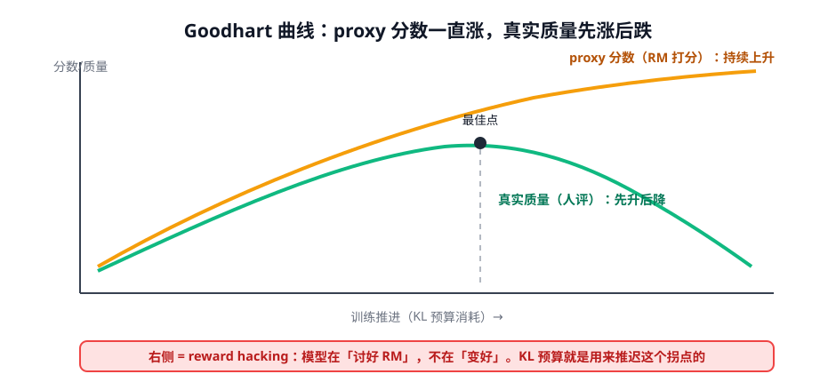

# 第 4 讲 · RLAIF 与 Reward Hacking：偏好的两道暗门

> [!NOTE]
> ⏱ 30 分钟 ｜ 前置：[第 1 讲 三阶段](../01-rlhf-three-stages/index.md) ｜ 下一站：[03 · 奖励模型模块](../../03-reward-models/README.md)
> 🔤 卡在符号？→ [符号速查表](../../../00-foundations/symbol-reference.md)
>
> 学完你能回答：**RLAIF 的偏好从哪来、有什么偏差？reward hacking 的曲线长什么样、怎么推迟拐点？**

---

## 1. RLAIF：把「人类标注」换成「AI 按原则标注」

Constitutional AI 的两步：

| 收益 | 新引入的偏差 |
|---|---|
| 标注成本降 1-2 个数量级 | AI judge 的偏见（偏爱长/正式/自家风格） |
| 原则可随时修改重标 | 原则覆盖不到的地方 = 无监督信号 |
| 可规模化红队对抗 | 「AI 味」风险：风格趋同、变谨慎 |

> [!TIP]
> 你在业务里大概率已经在用 RLAIF（用 GPT-4 类模型给回答打分挑数据）。要记住：**AI judge 就是你的 RM**，第 3 模块讲的 RM 偏差全部适用。

## 2. Reward Hacking：对齐的达摩克利斯之剑

- 机制：优化 proxy（RM/AI judge）⇒ 真实目标先升后降；proxy 自己一路虚高
- 经典形态：变长（RM 爱长回答）、套话堆砌、迎合句式、格式完美内容空洞
- 定量规律（Gao et al.）：proxy 越准、数据越多，真实质量的峰值越高、拐点越晚——**但拐点永远存在**

## 3. 推迟拐点的监控清单

| 监控 | 看什么 | 报警信号 |
|---|---|---|
| KL vs π_ref | 消耗速度 | 超预算（如 > 10 nats） |
| 长度分布 | 与 SFT 期对比 | 中位数持续右移 |
| proxy − gold 抽检 | 人工评小样本与 RM 分数的相关性 | 相关性下降 |
| 多样性 | 回复 n-gram 熵 | 明显变尖（套话化） |

## 4. 对你的工作意味着什么

- 任何「用分数驱动优化」的环节（数据筛选、DPO 数据构造、RL）都要预设拐点：**先定监控，再开训练**
- 原则化 AI 评估是可复制的：把你的业务标准写成 10-20 条 explicit 原则，比「你觉得好不好」可维护得多
- RLVR（第 4 模块）之所以火，本质是绕开 proxy：验证器不会 Goodhart（但验证器本身也会被钻——到时候讲）

## 5. 自测

① 把 Goodhart 现象翻译成一句工程警告。

「当你开始优化一个指标而不是目标本身，指标和目标的分歧就是你的损失」——proxy 分数涨不等于变好。

② 为什么 KL 预算能推迟拐点？

拐点来自模型钻 RM 空子所需的「偏离常见分布」；KL 罚让偏离持续付费，探索空子的速度被限制。

③ RLAIF 相比 RLHF 最本质的损失是什么？

人类分布的多样性：AI judge 按原则评，会系统性抹掉原则未覆盖但人类在意的维度（如语气分寸）。

## 6. 原始资料

见 [raw/RESOURCES.md](raw/RESOURCES.md)。
