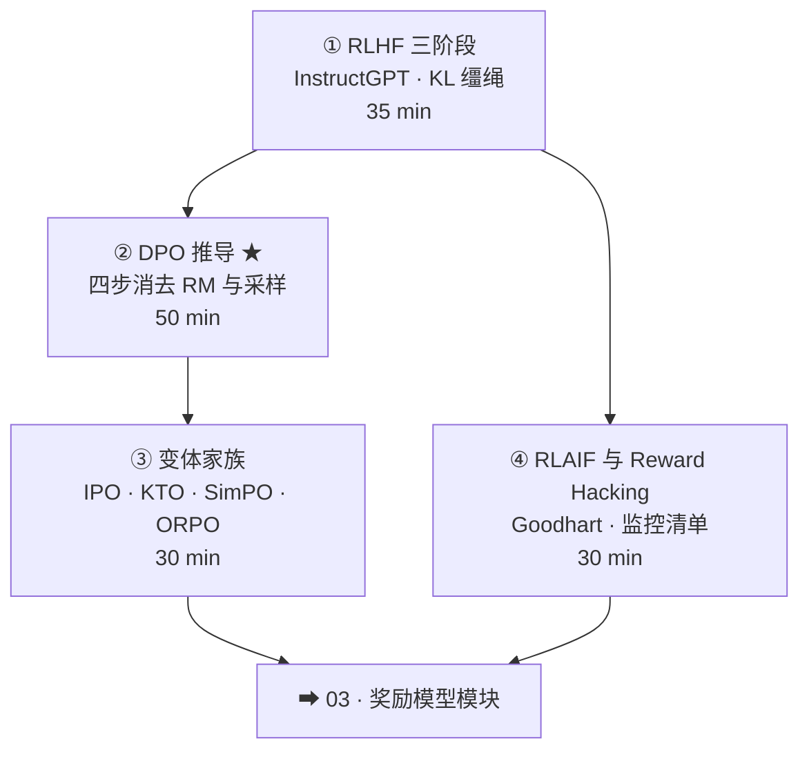

# 01-2 · 偏好对齐（RLHF / DPO 家族）

> 对应 [ROADMAP Phase 1](../../ROADMAP.md) Week 3。四讲：三阶段 → DPO 推导 → 变体家族 → RLAIF 与 hacking。
> 核心命题：**把「A 比 B 好」变成可优化的目标——两条路线（在线 RL / 离线 DPO）及其代价。**

## 课程地图

## 讲次表

| 讲 | 目录 | 你将学会 | 对应论文 |
|---|---|---|---|
| ① | [01-rlhf-three-stages](01-rlhf-three-stages/index.md) | 三阶段各自不可替代；KL 的角色 | InstructGPT |
| ② | [02-dpo-derivation](02-dpo-derivation/index.md) | 四步推导白板复现；β 与隐式 KL | DPO |
| ③ | [03-dpo-family](03-dpo-family/index.md) | 每个变体的 diff 视角与选型 | IPO · KTO · SimPO · ORPO |
| ④ | [04-rlaif-reward-hacking](04-rlaif-reward-hacking/index.md) | Goodhart 曲线；推迟拐点的监控 | Constitutional AI · Overoptimization |

## 出口测试

- [ ] 白板完整推导 DPO（四步，每步说清在干什么）
- [ ] 说出 DPO 与 PPO 的本质区别（on/off-policy）及其后果
- [ ] 给你的业务画一张 Goodhart 风险监控表
- [ ] 实践 P2（手写 mini-DPO）完成，见 [03-practice](../../03-practice/README.md)

通过 → [03-reward-models 课程地图](../03-reward-models/README.md)
