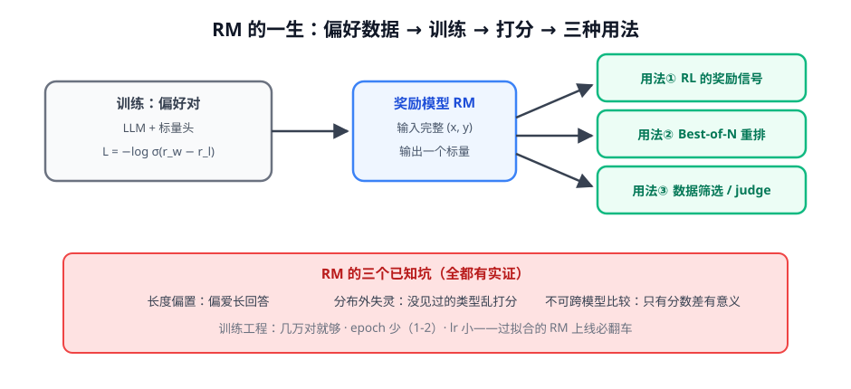

# 第 1 讲 · 奖励模型实战：训练与使用全景

> [!NOTE]
> ⏱ 30 分钟 ｜ 前置：[地基 · 第 5 讲 BT](../../../00-foundations/05-bradley-terry/index.md)、[偏好对齐 · 第 1 讲](../../02-preference-alignment/01-rlhf-three-stages/index.md) ｜ 下一讲：[02 · ORM vs PRM](../02-orm-vs-prm/index.md)
> 🔤 卡在符号？→ [符号速查表](../../../00-foundations/symbol-reference.md)
>
> 学完你能回答：**RM 怎么训练、打分怎么用？三个已知坑会在你的业务里怎么现形？**

---

## 1. 一张图看懂

**一句话**：RM = 「把偏好对压缩成一个打分函数」的 LLM + 标量头；它是 RLHF 的上限，也是 Best-of-N 的裁判。

## 2. 训练细节（很短，但都是关键）

$$\mathcal{L}_{RM} = -\log\, \sigma\big(r(x, y_w) - r(x, y_l)\big)$$

| 工程点 | 建议 | 为什么 |
|---|---|---|
| 数据量 | 1w-10w 对 | InstructGPT：量再大收益递减 |
| epoch | 1-2 | 过拟合的 RM 打分「自信且错」 |
| 校准检查 | 抽 200 条看分数分布 | 分数全挤在 0.9+ = 已废 |
| 去污染 | 与评测集查重 | 同 SFT 数据管线 |

> [!IMPORTANT]
> RM 分数**只有相对意义**：两个 RM 的分数不可比、同一 RM 跨 prompt 分布的分数不可比。
> 一切评估用「胜率/排序一致性」，不要用绝对分。

## 3. 三种用法，三种失败模式

| 用法 | 姿势 | 主要风险 |
|---|---|---|
| RL 奖励 | 每条 rollout 打分 | reward hacking（上一模块第 4 讲） |
| Best-of-N | N 条候选取最高分 | 分数偏置放大（只偏不坏 → 只挑长的） |
| 数据筛选 | 用 RM 筛训练数据 | 偏见固化进下一代模型 |

## 4. 对你的工作意味着什么

- 判别式 RM（本讲）→ PRM/GenRM（后两讲）→ RLVR（第 4 模块）是一条「奖励信号越来越可靠」的谱系，选型按任务可验证程度走
- 业务冷启动：拿强模型生成候选 + 人标 500-1000 对偏好，先训一个小 RM 支撑数据筛选，性价比最高
- 任何 RM 上线前跑一个「长度 ablation」：把 y_w 换成同内容更长的版本看分数变不变——变 = 有长度偏置，后续结果都要打折

## 5. 自测

① 为什么 RM 不能用 MSE 回归「人类绝对分」？

人类给不出可靠的绝对分（个体/时间不一致）；成对比较才稳定。BT 建模的就是成对比较。

② 「两个都差的回答也能分出高下」会导致什么？

优化它会把「差中优」越推越高——虚假改善。缓解：KL 拴住、或只在高质量候选间做偏好。

③ 把 RM 损失翻译成中文。

「对每条偏好数据，把『选中回答比拒绝回答分数高』这件事的概率推向 1」。

## 6. 原始资料

见 [raw/RESOURCES.md](raw/RESOURCES.md)。
