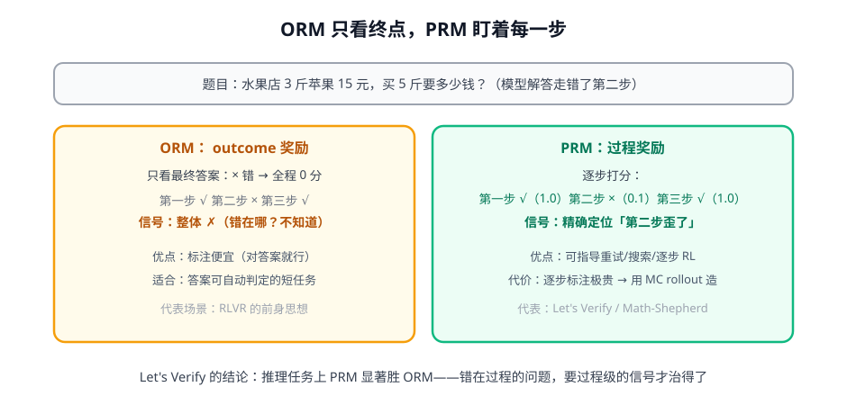
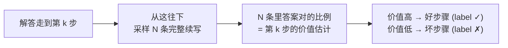

# 第 2 讲 · ORM vs PRM：奖励的粒度之争

> [!NOTE]
> ⏱ 35 分钟 ｜ 前置：[第 1 讲 RM 实战](../01-rm-basics/index.md) ｜ 下一讲：[03 · GenRM 与评测](../03-genrm-eval/index.md)
> 🔤 卡在符号？→ [符号速查表](../../../00-foundations/symbol-reference.md)
>
> 学完你能回答：**PRM 为什么在推理任务上赢？PRM 的训练数据从哪来（Math-Shepherd 算法）？**

---

## 1. 一张图看懂

**一句话**：ORM 给整条回答打一个分；PRM 给每一步打分——错在哪一步，一目了然。

## 2. PRM 的数据从哪来：Math-Shepherd 的 MC rollout

人工逐步标注太贵，Math-Shepherd 用「让模型自己走下去，看结局」自动标：

- 洞察：**好步骤 = 走到这里的解答「大概率能做对」**——用蒙特卡洛 rollout 把「过程好坏」变成可测量
- 偏差：探索不足时「其实能走通的冷门步骤」会被标成坏（假阴性）；N 越大越准、越贵

## 3. PRM 的三种用法

| 用法 | 姿势 | 见于 |
|---|---|---|
| Best-of-N 重排 | 用步骤分总和排序候选 | Let's Verify |
| 搜索引导 | 在解树上按 PRM 选枝 | rStar-Math（第 5 模块） |
| 过程级 RL | 每步一个奖励（dense reward） | 过程 RL 系列 |

> [!IMPORTANT]
> 本讲与地基课的伏笔相连：优势函数 $A$ 的本质就是「这一步比预期好多少」——PRM 的步骤分天然适合当 step-level RL 的奖励。
> 这是 Agent 模块里 credit assignment 的第一件武器。

## 4. 对你的工作意味着什么

- 判断用 ORM 还是 PRM：**错误能否定位到中间步骤**？能（数学/代码/多轮任务）→ PRM 思想；不能（开放问答）→ ORM/AI judge
- 「MC rollout 估计中间步骤价值」这个 trick 直接可搬：你 agent 的某个工具调用好不好，从那里续跑 N 次，看任务成功率
- 人工标注 PRM 数据极其贵，优先自动标注 + 人只做抽检仲裁

## 5. 自测

① PRM 在推理任务上赢 ORM 的根本原因？

推理错误是局部的：整题错但只有一步错。ORM 的整体 0 分抹掉了「哪一步错」的信息；PRM 保留可定位的梯度（反馈粒度匹配错误粒度）。

② MC rollout 标注的假阴性是怎么产生的？

从某步续写采样数有限，小概率走通的步骤被多数失败淹没 → 被标坏。加 N 或用更强的续写模型缓解。

③ 把「步骤价值 = 续写成功率」翻译成 RL 语言。

步骤价值 ≈ 该状态的价值 V(s)（从这里出发的期望回报）——MC rollout 就是在估 V。

## 6. 原始资料

见 [raw/RESOURCES.md](raw/RESOURCES.md)。
