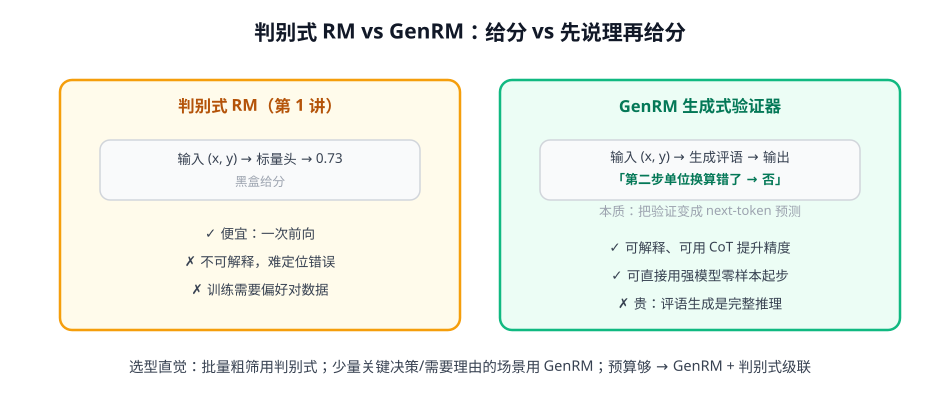

# 第 3 讲 · GenRM 与评测：验证器的两种形态

> [!NOTE]
> ⏱ 30 分钟 ｜ 前置：[第 2 讲 ORM vs PRM](../02-orm-vs-prm/index.md) ｜ 下一讲：[04 · Best-of-N 与过度优化](../04-bon-overoptimization/index.md)
> 🔤 卡在符号？→ [符号速查表](../../../00-foundations/symbol-reference.md)
>
> 学完你能回答：**GenRM 是什么、凭什么和判别式 RM 争？RewardBench/ProcessBench 各测什么？**

---

## 1. 一张图看懂

**一句话**：GenRM 把「验证」变成生成任务——让模型写出理由再下结论，理由本身就是 CoT。

## 2. GenRM 为什么有效

- LLM 最强的能力是 next-token 生成 → 让它「按解题的方式检查解题」，比塞一个标量头更贴合预训练分布
- 评语 + 结论的结构天然可解释：错了能知道错哪（衔接 PRM 的定位能力）
- 变体：看「结论 token」的概率当分数（ soft 判据），比硬输出 ✓/✗ 信息量大

| 维度 | 判别式 | GenRM |
|---|---|---|
| 成本/条 | 1 次前向 | 一次生成（贵 10-100 倍） |
| 可解释性 | 无 | 有（评语） |
| 冷启动 | 需偏好对训练 | 强模型零样本可用 |
| 过拟合风险 | 高（标量头死记） | 相对低 |

## 3. 两个基准，测的是两种能力

| 基准 | 测什么 | 形态 |
|---|---|---|
| RewardBench | RM 排序「好回答 vs 差回答」的能力 | 成对对比（聊天/推理/安全分桶） |
| ProcessBench | 定位「推理在哪一步开始错」的能力 | 给完整解答找第一个错误步骤 |

> [!IMPORTANT]
> 评测 RM 的正确姿势：**看排序一致性（胜率），不看绝对分**；你的业务 RM 上线前，应自建一个 200-500 条的内部 RewardBench（用真实失败模式造负例）。

## 4. 对你的工作意味着什么

- 业务里「AI judge」的正规化路径：先用强模型做 GenRM 零样本评 → 攒了偏好数据再训判别式 RM 降成本 → 级联（GenRM 抽检判别式）
- ProcessBench 的思路可直接搬进测试集建设：给「含已知错误步骤」的解答做定位测试，比笼统打分更能暴露 judge 盲区

## 5. 自测

① GenRM 为什么「天然带 CoT」？带来什么代价？

它要先生成评语再给结论——评语就是推理链。代价：每条验证都是完整生成，延迟与成本高一个量级。

② RewardBench 和 ProcessBench 的能力维度差在哪？

前者测「结果层面的偏好排序」，后者测「过程层面的错误定位」；好 judge 未必会定位，反之亦然。

③ 把「soft 判据」翻译成中文。

不看模型嘴上说什么，看它写下「正确结论」那个 token 的概率有多大——用概率而非二值做分数。

## 6. 原始资料

见 [raw/RESOURCES.md](raw/RESOURCES.md)。
