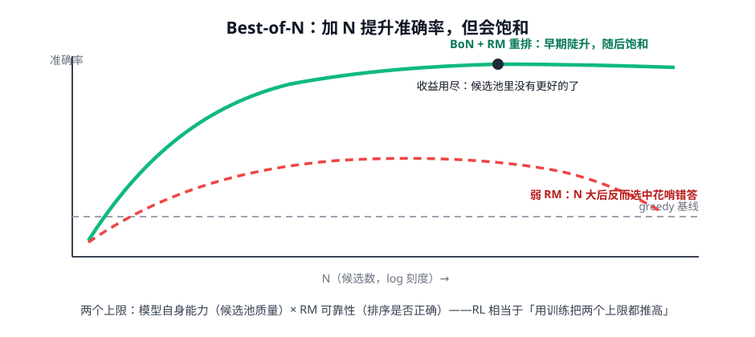

# 第 4 讲 · Best-of-N 与过度优化：不训练的「推理时 RL」

> [!NOTE]
> ⏱ 30 分钟 ｜ 前置：[第 1 讲 RM 实战](../01-rm-basics/index.md) ｜ 下一站：[04 · LLM 强化学习模块](../../04-rl-for-llm/README.md)
> 🔤 卡在符号？→ [符号速查表](../../../00-foundations/symbol-reference.md)
>
> 学完你能回答：**BoN 为什么有效又为什么饱和？它和 RL 是什么关系？**

---

## 1. BoN：最简单的 test-time scaling

**算法**：同一 prompt 采样 N 条回答 → RM 逐条打分 → 取最高分。

- 零训练成本，只花推理算力——是「推理时换质量」的第一手段
- 收益来源：候选池的**极值**优于均值（N 越大极值越极端）

## 2. 为什么饱和：两个上限

| 上限 | 含义 | 推高手段 |
|---|---|---|
| 候选池质量 | N 条里根本没有更好的答案 | 加温度/多样采样、更强 base |
| RM 排序可靠性 | 排序错了就选不出真最好 | 换 PRM/GenRM、RM 集成 |

> [!IMPORTANT]
> N 大到一定程度，弱 RM 开始「选中花哨的错误回答」——BoN 版的 reward hacking（上一模块 Goodhart 的推理时版本）。
> BoN 准确率随 N 的曲线是**检验你 RM 质量的最好体检**：早饱和/倒退 = RM 不行，别先怪模型。

## 3. BoN 与 RL：同一枚硬币

- BoN：在固定策略的分布上「挑极值」→ 推理时
- RL：把「挑极值的信息」写回参数 → 下次分布更好 → **RL ≈ 把 BoN 的收益蒸馏进权重**
- Gao et al. 的过度优化曲线在 BoN 里同样成立：N 越大越考验 RM；RL 把这个过程推到极限

## 4. 对你的工作意味着什么

- 上线性价比之王：模型不动，加 N + RM 重排，常见 5-15 个点的质量提升（代价是 N 倍推理成本——只在关键路径用）
- 做容量规划先画两条曲线：**BoN-N 曲线**（定 N）与 **KL-质量曲线**（定训练预算），它们是同一张图的两面
- BoN 挑选出的「高分回答」天然就是优质训练数据（拒绝采样的原料）——第 5 模块 R1 管线里会正式登场

## 5. 自测

① BoN 收益饱和的两个独立原因？

候选池极值触顶（模型能力上限）与 RM 排序错误（选择器上限）。二者任一触顶，加 N 都无益。

② 「BoN 是检验 RM 的体检」的原理？

RM 若可靠，BoN 收益应随 N 单调升后饱和；若 N 大后准确率下降，说明 RM 在高分段系统性地选错——暴露排序缺陷。

③ 把「RL ≈ BoN 蒸馏进权重」翻译成直觉。

BoN 每次都要重采样重挑；RL 把「什么样的回答会胜出」学进参数，让均值本身变好——一次性付费，推理免费。

## 6. 原始资料

见 [raw/RESOURCES.md](raw/RESOURCES.md)。
