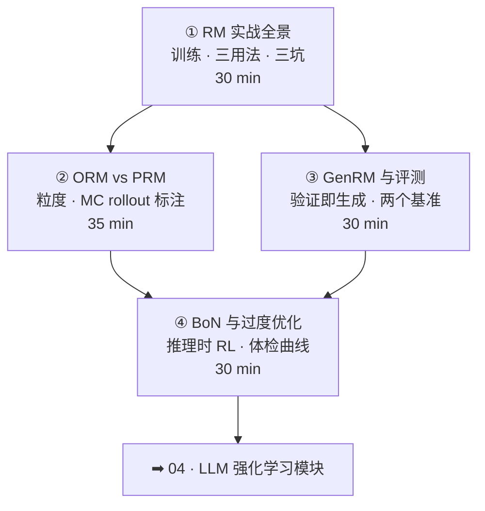

# 01-3 · 奖励模型（RM / PRM / GenRM）

> 对应 [ROADMAP Phase 1](../../ROADMAP.md) Week 4。四讲：RM 全景 → ORM vs PRM → GenRM 与评测 → BoN 与过度优化。
> 核心命题：**奖励的上限 = 对齐的上限。奖励信号的「粒度」与「可靠性」是两条主线。**

## 课程地图

## 讲次表

| 讲 | 目录 | 你将学会 | 对应论文 |
|---|---|---|---|
| ① | [01-rm-basics](01-rm-basics/index.md) | RM 训练与三用法；长度偏置体检 | InstructGPT · RewardBench |
| ② | [02-orm-vs-prm](02-orm-vs-prm/index.md) | 奖励粒度；MC rollout 自动标注 | Let's Verify · Math-Shepherd |
| ③ | [03-genrm-eval](03-genrm-eval/index.md) | 验证即生成；两类评测维度 | GenRM · ProcessBench |
| ④ | [04-bon-overoptimization](04-bon-overoptimization/index.md) | BoN 双上限；与 RL 的关系 | Overoptimization |

## 出口测试

- [ ] 讲清 PRM 赢 ORM 的条件与 MC rollout 标注算法
- [ ] 给你的业务 RM 设计一份「体检方案」（长度 ablation + BoN 曲线 + 内部评测集）
- [ ] 说出 BoN 饱和的两个上限与对应推高手段
- [ ] 实践 P6（训 RM + BoN 评估）完成，见 [03-practice](../../03-practice/README.md)

通过 → [04-rl-for-llm 课程地图](../04-rl-for-llm/README.md)
