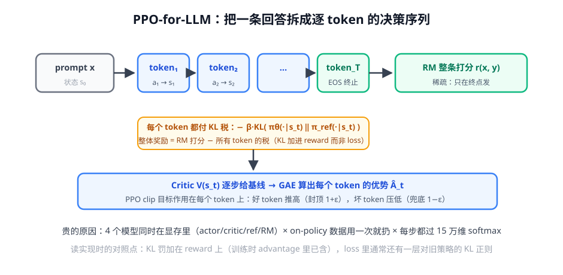
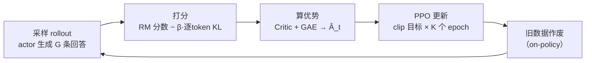

# 第 1 讲 · PPO-for-LLM：管线逐层拆开

> [!NOTE]
> ⏱ 45 分钟 ｜ 前置：[地基 · 第 3 讲 PPO](../../../00-foundations/03-ppo/index.md)、[地基 · 第 4 讲 KL](../../../00-foundations/04-kl-divergence/index.md) ｜ 下一讲：[02 · GRPO 推导](../02-grpo/index.md)
> 🔤 卡在符号？→ [符号速查表](../../../00-foundations/symbol-reference.md)
>
> 学完你能回答：**一条回答怎么变成逐 token 的 RL 决策？KL 罚加在哪？为什么这么贵？**

---

## 1. 一张图看懂

**关键转译**：地基课的 MDP 落地——prompt 是 s₀，每个 token 是动作 a_t，生成完新上下文是 s_t，RM 分数在终点发。

## 2. 一次训练迭代的时间线

## 3. 三个必懂的实现细节

| 细节 | 做法 | 为什么 |
|---|---|---|
| KL 加在哪 | 逐 token 加进 **reward**（−β·KL_t），不是 loss | 让 advantage 自然含「偏离成本」，credit 归到 token 级 |
| KL 怎么估 | k3 估计器（地基第 4 讲） | 直接 log 比值方差大 |
| advantage 归一化 | batch 内减均值除 std | 不做 → 更新尺度失控，训练必炸 |

## 4. 对你的工作意味着什么

- **显存账**：4 模型 × 权重+激活 ≈ 全参 PPO 的硬门槛；这是 GRPO（下一讲）出现的直接原因
- 读任何 RLHF 框架代码时，先找四样东西：rollout 循环、KL 罚位置、advantage 归一化、clip 目标——骨架都一样
- 调参心法：先看 KL 曲线（涨太快 → 加 β 或降 lr），再看 reward 曲线（涨但人评掉 → hacking，回地基模块第 4 讲）

## 5. 自测

① 为什么 KL 罚加进 reward 而不是 loss？

加进 reward → 计入 return → advantage 分配到每个 token（谁的偏离谁负责）；加在 loss 里则是全局平均，credit assignment 变粗。

② 「on-policy 数据用一次就扔」翻译成成本语言？

每一步梯度更新都需要重新生成 batch——采样（推理）算力常是训练算力的数倍，rollout 是 LLM RL 的成本大头。

③ advantage 不归一化会发生什么？

不同 batch 的 Â 尺度差异巨大（RM 分数范围不稳定），clip 的 ε 是按 ratio 定的，等价学习率剧烈波动 → 训练震荡。

## 6. 原始资料

见 [raw/RESOURCES.md](raw/RESOURCES.md)。
