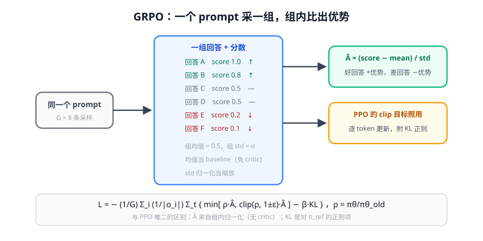

# 第 2 讲 · GRPO 推导：DeepSeek 的减法美学 ★

> [!NOTE]
> ⏱ 50 分钟 ｜ 前置：[第 1 讲 PPO-for-LLM](../01-ppo-for-llm/index.md)、[地基 · 第 2 讲 策略梯度](../../../00-foundations/02-policy-gradient/index.md) ｜ 下一讲：[03 · GRPO 变体地图](../03-grpo-variants/index.md)
> 🔤 卡在符号？→ [符号速查表](../../../00-foundations/symbol-reference.md)
>
> 学完你能回答：**GRPO 的 advantage 从哪来？它和 RLOO 什么关系？四个已知问题分别是什么？**

---

## 1. 一张图看懂

**一句话**：GRPO = PPO 砍掉 Critic，用「同一个 prompt 采 G 条回答，组内归一化的分数」当 advantage。

## 2. 为什么砍 Critic 是合理的

地基课讲过：advantage $A = G - b(s)$，$b$ 只要是**与动作无关的基线**就成立，不必是学出来的 V(s)。

- 同一组里其他回答的平均分，就是天然的基线（「你的同行平均水平」）
- 省掉 Critic = 省一个和 Actor 同规模的模型 → 显存/算力近半

## 3. 公式逐项读

$$\hat{A}_i \;=\; \frac{r_i \;-\; \text{mean}(r_1,\dots,r_G)}{\text{std}(r_1,\dots,r_G)}$$

| 符号 | 意思 | 备注 |
|---|---|---|
| $r_i$ | 第 i 条回答的奖励（RLVR 对错/RM 分） | 整条一个分（trajectory 级） |
| mean | 组内平均 | 充当 baseline（无偏） |
| std | 组内标准差 | 归一化：组内全同分 → 全 0（见问题③） |

$$\mathcal{L} = -\frac{1}{G}\sum_i \frac{1}{|o_i|}\sum_t \Big[\min\big(\rho_{i,t}\hat{A}_i,\; \text{clip}(\rho_{i,t}, 1{\pm}\epsilon)\hat{A}_i\big) \;-\; \beta\, D_{KL}\big(\pi_\theta\|\pi_{ref}\big)\Big]$$

与 PPO 比只有两处不同：**Â 的来源**（组内归一化 vs Critic+GAE）、**KL 变成对 π_ref 的显式正则项**。逐 token 展开与 clip 逻辑完全一致。

## 4. GRPO 的四个已知问题（变体的靶子）

| # | 问题 | 机制 |
|---|---|---|
| ① | 长度偏差 | loss 按回答平均（1/|o_i|），长回答单 token 权重被稀释 → 偏好短回答 |
| ② | std 归一化偏置 | 组内分差小时 std 小 → 梯度被放大，噪声变成「信心」 |
| ③ | 全对/全错组零梯度 | G 条全对（或全错）→ std=0 → Â 全 0 → 白采一组 |
| ④ | KL 淹没 clip | β 偏大时梯度主项变成 KL，clip 失去意义 |

> [!IMPORTANT]
> 下一讲的整个变体家族，就是对这四条的逐一修补。**先记住问题，再看修复**——这是读 RL 论文最快的方式。

## 5. 对你的工作意味着什么

- GRPO 是当前 LLM RL 的事实默认起点（R1 同款）：实现简单、显存友好、天然适配 RLVR 的 0/1 奖励
- G 的选择：8-16 常见；任务难时加大 G（否则全错组暴增 = 白花钱）——**先算你的任务「单 prompt 期望通过数」再定 G**
- RLOO（leave-one-out）是 GRPO 的精神前身：baseline = 除自己外的平均，方差性质略不同——面试常考对比

## 6. 自测

① 把 Â = (r−mean)/std 翻译成中文。

「这条回答比组内平均好多少，按组内波动归一」——相当于组内 z-score 排名。

② 数学题全错的组，GRPO 学到什么？DAPO 怎么办？

零梯度（std=0），纯浪费算力。DAPO 的 dynamic sampling：把全对/全错组丢掉重采，直到 batch 里有有效梯度组。

③ GRPO 与 RLOO 的 baseline 差异？

RLOO 的 baseline 是「除自己外」的平均（严格无偏）；GRPO 用包含自己的全组均值并除 std（引入轻微偏置换取尺度稳定）。

## 7. 原始资料

见 [raw/RESOURCES.md](raw/RESOURCES.md)。
