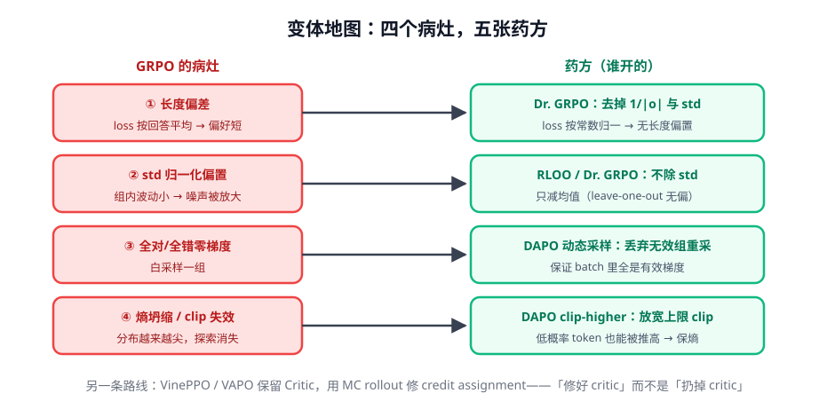

# 第 3 讲 · GRPO 变体地图：病灶与药方

> [!NOTE]
> ⏱ 40 分钟 ｜ 前置：[第 2 讲 GRPO](../02-grpo/index.md) ｜ 下一讲：[04 · RLVR 与 verl](../04-rlvr-and-verl/index.md)
> 🔤 卡在符号？→ [符号速查表](../../../00-foundations/symbol-reference.md)
>
> 学完你能回答：**每个变体修的是上一讲四个问题里的哪一个？改动落在公式哪一项？**

---

## 1. 一张图看懂

## 2. 逐个对账（改动 vs 公式位置）

| 变体 | 公式改动 | 修哪个病灶 | 备注 |
|---|---|---|---|
| **Dr. GRPO** | 去掉 1/\|o_i\|（按常数归一）；去掉 std | ①② | 「偏置的来源是两个除法」 |
| **RLOO** | baseline = 除自己外的组均值 | ②（顺带①的弱化版） | 严格无偏，最朴素 |
| **REINFORCE++** | 朴素 PG + 全套经典技巧（基线/裁剪/KL） | 稳定性 | 「回到 REINFORCE 再认真加装备」 |
| **DAPO** | clip-higher（上界放宽 ε_high）+ dynamic sampling + token 级 loss + 过长过滤 | ③④① | 工程细节密度最高的论文 |
| **VinePPO** | 每步用 MC rollout 估计 V 替代 Critic 网络 | credit assignment | 不训 critic 但保留 value 思想 |
| **VAPO** | value-based 完整管线（推理任务上超 GRPO 系） | 整体路线之争 | 「critic 没死，只是没训好」 |

> [!IMPORTANT]
> 读变体论文的正确姿势：**先找它说的「GRPO 的病」，再对照它改的公式项**。
> 大多数变体的 diff 小到只有几行——RL 论文的创新密度在「发现病灶」而非「代码量」。

## 3. DAPO 四件套展开（值得背）

1. **clip-higher**：上界 ε_high > 下界 ε——低概率 token 不被 clip 锁死 → 保持探索（防熵坍缩）
2. **dynamic sampling**：全对/全错组丢弃重采 → batch 全是有效梯度
3. **token 级 loss**：去掉按回答平均 → 修长度偏差（同 Dr. GRPO 的药方之一）
4. **overlong 过滤**：超长截断的样本不参与 loss → 防止惩罚「被截断的探索」

## 4. 对你的工作意味着什么

- 实践默认栈：**GRPO + DAPO 的 dynamic sampling + token 级 loss**，几乎无理由从更花哨的起步
- 熵是你的体检指标：训练中熵一路下降且采样多样性变差 = 坍缩前兆（加 clip-higher、降 lr、检查奖励太稀疏）
- VAPO 路线提醒我们：0/1 稀疏奖励 + 长回答时，value-based 值得留在工具箱里

## 5. 自测

① Dr. GRPO 说的「两个除法」是哪两个？

① loss 按 |o_i| 平均（长回答被稀释 → 长度偏差）；② advantage 除以组内 std（分差小时放大噪声）。

② clip-higher 为什么能防熵坍缩？

对称 clip 下，低概率「好 token」的 ρ 很快顶到 1+ε，梯度被封死 → 永远推不高 → 分布变尖。放宽上界让新探索有机会长大。

③ VinePPO 和 GRPO 的哲学差异一句话？

GRPO：critic 不好 → 扔掉换组基线；VinePPO：critic 不好 → 用真 rollout 把它算准。殊途同归于「advantage 要准」。

## 6. 原始资料

见 [raw/RESOURCES.md](raw/RESOURCES.md)。
