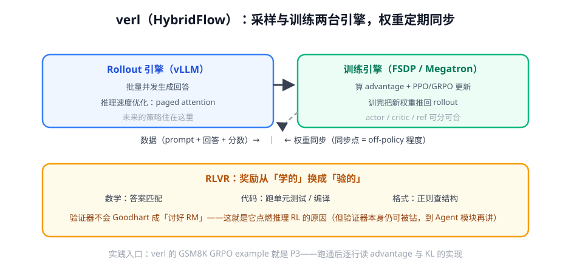

# 第 4 讲 · RLVR 与 verl：奖励换源 + 架构落地

> [!NOTE]
> ⏱ 40 分钟 ｜ 前置：[第 3 讲 变体地图](../03-grpo-variants/index.md) ｜ 下一站：[05 · 推理模型模块](../../05-reasoning/README.md)
> 🔤 卡在符号？→ [符号速查表](../../../00-foundations/symbol-reference.md)
>
> 学完你能回答：**RLVR 的「可验证」具体指什么？verl 的两引擎架构为什么要权重同步？**

---

## 1. RLVR：把奖励从「学的」换成「验的」

| 验证器 | 奖励 | 防 hack 手段 |
|---|---|---|
| 数学答案匹配 | 对 1 错 0 | 答案抽取规则严格化、防格式钓鱼 |
| 单元测试 | 通过率 | 测试用例质量本身是瓶颈 |
| 编译/执行 | 能否跑通 | 弱信号：能跑 ≠ 对 |
| 格式正则 | 结构奖励（小权重） | 权重过大 → 模型只凑格式 |

> [!IMPORTANT]
> RLVR 点燃推理 RL 的本质：**验证器 = 无限量、无偏、成本趋零的 RM**。
> 偏好对齐时代的所有「RM 上限」焦虑被绕开了。注意它没消除 Goodhart——只是把 hacking 从「讨好 RM」变成「钻验证器空子」（边界 case、凑格式），奖励设计纪律依然需要。

## 2. verl 的两引擎架构

- **Rollout 引擎（vLLM）**：只管生成，批量并发榨吞吐
- **训练引擎（FSDP/Megatron）**：只管梯度更新
- 两者之间是**权重同步**：训练推进 → 新权重推给 rollout → 下一批采样

**为什么要同步点**：on-policy 要求采样分布 ≈ 当前策略。同步间隔越大，「采样用的策略」与「被更新的策略」差得越远 → 越接近 off-policy，clip/KL 的前提开始失真。工程上就是**吞吐 vs 新鲜度的权衡**。

## 3. 对你的工作意味着什么

- **P3 实战入口**：verl 官方 GSM8K GRPO example（Qwen2.5-1.5B），单机单卡可跑通；跑通后做三件事——看 reward 曲线、读 `core_algos` 的 GRPO 实现、做一次消融（关掉 advantage 归一化）
- 设计你自己的 RLVR 任务时的检查单：验证器可自动化？答案抽取无歧义？格式奖励权重 < 0.1 × 正确性？测试集与训练题去污染？
- verl 的架构思想（采样/训练分离、权重同步）是所有生产级 LLM RL 系统的原型——以后读任何公司的技术报告都在讲同一件事

## 4. 自测

① RLVR 为什么天然抗 Goodhart？它的残余风险是什么？

验证器直接测目标本身（对/错），不存在 proxy 与目标的分歧。残余风险：验证器覆盖不全（弱测试用例、可凑格式），模型钻覆盖外的空子。

② 权重同步间隔变大，等价于什么？

采样策略落后于训练策略 → 数据 off-policy 程度上升 → PPO/GRPO 的重要性比失真，训练稳定性下降，但采样吞吐提升。

③ 格式奖励为什么必须小权重？

格式是最容易先拿满的信号：权重大 → 模型先收敛到「格式投机」就停了，正确性的梯度被淹没。

## 5. 原始资料

见 [raw/RESOURCES.md](raw/RESOURCES.md)。
