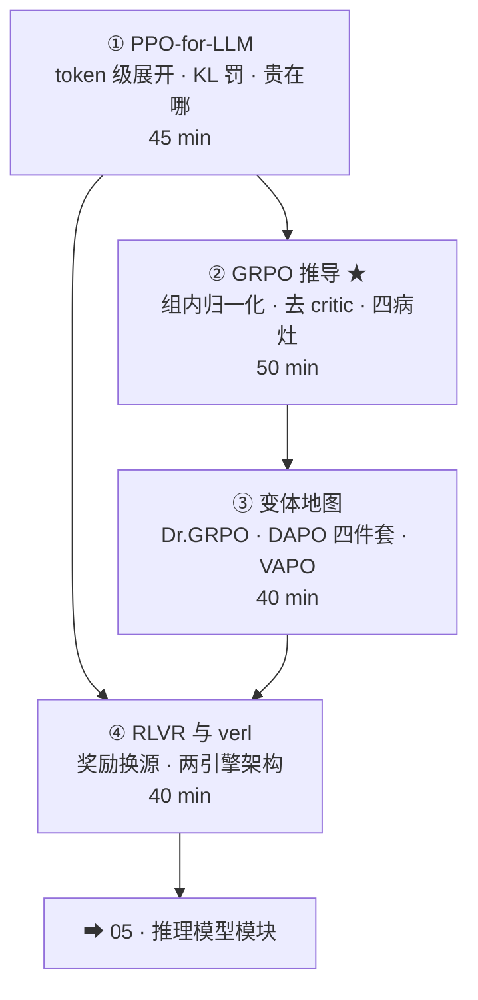

# 01-4 · LLM 强化学习（PPO / GRPO / RLVR）★★

> 对应 [ROADMAP Phase 1](../../ROADMAP.md) Week 5-6，全库最重要模块。四讲：PPO 管线 → GRPO 推导 → 变体地图 → RLVR 与 verl。
> 核心命题：**Advantage 的质量是第一杠杆；奖励换源（RLVR）是推理时代点火器；架构（verl）决定你能跑多大。**

## 课程地图

## 讲次表

| 讲 | 目录 | 你将学会 | 对应论文 |
|---|---|---|---|
| ① | [01-ppo-for-llm](01-ppo-for-llm/index.md) | token 级决策序列；KL 罚位置；成本结构 | InstructGPT · TRL |
| ② | [02-grpo](02-grpo/index.md) | GRPO 公式逐项；四个已知问题 | DeepSeekMath · RLOO |
| ③ | [03-grpo-variants](03-grpo-variants/index.md) | 病灶→药方对账；DAPO 四件套 | Dr. GRPO · DAPO · VAPO |
| ④ | [04-rlvr-and-verl](04-rlvr-and-verl/index.md) | 验证器设计；两引擎架构与权重同步 | DeepSeek-R1 · HybridFlow |

## 出口测试

- [ ] 白板推导 GRPO loss（从 PPO 出发说清两处差异）
- [ ] 对着变体地图复述「病灶→药方」对账表
- [ ] 给一个新任务设计 RLVR 奖励（用第 4 讲检查单）
- [ ] P3 完成：verl 跑通 GRPO + `core_algos` 源码笔记，见 [03-practice](../../03-practice/README.md)

通过 → [05-reasoning 课程地图](../05-reasoning/README.md)
