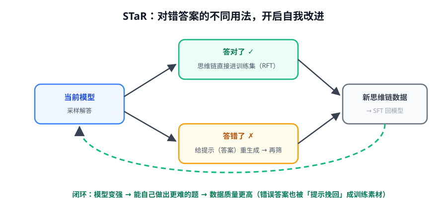
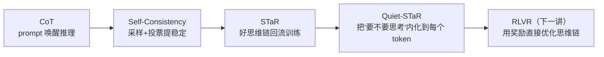

# 第 1 讲 · 前史：CoT 到 STaR，推理变成可训练的对象

> [!NOTE]
> ⏱ 35 分钟 ｜ 前置：[地基 · 第 6 讲 全景](../../../00-foundations/06-llm-training-panorama/index.md) ｜ 下一讲：[02 · DeepSeek-R1 精读](../02-deepseek-r1/index.md)
> 🔤 卡在符号？→ [符号速查表](../../../00-foundations/symbol-reference.md)
>
> 学完你能回答：**CoT 为什么有效？STaR 怎么把「对/错答案」都变成训练数据？**

---

## 1. CoT：推理能力的「唤醒」而不是「注入」

- CoT（2022）：prompt 里给几个带推理步骤的例子 → 模型输出中间步骤 → 复杂题准确率大涨
- 关键认识：**base model 在预训练里已经见过海量推理文本**；CoT 只是给了它「展开思考」的输出格式
- Self-Consistency（采样 N 条投票）证明：CoT 的收益有方差，多次采样取众数更稳

> [!TIP]
> 这给我们的「论文级启示」：后训练时代很多突破都是**唤起 + 放大已有能力**，而不是无中生有——这个视角贯穿 R1。

## 2. STaR：第一次把「生成思维链」变成训练循环

STaR 的两个机制：

| 情况 | 处理 | 名字 |
|---|---|---|
| 答对了 | 该题的思维链直接进 SFT 集 | Rationalization / RFT |
| 答错了 | 把正确答案当提示喂回去，重生成思维链，对了再进集 | hint 挽回 |

- 意义：**错误不再是废料**——两种情况都能产出「以正确结论收尾的推理链」
- 局限：仍是 SFT（模仿自己的好输出），没有「被惩罚」的信号——这正是后来 RLVR 要补的

## 3. 演进逻辑链（记住这条线）

Quiet-STaR 一句话：不只在「答题时」思考，在**每个 token 后**都生成隐藏理由，思考内化为默认行为——它是「推理模型」概念的哲学前身。

## 4. 对你的工作意味着什么

- STaR 闭环（生成→按结果筛选→回流训练）是你能在业务里**立刻复刻**的最小自我改进：错误样本 + 提示重写 = 免费的难例数据
- CoT 效果不稳定时先上 self-consistency（纯推理侧），再考虑训练——便宜的旋钮先拧

## 5. 自测

① STaR 对错答案的两种用法分别是什么？

答对：思维链直接进集（RFT）；答错：给正确答案作提示重生成，生成对了再进集（rationalization 挽回）。

② STaR 与 RLVR 的本质差别？

STaR 只筛选正样本做 SFT（没有负梯度、没有惩罚）；RLVR 用奖励直接做策略优化，错答案以负优势参与更新。

③ 为什么说 CoT 是「唤醒」？

推理文本在预训练语料中大量存在；CoT 只是把输出格式改成「先推理后答案」，让已有能力被表达出来。

## 6. 原始资料

见 [raw/RESOURCES.md](raw/RESOURCES.md)。
