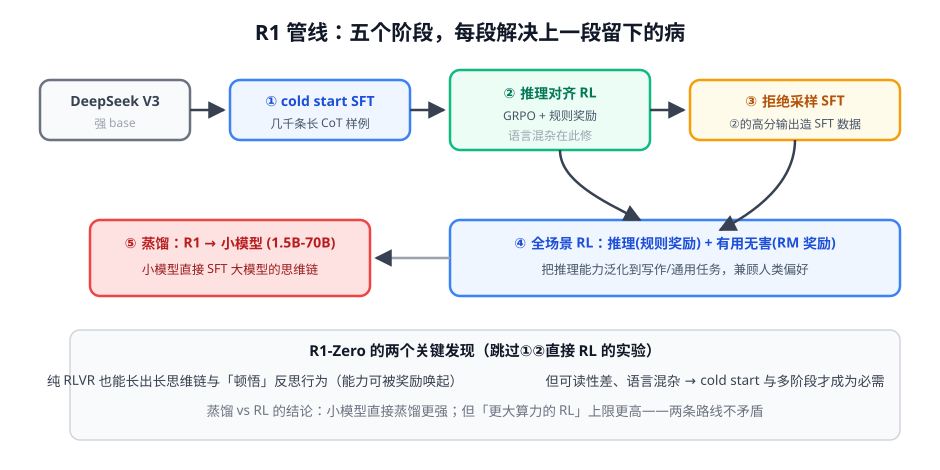

# 第 2 讲 · DeepSeek-R1 精读：推理 RL 的完整蓝图 ★

> [!NOTE]
> ⏱ 50 分钟 ｜ 前置：[第 1 讲 前史](../01-cot-to-star/index.md)、[04-rl-for-llm · 第 2 讲 GRPO](../../04-rl-for-llm/02-grpo/index.md) ｜ 下一讲：[03 · Test-Time Scaling](../03-test-time-scaling/index.md)
> 🔤 卡在符号？→ [符号速查表](../../../00-foundations/symbol-reference.md)
>
> 学完你能回答：**R1-Zero 证明了什么？五阶段管线各自治什么病？蒸馏和 RL 怎么选？**

---

## 1. 一张图看懂

## 2. R1-Zero：一次「只发奖励」的大胆实验

直接在 base 上跑 GRPO + 规则奖励（答案对 + 格式对），跳过所有 SFT：

| 观察到的涌现 | 说明什么 |
|---|---|
| 响应平均长度持续增长 | 模型自己发现「多想 = 多对」（奖励只看对错） |
| 出现「顿悟时刻」：中途自我质疑、回溯 | 反思行为可以被奖励塑造出来 |
| 语言混杂、可读性差 | 纯奖励优化的副作用 |

> [!IMPORTANT]
> R1-Zero 的历史意义：**证明了复杂推理行为可以只靠「结果对错」的奖励长出来**，不需要过程标注（PRM）、不需要人类示范推理。
> 这就是 RLVR 范式的加冕礼。

## 3. 五阶段管线：每段治什么病

| 阶段 | 治什么病 | 关键点 |
|---|---|---|
| ① cold start SFT | R1-Zero 的可读性差、语言混杂 | 几千条精心写的长 CoT 起步 |
| ② 推理 RL (GRPO) | 能力上强度 | 规则奖励；加语言一致性奖励修混杂 |
| ③ 拒绝采样 SFT | ②只会做题，不会说人话 | 用②的高分输出+V3 数据混合重 SFT |
| ④ 全场景 RL | 推理与偏好兼得 | 数学/代码用规则奖励，通用用 RM |
| ⑤ 蒸馏小模型 | 让小模型也能推理 | 直接 SFT 大模型的思维链，不走 RL |

## 4. 蒸馏 vs RL：论文给出的答案

| 维度 | 蒸馏（SFT 大模型轨迹） | 小模型自己 RL |
|---|---|---|
| 成本 | 低（一份数据多处用） | 高（每个模型都要跑） |
| 效果 | 同尺寸下**更强** | 略弱 |
| 上限 | 受老师限制 | **更大算力可超越** |

> [!TIP]
> 实践翻译：追求「小模型快速可用」→ 蒸馏；追求「能力天花板」→ RL。R1 团队两条都做，因为它们服务不同产品层。

## 5. 对你的工作意味着什么

- 复刻优先级：⑤（蒸馏）最容易 → ②（单阶段 GRPO）需要算力但配方公开 → 完整管线是 DeepSeek 级工程
- 「响应长度曲线」是你 mini-R1（第 4 讲）最重要的观察对象：它是最早出现的涌现信号
- 检查你业务的「推理类任务」清单：凡是答案可验证的，都是 RLVR + R1 配方的候选地

## 6. 自测

① R1-Zero 证明了什么、没证明什么？

证明：纯规则奖励 RL 能长出长思维链与反思行为。没证明：这样得到的模型可读/可用（语言混杂需 cold start 修复）。

② 阶段③为什么需要「拒绝采样」？

把②产出的高分推理轨迹变成干净 SFT 数据——用自己最强输出教自己说话（BoN 造数据：奖励模型模块第 4 讲的伏笔）。

③ 蒸馏对小模型有效说明什么？

推理模式可以显式表达在文本中并被模仿习得——「会推理」不一定要「亲历 RL 探索」才能学到基础形态。

## 7. 原始资料

见 [raw/RESOURCES.md](raw/RESOURCES.md)。
