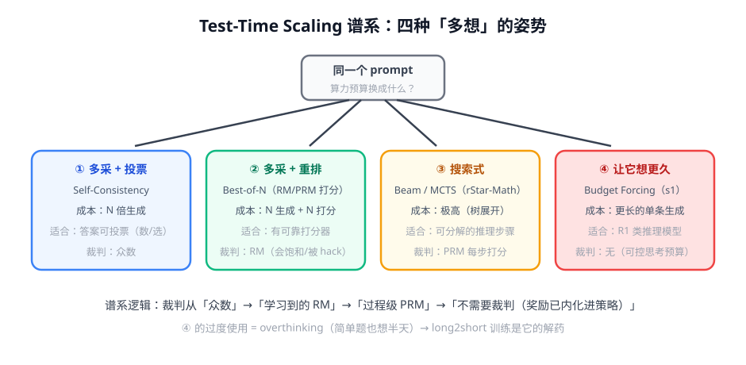

# 第 3 讲 · Test-Time Scaling：推理时算力怎么花

> [!NOTE]
> ⏱ 40 分钟 ｜ 前置：[第 2 讲 R1](../02-deepseek-r1/index.md)、[奖励模型 · 第 4 讲 BoN](../../03-reward-models/04-bon-overoptimization/index.md) ｜ 下一讲：[04 · mini-R1 实战](../04-mini-r1-practice/index.md)
> 🔤 卡在符号？→ [符号速查表](../../../00-foundations/symbol-reference.md)
>
> 学完你能回答：**四种 test-time scaling 各自的算力-收益特征？什么场景选哪种？**

---

## 1. 一张图看懂

## 2. 四种姿势的对账表

| 方法 | 怎么花算力 | 裁判 | 主要风险 |
|---|---|---|---|
| ① Self-Consistency | 采 N 条投票 | 众数 | 答案不可投票时失效 |
| ② Best-of-N | 采 N 条 + RM 选 | RM/PRM | 排序偏置、饱和（奖励模块第 4 讲） |
| ③ 搜索式（MCTS） | 树展开 + 过程打分 | PRM | 成本爆炸；PRM 误差沿树放大 |
| ④ Budget Forcing | 单条想更久 | 无（策略已内化奖励） | overthinking；预算上限 |

- s1 的贡献是④的可控旋钮：**「Wait，再想想」延长思考**与「强制截止」压缩思考——思考长度变成可调参数
- rStar-Math 的贡献是③的工程化：MCTS + PRM + 自举，小模型做题逼近大模型——代价是巨大的搜索算力

## 3. 两条互补的 scaling 轴

- 训练时 scaling：一次性贵，之后免费享受（R1 路线）
- 推理时 scaling：每次付费，可紧急拉高（BoN/搜索）
- 两者**互补而非替代**：推理模型 + 推理时调度 = 生产标配

## 4. 对你的工作意味着什么

- 选型决策树：答案可投票？→ ①。有好 RM？→ ②。步骤可分解且值钱？→ ③。有 R1 类模型？→ ④（思考预算做成产品参数）
- overthinking 监控：统计「简单题的平均思考长度」，上涨就是信号（成本×延迟双杀）；解药是 long2short 训练或路由
- 成本换算直觉：①②成本 ≈ N 倍；③ ≈ 10-100 倍；④ ≈ 2-5 倍（长输出）——先④后①②，③留给高价值场景

## 5. 自测

① ②和③的裁判有什么本质区别？

②裁判看整条回答（结果级 RM）；③裁判看每一步（过程级 PRM），因此能中途剪枝——裁判粒度决定了搜索可行性。

② budget forcing 为什么不需要裁判？

奖励已经内化进策略（R1 类模型被 RLVR 训练过）：延长思考本身就在提升正确率，无需外部打分，只要控制「想多久」。

③ overthinking 在监控里长什么样？

简单题（人评难度低）的平均生成 token 数上升、延迟上升而准确率不变——典型的「无收益思考」。

## 6. 原始资料

见 [raw/RESOURCES.md](raw/RESOURCES.md)。
