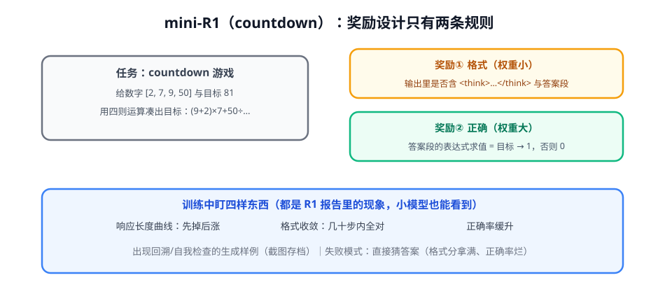

# 第 4 讲 · mini-R1 实战：亲手看一次涌现（P4）

> [!NOTE]
> ⏱ 60 分钟（动手）｜ 前置：前三讲 + [04-rl-for-llm P3](../../04-rl-for-llm/README.md) ｜ 下一站：[02-agentic · Agent 算法模块](../../../02-agentic/README.md)> 🔤 卡在符号？→ [符号速查表](../../../00-foundations/symbol-reference.md)
>
> 目标：用 verl 在小模型上跑 countdown 任务，亲眼看到「响应变长 + 顿悟」。（对应 [03-practice P4](../../../03-practice/README.md)）

---

## 1. 任务与奖励设计

**为什么选 countdown**：题目可无限程序化生成（防背题）、验证器一行代码（表达式求值 == 目标）、难度可调（数字个数）。

## 2. 配置起点

| 项 | 起点 | 说明 |
|---|---|---|
| 模型 | Qwen2.5-1.5B / 3B | base 而非 instruct（复刻 R1-Zero 路线） |
| 算法 | GRPO，G = 8 | 全错组多 → 加 G 或上 dynamic sampling |
| 奖励 | 格式 0.1 + 正确 1.0 | 严格小权重 |
| 数据 | 程序生成 5-10 万题 | 每题数字随机 |
| 步数 | 300-500 步内应见现象 | 不行先查奖励实现 |

## 3. 观察清单（本实验的灵魂）

1. **响应长度曲线**：早期下降（先学格式）、中期开始上涨（发现「多想有用」）——这就是 R1 报告现象的 mini 版
2. **格式收敛**：几十步内格式分拉满；若拉满后正确率仍烂 → 出现「格式投机」，检查正确性奖励是否生效
3. **生成样例巡检**：每 50 步人读 10 条——捕捉第一段「等等，我算错了，重来」
4. **防 hack 自检**：抽答案分布，确认模型没学会「只输出常见数字组合」

> [!IMPORTANT]
> 实验记录照 [03-practice 五段格式](../../../03-practice/README.md) 存档。**看到拐点那天，你对「涌现」的理解就从名词变成了动词**——这是 P4 的真正交付物。

## 4. 常见失败模式与处置

| 症状 | 诊断 | 处置 |
|---|---|---|
| 奖励恒 0 | 格式/抽取器 bug | 先用随机输出测验证器 |
| 全对组极多 | 任务太简单 | 加数字个数提高难度 |
| 全错组极多 | 任务太难 / 模型太弱 | 减数字、换大模型、加 G |
| 响应无限变长 | 奖励只看对错不管长度 | 加长度惩罚或过long过滤（DAPO 套路） |
| 学会固定套路 | 题目多样性不足 | 增加生成随机维度 |

## 5. 自测

① 为什么用 base 模型而不是 instruct？

复刻 R1-Zero：观察「纯 RLVR 从头塑造行为」；instruct 模型已带对齐行为，现象被污染。

② 「响应长度先降后升」的两段分别是什么？

先降：模型抛弃啰嗦输出、快速学格式；后升：发现长思考提升正确率，主动展开探索。

③ 本实验和 R1 的最大差距在哪？

规模（模型/数据/步数）与管线（只有②没有③④⑤）；但「奖励→行为」的因果现象同构，这就是它的教学价值。

## 6. 原始资料

见 [raw/RESOURCES.md](raw/RESOURCES.md)。
