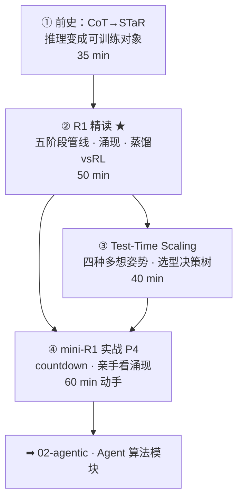

# 01-5 · 推理模型（Reasoning Models）

> 对应 [ROADMAP Phase 2](../../ROADMAP.md)。四讲：前史 → R1 精读 → test-time scaling → mini-R1 实战。
> 核心命题：**可验证的奖励 + 策略优化 = 「会思考」可以被训练出来。这是 agentic RL 的直接前置。**

## 课程地图

## 讲次表

| 讲 | 目录 | 你将学会 | 对应论文 |
|---|---|---|---|
| ① | [01-cot-to-star](01-cot-to-star/index.md) | CoT/STaR/自举闭环的演进逻辑 | CoT · STaR · Self-Consistency |
| ② | [02-deepseek-r1](02-deepseek-r1/index.md) | R1-Zero 涌现；五阶段各治什么病；蒸馏vsRL | DeepSeek-R1 · Kimi k1.5 |
| ③ | [03-test-time-scaling](03-test-time-scaling/index.md) | 四种姿势对账；overthinking 监控 | s1 · rStar-Math |
| ④ | [04-mini-r1-practice](04-mini-r1-practice/index.md) | 跑通 P4；观察涌现；防格式投机 | TinyZero（项目） |

## 出口测试

- [ ] 讲清「RLVR vs 蒸馏」的本质差异与各自适用场景（附 P4 证据）
- [ ] 白板画出 R1 五阶段管线并说每段治什么病
- [ ] 给四种 test-time scaling 做场景选型
- [ ] P4 实验记录完成（响应长度曲线 + 拐点样例截图）

通过 → [02-agentic 课程地图](../../02-agentic/README.md)
