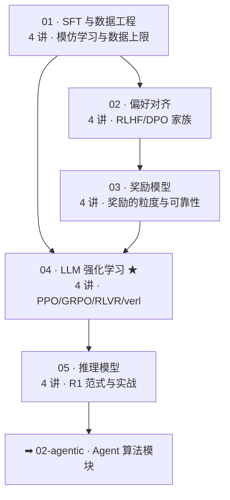

# 01 · 后训练主线（Post-Training Core）★本库核心

> 对应 [ROADMAP Phase 1-2](../ROADMAP.md)。**五个模块、20 讲，全部可直接阅读**，每讲「图 > 表 > 公式 > 文字」，含自测与原始资料索引。
> 出口标准：做出一次 45 分钟的「从 SFT 到 GRPO」内部分享；能独立跑通 verl 的一个 RL 实验。

## 课程地图

推荐顺序：01 → 02 → 03 → 04 → 05（02 与 03 可互换；04 依赖 01-03 的全部概念）。

## 各模块入口

| 模块 | 内容 | 讲次 |
|---|---|---|
| [01 SFT 与数据](01-sft-and-data/README.md) | 指令微调 · 数据工程 · LoRA · P1 实战 | 4 |
| [02 偏好对齐](02-preference-alignment/README.md) | RLHF 三阶段 · DPO 推导 ★ · 变体 · hacking | 4 |
| [03 奖励模型](03-reward-models/README.md) | RM 全景 · PRM · GenRM · BoN | 4 |
| [04 LLM 强化学习](04-rl-for-llm/README.md) ★ | PPO-for-LLM · GRPO · 变体地图 · RLVR/verl | 4 |
| [05 推理模型](05-reasoning/README.md) | 前史 · R1 精读 ★ · TTS · mini-R1 实战 | 4 |

## 与实践线的对应

| 实践 | 在哪个讲次启动 |
|---|---|
| P1 SFT 小模型 | 01 模块第 4 讲 |
| P2 手写 mini-DPO | 02 模块第 2 讲后 |
| P6 训 RM + BoN | 03 模块第 4 讲后 |
| P3 verl GRPO | 04 模块第 4 讲后 |
| P4 mini-R1 | 05 模块第 4 讲 |

实践规范统一在 [03-practice](../03-practice/README.md)。

## 阶段里程碑

完成本目录后：能读懂数学/代码方向新 RL 论文的 method 节；能对着任何一篇新 GRPO 变体论文说出「它改的是公式哪一项、修的是哪个病灶」；能独立设计一个 RLVR 任务的奖励并跑通 verl。
