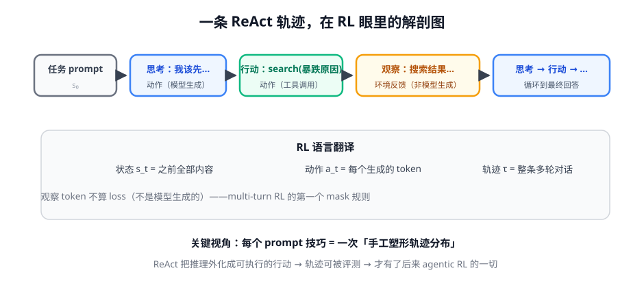

# 第 1 讲 · ReAct 与轨迹视角：你已经在做 RL 了

> [!NOTE]
> ⏱ 40 分钟 ｜ 前置：[地基 · 第 1 讲 MDP](../../../00-foundations/01-mdp/index.md) ｜ 下一讲：[02 · 反思与规划](../02-reflection-planning/index.md)
> 🔤 卡在符号？→ [符号速查表](../../../00-foundations/symbol-reference.md)
>
> 学完你能回答：**你的 agent 一次运行怎么翻译成 (s, a, o) 序列？为什么说 ReAct 是「可被 RL 的接口」？**

---

## 1. 一张图看懂

## 2. 换一副眼镜：工程实践 = 轨迹塑形

| 你每天做的事 | RL 视角下是什么 |
|---|---|
| 写 system prompt | 约束初始策略的支撑集 |
| few-shot 示例 | 手工把轨迹分布拉向高质量区 |
| 强制输出格式 | 缩小动作空间 |
| 失败重试 + 反思 prompt | test-time 的轨迹修正 |
| 换更强的模型 | 直接换策略 |

> [!IMPORTANT]
> 这些手段的共同点：**不改变参数，只改变采样**。RL 要做的事一样——塑形轨迹分布——只是把「手工」换成「用奖励自动学」。
> 这就是为什么你会写 agent 却还要学算法：手工塑形到不了的地方（模型没见过的输入组合），只有训练能到。

## 3. ReAct 的历史地位（论文只做对了一件事）

- ReAct 本身只是「交错输出思考和行动 + 解析执行」——工程上你早已超过它
- 它的历史贡献是把**推理外化为可执行、可观测、可评测的轨迹**：轨迹有成功/失败 → 有了奖励 → 有了可优化性
- 后面第 4 模块的所有 agentic RL，训练的正是「这条轨迹的生成概率」

## 4. 对你的工作意味着什么

- 复盘你手头最成熟的 agent：把一条典型成功轨迹和失败轨迹各拉出来——**这两条轨迹的 diff，就是你业务里最值钱的训练信号**（第 4 模块会把它变成 GRPO 数据）
- 动作空间设计（工具数量、粒度、描述质量）直接决定后续 RL 的探索难度——现在多花的心思，训练时都会还你

## 5. 自测

① 一条 5 轮工具调用的 agent 运行，RL 记账记几条轨迹？

1 条轨迹（一个 episode），内含多轮 (s, a, o)；每轮的多个 token 都是动作步。轨迹数按「从任务开始到终止」计，不按轮数计。

② 观察（搜索结果）的 token 为什么训练时不该算 loss？

它们不是模型生成的，没有策略概率可言；算进 loss 等于训练模型「模仿搜索结果」，梯度全是噪声。

③ 把「few-shot 示例」翻译成 RL 语言。

给初始策略增加一批高质量演示轨迹 → 等价于行为克隆式地拉高目标行为先验（SFT 的 in-context 版本）。

## 6. 原始资料

见 [raw/RESOURCES.md](raw/RESOURCES.md)。
