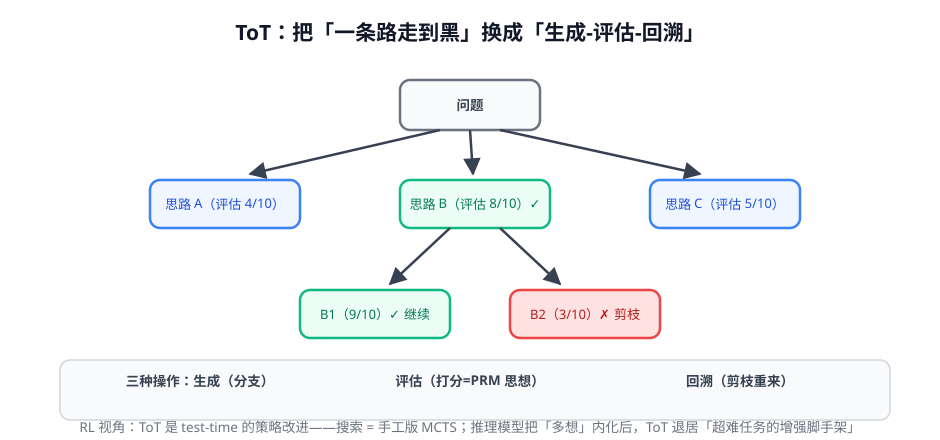

# 第 2 讲 · 反思与规划：test-time 的策略改进

> [!NOTE]
> ⏱ 35 分钟 ｜ 前置：[第 1 讲 ReAct 与轨迹视角](../01-react-trajectory/index.md) ｜ 下一讲：[03 · 工具调用训练](../03-tool-learning/index.md)
> 🔤 卡在符号？→ [符号速查表](../../../00-foundations/symbol-reference.md)
>
> 学完你能回答：**Reflexion 的「记忆」存的是什么？ToT 的评估器和 PRM 什么关系？推理模型时代还需要外部 scaffold 吗？**

---

## 1. 一张图看懂 ToT

## 2. 两种机制，一个本质

| 机制 | 怎么做 | 存的是什么 | RL 视角 |
|---|---|---|---|
| Reflexion | 失败后把「语言化教训」写进下次的上下文 | 失败轨迹的**自我总结** | 无参数的情景记忆；轨迹间学习 |
| ToT | 每层生成多个候选 → 评估 → 剪枝回溯 | 中间状态的**价值评估** | test-time 的策略改进（≈手工 MCTS） |

> [!IMPORTANT]
> 演进的合流点：**Reflexion 的反思能力、ToT 的多路探索，后来都被推理模型「吞进肚里」**——R1 类模型的长思维链里，你看到的就是内置的反思（「等等，重新想」）和隐式的多路尝试。
> 判断 scaffold 是否还需要：任务难到「一次生成都放不下思考过程」（超大搜索空间、需要外部状态）→ 仍要；否则模型内置思考更便宜。

## 3. 评估器是关键（又是奖励问题）

- ToT 成败在「中间状态打分准不准」——PRM 思想（奖励模型模块第 2 讲）
- 打分方式三档：模型自评（便宜但自恋）/ 专门 PRM（准但贵）/ 执行反馈（最硬：代码跑通了没有）
- **有执行反馈的任务，优先用执行反馈**——这是你业务的天然优势

## 4. 对你的工作意味着什么

- 你业务里所有「失败后重试」的逻辑，升级方向就是 Reflexion：把 `重试 N 次` 换成 `带着失败教训重试`
- 长程规划类任务先测 ToT 式并行采样+评估（便宜），不够再上推理模型长思考
- 每次加 scaffold 前问一句：这个能力值不值得直接训练进模型？（第 4 讲工具学习的训练视角）

## 5. 自测

① Reflexion 的「记忆」和 RAG 的检索有什么区别？

Reflexion 存的是「自己失败的自我总结」（任务特定、短命）；RAG 检索的是外部知识（任务无关、长寿）。一个是经验，一个是知识。

② ToT 的剪枝依据和 RL 的 advantage 什么关系？

评估分 ≈ 状态价值 V(s)：高分继续、低分剪枝就是「按预期回报选择分支」——贪心版的价值搜索。

③ 什么情况下外部 scaffold 仍然不可替代？

需要外部真实反馈（执行代码/查库）、搜索空间大到单条生成装不下、或失败代价高需要显式回滚的场景。

## 6. 原始资料

见 [raw/RESOURCES.md](raw/RESOURCES.md)。
