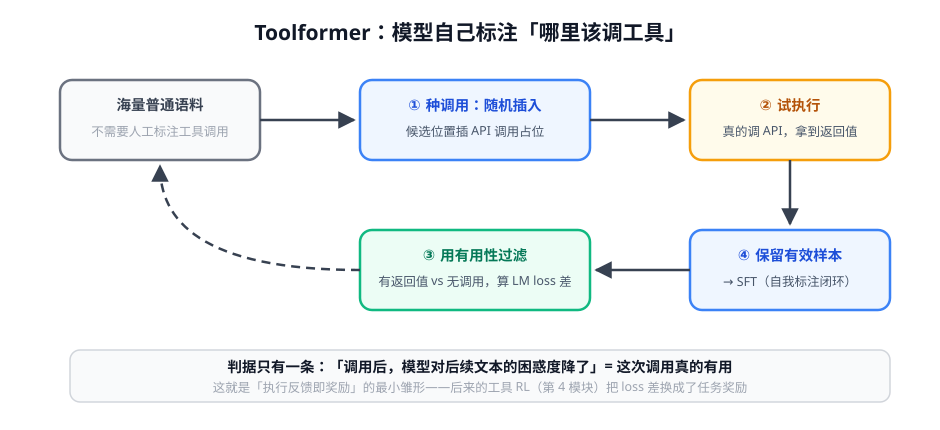

# 第 3 讲 · 工具调用训练：从会调到调得准

> [!NOTE]
> ⏱ 35 分钟 ｜ 前置：[第 1 讲 ReAct](../01-react-trajectory/index.md) ｜ 下一站：[02-agentic-rl 模块](../../02-agentic-rl/README.md)
> 🔤 卡在符号？→ [符号速查表](../../../00-foundations/symbol-reference.md)
>
> 学完你能回答：**工具调用的训练数据从哪来？「会填参数」和「会选工具」差在哪？**

---

## 1. 一张图看懂：Toolformer 自标注闭环

## 2. 工具学习的三层能力

| 层 | 能力 | 训练方式 | 常见失败 |
|---|---|---|---|
| 选不选 | 判断此刻该不该调工具 | 数据里混「不需要调用」的正例 | 幻觉调用：不需要也调 |
| 选哪个 | 从 N 个工具里挑对 | 多工具覆盖 + 描述质量 | 相似工具混淆 |
| 怎么填 | 参数正确、格式合法 | 执行反馈过滤 + 格式奖励 | 参数幻觉、JSON 不合法 |

> [!IMPORTANT]
> 你的工具**文档（描述/参数说明）就是模型的教材**——scaffold 时代写描述是 prompt 工程，训练时代写描述是造训练数据。
> 同一份文档，两种用途。

## 3. 执行反馈：免费的奖励信号

- 调用成功（200 返回、编译通过、查询非空）= 天然的正信号，无需人工标注
- Gorilla 用检索增强缓解 API 幻觉；SWE-agent 把「interface 设计」当一等公民：**动作空间设计得好，模型少走弯路**
- 与地基课相连：执行反馈就是环境的 reward —— 工具调用是最容易「奖励可验证化」的 agent 行为（第 4 模块的 RLVR 思路直接适用）

## 4. 对你的工作意味着什么

- 盘点你的工具集：每个工具有没有「调用成功」的硬信号？没有的先补（返回码/校验器）——这是未来 RL 化的前提
- 数据自举路径：线上日志里筛「成功调用」轨迹 → 过滤 + 脱敏 → SFT 数据（Toolformer 思想的业务版）
- 工具数量多时（>20），先做工具检索/分组，训练和推理一起省

## 5. 自测

① Toolformer 判断「调用有用」的指标是什么？

插入调用+返回值后，模型对后续文本的 LM loss 是否下降——降了说明返回值真的帮到了预测。

② 幻觉调用（不需要也调）的根因与缓解？

训练数据里几乎全是「有调用」的样本，模型学到「总要调」。缓解：数据中混入大量不调用的正例 + 奖励里惩罚无效调用。

③ 把「执行反馈即奖励」翻译成 RL 语言。

环境对动作给出确定性标量（成功/失败）——就是 RLVR 的可验证奖励，工具调用场景的天然优势。

## 6. 原始资料

见 [raw/RESOURCES.md](raw/RESOURCES.md)。
