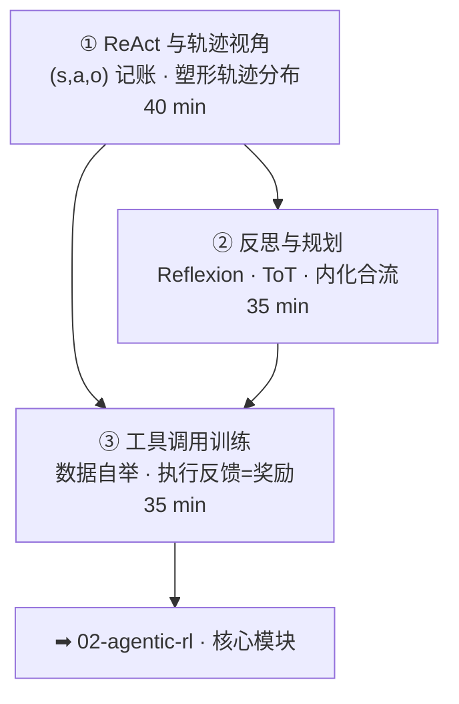

# 02-1 · Agent 范式（Paradigms）

> 对应 [ROADMAP Phase 3](../../ROADMAP.md) Week 1。三讲：ReAct 轨迹 → 反思规划 → 工具学习。
> 核心命题：**把你已经会写的 agent，翻译成 RL 的语言——轨迹、动作空间、执行反馈。为 agentic RL 备好坐标。**

## 课程地图

## 讲次表

| 讲 | 目录 | 你将学会 | 对应论文 |
|---|---|---|---|
| ① | [01-react-trajectory](01-react-trajectory/index.md) | 轨迹记账；prompt=塑形分布 | ReAct |
| ② | [02-reflection-planning](02-reflection-planning/index.md) | 反思记忆；评估器=PRM 思想 | Reflexion · ToT |
| ③ | [03-tool-learning](03-tool-learning/index.md) | 三层能力；数据自举；执行反馈 | Toolformer · Gorilla |

## 出口测试

- [ ] 把你手头的 agent 画出一条轨迹的 (s, a, o) 解剖图，标出 loss mask 位置
- [ ] 说清 Reflexion/ToT 与推理模型内置能力的对应与边界
- [ ] 给你的工具集做一次「执行反馈可验证性」盘点

通过 → [02-agentic-rl 课程地图](../02-agentic-rl/README.md)
