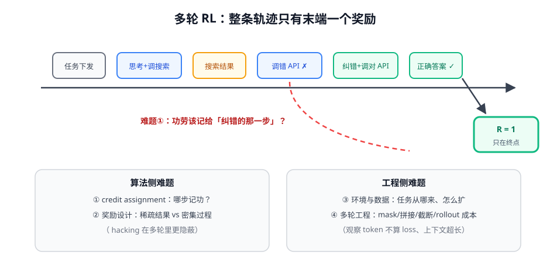

# 第 1 讲 · 多轮 RL 四大难题：全模块的地图

> [!NOTE]
> ⏱ 40 分钟 ｜ 前置：[Agent 范式 · 第 1 讲](../../01-agent-paradigms/01-react-trajectory/index.md)、[04-rl-for-llm · 第 2 讲 GRPO](../../../01-post-training/04-rl-for-llm/02-grpo/index.md) ｜ 下一讲：[02 · 发展时间线](../02-sft-to-rl-timeline/index.md)
> 🔤 卡在符号？→ [符号速查表](../../../00-foundations/symbol-reference.md)
>
> 从单轮 RLVR 到 agentic RL，算法没变、变的是处境。这一讲把「变了的处境」列全。

---

## 1. 一张图看懂

## 2. 四大难题对账表（后续三讲全部挂在这四条上）

| # | 难题 | 单轮 RLVR 为什么没有 | 现有武器 |
|---|---|---|---|
| ① | Credit assignment | 单轮一步出结果 | 层级 advantage（GiGPO）、高熵分支采样（ARPO）、PRM 式过程奖励 |
| ② | 奖励设计 | 对/错一个数 | 结果+过程+格式混合奖励；执行反馈可验证化（ToolRL） |
| ③ | 环境与数据 | 题目可无限生成 | 任务自举（WebRL 课程）、环境平台（AgentGym） |
| ④ | 多轮工程 | 一条 completion 就完事 | 多轮 mask/拼接、异步 rollout、上下文管理 |

> [!IMPORTANT]
> 与单轮最大的视角差：**轨迹是「部分可观测」的**——模型看不到环境全貌，观察还很长很贵。
> 这导致 rollout 成本失控（一次交互几秒）+ 上下文爆炸（几轮就把窗口吃满）。agentic RL 的工程一半在伺候这两个问题。

## 3. 与单轮 GRPO 的三个「沉默的坑」

1. **组内方差来源变了**：多轮轨迹的分数差异不只来自「能力」，还来自环境随机性（搜索结果不同）——组基线会把环境噪声当能力差异学
2. **长轨迹的优势稀释**：trajectory 级 advantage 平摊到几百个 token，单个关键动作收到的信号极弱（难题①的根源）
3. **reward shaping 的诱惑更大**：中间步给密集奖励很诱人，但每条密集奖励都是新的 hacking 面

## 4. 对你的工作意味着什么

- 设计你业务的 agentic RL 方案前，先填这张表：四个难题各自选哪件武器、为什么
- 评估你的环境：单次交互延迟 × 平均轮数 = 单条 rollout 成本——它决定 G 能开多大、训练要多贵
- 优先挑「轮数少、执行反馈硬」的任务先做 RL（如 SQL 生成→执行验证），别一上来啃 20 轮浏览任务

## 5. 自测

① 为什么说「环境随机性会污染组基线」？

GRPO 的组内对比假设分数差=策略差；若两次搜索返回不同结果，同样的动作序列得分不同——基线把运气当成了能力信号。

② 一个 15 轮、只有末端奖励的轨迹，GRPO 会怎么分配优势？

trajectory 级 Â 平摊给全部 token（GRPO 组内同分）——关键纠错步和废步拿到同样的量。这正是层级 advantage 要解决的。

③ 你的业务哪个任务最适合第一个上 agentic RL？给出四难题表格再回答。

参考判据：轮数少、执行反馈硬（可验证）、环境确定性高、任务可程序化生成变体。

## 6. 原始资料

见 [raw/RESOURCES.md](raw/RESOURCES.md)。
