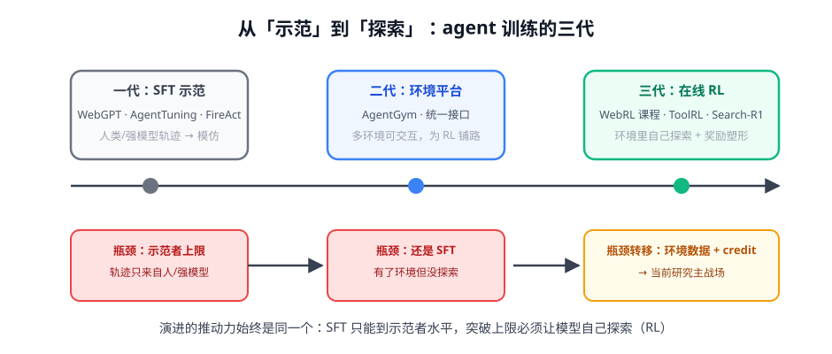

# 第 2 讲 · 发展时间线：从示范到探索的三代

> [!NOTE]
> ⏱ 30 分钟 ｜ 前置：[第 1 讲 四大难题](../01-four-challenges/index.md) ｜ 下一讲：[03 · 前沿算法](../03-frontier-methods/index.md)
> 🔤 卡在符号？→ [符号速查表](../../../00-foundations/symbol-reference.md)
>
> 学完你能回答：**三代方法各自被什么瓶颈逼出来？当前瓶颈转移到哪了？**

---

## 1. 一张图看懂

## 2. 三代对账表

| 代 | 代表 | 数据 | 里程碑贡献 | 天花板 |
|---|---|---|---|---|
| 一代 SFT | WebGPT / AgentTuning / FireAct | 人或强模型的轨迹 | 证明 agent 行为可训练；多任务混合有用 | **示范者上限**：轨迹只来自外部 |
| 二代平台 | AgentGym 等 | 多环境统一接口 | 把「环境」变成可复用基建；评测标准化 | 有环境但还在 SFT，没探索 |
| 三代 RL | WebRL / ToolRL / Search-R1 | 模型自己 rollout + 奖励 | 突破示范者上限；自举任务 | 环境数据与 credit assignment |

## 3. 两个承前启后的关键工作

- **WebGPT（2021）**：最早把「RL + 真实环境（搜索）+ RM」串起来的完整实践——今天的 Search-R1 换了个算法骨架，问题形式几乎没变
- **AgentGym（2024）**：把分散的 agent 环境标准化成平台——一代二代解决「有没有」，三代开始解决「好不好」

> [!TIP]
> 读时间线的收益：任何一篇新 agentic RL 论文，先定位它在三代里的坐标，就知道该用哪代的眼光审视它（三代论文看奖励与 credit，一代论文看数据构造）。

## 4. 对你的工作意味着什么

- 你的业务大概率同时需要两代手段：**三代 RL 之前，先用一代 SFT 把行为格式立起来**（RL 需要一个「会做基本动作」的起点）
- 自检：你的「环境」还停留在 prompt 里（一代）？还是有了可批量交互的接口（二代）？——没有二代基建，三代无从谈起
- 这条时间线的下一格（四代？）：环境自动生成 + self-evolving 课程（WebRL 方向）+ 记忆管理可训练——第 03 模块会接上

## 5. 自测

① 一代到二代的本质变化是什么？

从「固定数据集」到「可交互环境」：数据从一次性资源变成可持续产生轨迹的引擎——RL 的前提。

② WebGPT 放到今天，哪些部分过时了、哪些没有？

过时：RLHF 细节与模型规模。没过时：问题形式（搜索环境 + 端到端奖励 + 引用）与环境接口设计。

③ 为什么说「没有二代基建，三代无从谈起」？

在线 RL 需要高吞吐、可重置、可批量并发的环境交互；没有标准化接口，rollout 成本会吞掉一切算法收益。

## 6. 原始资料

见 [raw/RESOURCES.md](raw/RESOURCES.md)。
