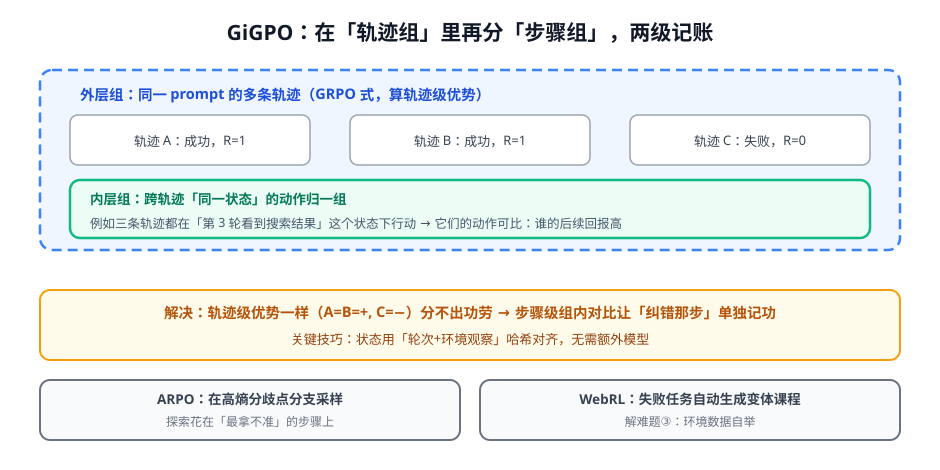

# 第 3 讲 · 前沿算法：给多轮 RL 装上专属武器

> [!NOTE]
> ⏱ 45 分钟 ｜ 前置：[第 1 讲 四大难题](../01-four-challenges/index.md) ｜ 下一讲：[04 · Search-R1 复现](../04-search-r1-practice/index.md)
> 🔤 卡在符号？→ [符号速查表](../../../00-foundations/symbol-reference.md)
>
> 学完你能回答：**GiGPO 怎么在 GRPO 里做步骤级 credit？WebRL 的课程怎么自举？ARPO 的探索花在哪？**

---

## 1. GiGPO：两级分组的 advantage



$$\hat{A}_{i,t} \;=\; \underbrace{\hat{A}^{traj}_i}_{\text{GRPO 轨迹级}} \;+\; \underbrace{\hat{A}^{step}_{i,t}}_{\text{步骤级：同状态组内相对}}$$

- **外层**：GRPO 式，同一 prompt 的 G 条轨迹互比 → 轨迹级优势
- **内层**：跨轨迹找「同一状态」（轮次 + 观察哈希对齐），这些位置的动作互比后续回报 → 步骤级优势
- 相加：关键纠错步的功劳不再被平摊稀释；**全程无额外模型**（对比训练 critic 的路线）

## 2. ARPO：把探索算力花在刀刃上

- 观察：模型在「环境观察返回后」的下一步，token 熵骤升（拿不准接下来该干嘛）
- 做法：在高熵分歧点做分支采样（扩展 rollout），低熵段合并优化
- 直觉：确定的地方少浪费，犹豫的地方多探索——把 GRPO 的组采样从「均匀撒」改成「按熵布防」

## 3. WebRL：环境数据自举（难题③的答案）

```
失败任务 → LLM 分析失败原因 → 生成「更简单的变体任务」→ 训练通过 → 再升级难度
```

- self-evolving curriculum：不靠人工出题，靠「失败驱动出题」把任务难度对齐当前能力
- 与课程学习（curriculum）经典思路的差异：难度阶梯是**动态生成的**，不是预定义的

## 4. 对你的工作意味着什么

- 三件武器对应三张处方：分不清功劳 → GiGPO 式分组；探索低效 → ARPO 式按熵采样；没题可练 → WebRL 式自举课程
- GiGPO 的「状态对齐」在业务里常能更简单：用「轮次号 + 工具名 + 关键参数」做状态签名即可起步
- WebRL 课程思想甚至不训练也能用：给 agent 做评估集时，用失败驱动的变体扩题

## 5. 自测

<details markdown="1"><summary>① GiGPO 的内层组怎么定义「同一状态」？为什么可行？</summary>
轮次+观察哈希对齐。可行因为多轮轨迹结构相同（同样的任务模板），同名状态在不同轨迹里自然重复出现，无需学状态表征。</details>

<details markdown="1"><summary>② ARPO 为什么选「观察返回后」的步骤分支？</summary>
该时刻模型刚收到新信息、对「下一步动作」分歧最大（熵最高）——正是探索信息价值最高的决策点。</details>

<details markdown="1"><summary>③ 把 WebRL 课程思想用在你业务，第一版怎么做？</summary>
收集 RL/评测失败案例 → 让强模型把失败任务改写成 2-3 个降级变体（少一步/少约束）→ 组成难度阶梯，验证 agent 通过率爬坡。</details>

## 6. 原始资料

见 [raw/RESOURCES.md](raw/RESOURCES.md)。
