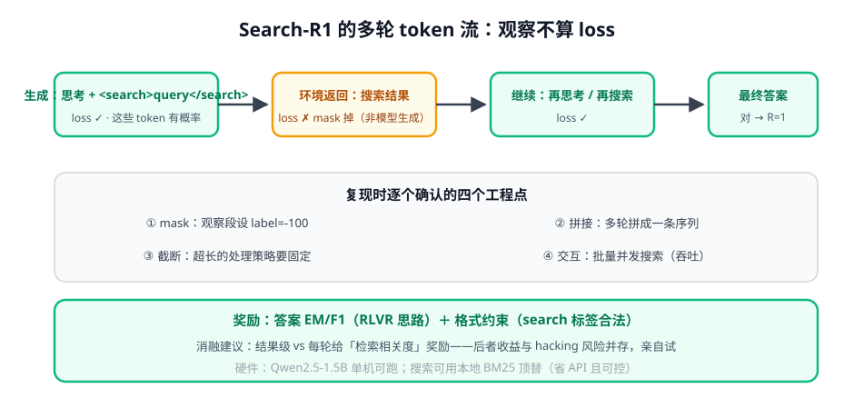

# 第 4 讲 · Search-R1 复现指南：你的第一个 agentic RL（P5）

> [!NOTE]
> ⏱ 60 分钟（动手）｜ 前置：前三讲 + [04-rl-for-llm P3](../../../01-post-training/04-rl-for-llm/README.md) ｜ 下一站：[03-memory-and-tools 模块](../../03-memory-and-tools/README.md)
> 🔤 卡在符号？→ [符号速查表](../../../00-foundations/symbol-reference.md)
>
> 对应 [03-practice P5](../../../03-practice/README.md)：把「搜索引擎当环境」，跑通多轮 GRPO。

---

## 1. 一张图看懂 token 流

## 2. 任务设定

| 项 | 内容 |
|---|---|
| 数据 | NQ / HotpotQA 风格问答（训练集部分） |
| 环境 | 搜索工具：本地 BM25（推荐起步）或 SERPER |
| 交互协议 | 模型输出 `<search>query</search>` → 环境注入结果 → 继续 |
| 奖励 | 答案 EM/F1 + 格式合法性（小权重） |
| 算法 | GRPO（G=8-16），Qwen2.5-1.5B |

## 3. 四个工程点的检查清单（按翻车率排序）

- [ ] **mask 正确性**：观察段 label=-100；打印一条样本逐 token 核对
- [ ] **截断策略**：max length 打满后怎么办（硬截断=任务失败+惩罚？）要显式定义并全程一致
- [ ] **搜索并发**：一个 batch 同时发几十个查询——串行 = 训练时间×N
- [ ] **多轮的「轮」从哪数**：以 search 标签对为单位；非法标签（未闭合）按无工具回答处理并给格式惩罚

## 4. 训练观察与消融

| 观察 | 健康信号 |
|---|---|
| 奖励曲线 | 缓升；若平台期早 → 检查全错组占比 |
| 平均搜索次数 | 先增后稳（学会用工具）；骤降=在猜答案 |
| 查询质量 | 抽样看 query 是否随训练变得具体 |

必做消融（写进实验记录）：① 有/无格式奖励 ② 结果奖励 vs 结果+轮级检索相关度 ③ G=8 vs 16。

> [!IMPORTANT]
> P5 的交付物 = 曲线 + 「multi-turn 工程细节笔记」（mask/拼接/截断各一段）+ 一组消融结论。
> 这份笔记将直接支撑你设计自己业务的第一个 agentic RL 实验——它比模型分数量值重要得多。

## 5. 自测

① 观察 token 若不 mask，训练会发生什么？

模型被训练去「模仿搜索结果文本」——学习目标是预测环境行为而非自己的动作，梯度纯噪声且奖励信号被稀释。

② 为什么推荐本地 BM25 起步而不是真搜索 API？

可控（结果稳定可复现）、免费（rollout 量大）、无速率限制；算法结论与「用什么搜索引擎」基本无关。

③ 「平均搜索次数骤降」意味着什么？

模型跳过工具直接猜答案（搜索有格式成本但奖励只看答案）——典型的 reward hack，需惩罚无效回答或检查奖励权重。

## 6. 原始资料

见 [raw/RESOURCES.md](raw/RESOURCES.md)。
