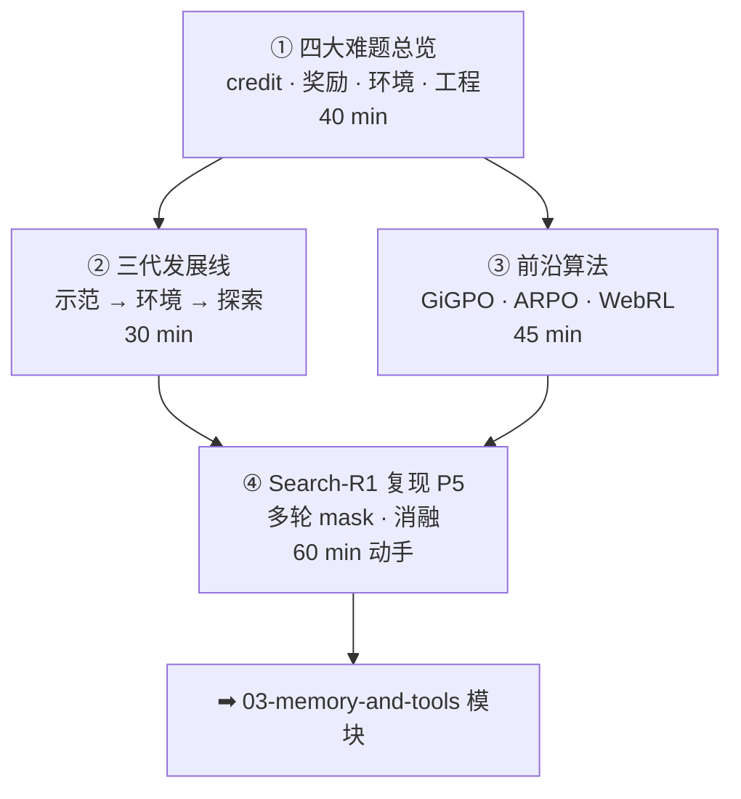

# 02-2 · Agentic RL ★当前最前沿

> 对应 [ROADMAP Phase 3](../../ROADMAP.md) Week 2-3。四讲：四大难题 → 发展时间线 → 前沿算法 → Search-R1 复现。
> 核心命题：**算法（GRPO 系）现成，难点在多轮：credit 怎么记、奖励怎么防 hack、环境哪来、工程怎么伺候。**

## 课程地图

## 讲次表

| 讲 | 目录 | 你将学会 | 对应论文 |
|---|---|---|---|
| ① | [01-four-challenges](01-four-challenges/index.md) | 四难题框架；单轮→多轮的三个坑 | Search-R1 · ToolRL |
| ② | [02-sft-to-rl-timeline](02-sft-to-rl-timeline/index.md) | 三代演进；瓶颈转移 | WebGPT · AgentGym |
| ③ | [03-frontier-methods](03-frontier-methods/index.md) | 层级 advantage；熵基探索；自举课程 | GiGPO · ARPO · WebRL |
| ④ | [04-search-r1-practice](04-search-r1-practice/index.md) | 跑通 P5；多轮工程细节；消融 | Search-R1 |

## 出口测试

- [ ] 独立写一份 agentic RL 训练方案（环境/奖励/算法/评估/3 个风险）
- [ ] 讲清 GiGPO 两级分组解决什么、前提假设是什么
- [ ] P5 完成：多轮 GRPO 跑通 + 工程细节笔记 + 消融，见 [03-practice](../../03-practice/README.md)

通过 → [03-memory-and-tools 课程地图](../03-memory-and-tools/README.md)
