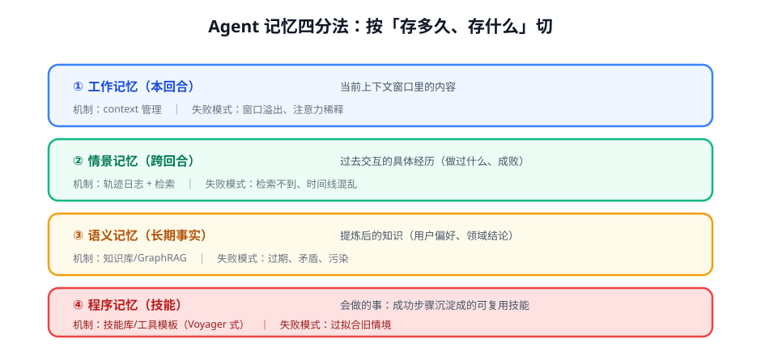

# 第 1 讲 · 记忆分类学：先搞清你在管什么

> [!NOTE]
> ⏱ 30 分钟 ｜ 前置：[Agent 范式 · 第 1 讲](../../01-agent-paradigms/01-react-trajectory/index.md) ｜ 下一讲：[02 · MemGPT 与自管理记忆](../02-memgpt-self-editing/index.md)
> 🔤 卡在符号？→ [符号速查表](../../../00-foundations/symbol-reference.md)
>
> 学完你能回答：**四类记忆分别对应你系统里的什么组件？「记忆操作是动作」为什么重要？**

---

## 1. 一张图看懂

## 2. 用这张表诊断你的系统

| 类 | 你系统里对应什么 | 常见缺失 |
|---|---|---|
| 工作记忆 | system prompt + 当前对话窗口 | 无压缩策略，长任务必溢出 |
| 情景记忆 | 会话历史/轨迹日志 | 「有存储、无检索」= 等于没有 |
| 语义记忆 | 用户画像/知识库 | 无更新与失效机制，越用越错 |
| 程序记忆 | 写死的工具编排/prompt 模板 | 全靠人手沉淀，不能自举 |

> [!IMPORTANT]
> 关键视角：**读、写、忘、压缩，这四个记忆操作本身可以看作 agent 的动作**。
> 一旦记忆操作是动作，就有了「动作好不好」的评判 → 就有奖励 → 就可以被 RL 训练。
> 这就是记忆管理与 agentic RL（第 4 模块）的接口。

## 3. 四类记忆的两条设计公理

1. **写入有代价，检索有噪声**：任何记忆系统都要同时回答「存什么」和「何时取回」——只做存储不做检索策略 = 摆设
2. **记忆会过期与冲突**：语义记忆没有版本/置信度管理，迟早「记得越多越笨」（旧偏好覆盖新偏好）

## 4. 对你的工作意味着什么

- 用第 2 节的表做一次诊断：你系统的四格各是什么组件、哪格是空的——空的那格就是你下一个迭代项
- 最常见的杠杆点：情景记忆的检索（多数系统「存了不查」）；第二杠杆：工作记忆的压缩策略
- 给每个记忆组件加「失效测试」：故意喂过期信息，看系统是否会犯错

## 5. 自测

① 「存了不查」为什么等于没有情景记忆？

记忆的价值在正确时刻被取回；无检索策略时内容永远不被引用，等同占空间的日志。评测方法：召回测试（该想起的场景想起几成）。

② 把「压缩对话历史」翻译成记忆操作的语言。

写操作 + 遗忘操作的复合：从情景记忆中提炼摘要写入语义/工作记忆，同时丢弃原文——每一步都是有损决策。

③ 记忆操作可训练化后，奖励信号从哪来？

下游任务成功率：带某条记忆的运行 vs 不带的对照（或 ablation）——记忆的价值 = 它对任务回报的边际贡献。

## 6. 原始资料

见 [raw/RESOURCES.md](raw/RESOURCES.md)。
