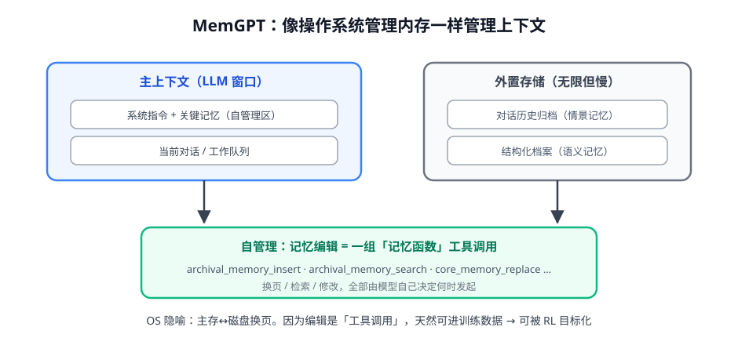

# 第 2 讲 · MemGPT 与自管理记忆：编辑即工具调用

> [!NOTE]
> ⏱ 30 分钟 ｜ 前置：[第 1 讲 记忆分类学](../01-memory-taxonomy/index.md)、[Agent 范式 · 第 3 讲](../../01-agent-paradigms/03-tool-learning/index.md) ｜ 下一讲：[03 · Context Engineering](../03-context-engineering/index.md)
> 🔤 卡在符号？→ [符号速查表](../../../00-foundations/symbol-reference.md)
>
> 学完你能回答：**MemGPT 的 OS 隐喻落在哪几个机制上？为什么「记忆编辑」能变成 RL 目标？**

---

## 1. 一张图看懂

## 2. 两个关键设计

| 设计 | 内容 | 为什么重要 |
|---|---|---|
| 分层内存 | 主上下文（贵、快、有限）+ 外置存储（便宜、慢、无限） | 打破窗口限制，历史不丢 |
| 自管理函数 | insert / search / replace 等记忆工具 | 记忆操作与普通工具调用同构 |

> [!IMPORTANT]
> 与传统 RAG 的分界线：RAG 是**外部管线**替模型决定「何时检索什么」；MemGPT 是**模型自己**决定何时写入、检索、改写。
> 决策权交还模型 → 这些决策成为轨迹的一部分 → 与 Agent 范式第 3 讲的结论合流：**是动作，就可训练**。

## 3. 怎么给记忆操作定奖励（思想实验）

- 直接信号难（记忆质量抽象）→ 走**结果反推**：同一任务，带/不带某次记忆操作的对照成功率差
- 代理信号：检索命中率、被引用次数、信息时效性——便宜但可 hack（囤积热门记忆）
- 现实路线：先 SFT 自举（用强模型示范好的记忆操作轨迹，Agent 范式第 3 讲的数据自举法），RL 收尾

## 4. 对你的工作意味着什么

- 把你系统的「人工记忆规则」（如「超过 20 轮就截断」）改成记忆工具，让模型按需调用——第一步不需要训练，先收集轨迹
- 评估先行：建一个「长程会话回访测试集」（上周问过的事这周还记得吗），没有评测的记忆优化都是玄学
- Voyager 的技能库视角补充：程序记忆的沉淀单位是「代码技能」，比你想象的更适合从日志自动提取

## 5. 自测

① MemGPT 和 RAG 的本质区别一句话？

检索与写入的决策权：RAG 由外部管线按固定策略触发；MemGPT 由模型作为动作自主决策。

② 「记忆函数」设计要防什么滥用？

囤积（什么都 insert 导致外置存储噪声化）与过度改写（把主上下文关键约束覆盖掉）——工具描述与示例要显式约束。

③ 把「记忆操作可 RL」的完整链路说一遍。

操作=动作 → 动作好坏由下游任务回报评判 → 轨迹进训练 → 策略学会「何时存/取/忘」。

## 6. 原始资料

见 [raw/RESOURCES.md](raw/RESOURCES.md)。
