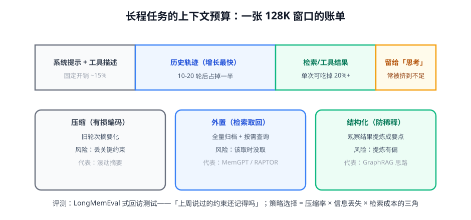

# 第 3 讲 · Context Engineering：窗口是一张预算表

> [!NOTE]
> ⏱ 30 分钟 ｜ 前置：[第 2 讲 MemGPT](../02-memgpt-self-editing/index.md) ｜ 下一站：[04-multi-agent 模块](../../04-multi-agent/README.md)
> 🔤 卡在符号？→ [符号速查表](../../../00-foundations/symbol-reference.md)
>
> 学完你能回答：**窗口预算怎么分配？压缩/外置/结构化三种策略的风险各是什么？长程记忆怎么评测？**

---

## 1. 一张图看懂：窗口账单

> [!IMPORTANT]
> 长程任务的头号死因不是「窗口不够大」，而是**注意力稀释**：关键约束在 50 轮之前说过，模型「看得见、想不起」。
> 所以 context engineering 的本质是：**让对的信息在对的时刻出现在注意力里**——窗口大小只是约束之一。

## 2. 三策略的取舍三角

| 策略 | 省窗口 | 信息保真 | 成本 |
|---|---|---|---|
| 压缩（摘要化旧轮次） | ✓✓ | ✗ 有损（丢约束是经典事故） | 摘要生成 |
| 外置（归档+检索） | ✓✓✓ | ✓ 全量，但取回靠检索 | 检索延迟+漏检 |
| 结构化（观察提炼成要点） | ✓ | 部分（提炼有偏） | 提炼调用 |

工程上组合使用：观察即提炼（结构化）→ 旧轮次摘要（压缩）→ 全量归档备查（外置）。

## 3. 长程记忆评测（先于一切优化）

LongMemEval 式的回访测试：

1. 在会话早期埋下 N 条「关键信息」（约束/偏好/事实）
2. 隔着大量无关轮次后提出依赖该信息的问题
3. 指标：回访命中率 × 干扰鲁棒性（无关信息是否带偏）

> [!TIP]
> 这套测试是你记忆系统的「单测」——每次改动压缩/检索策略前先跑一遍，防负优化。

## 4. 对你的工作意味着什么

- 给你系统的 context 记一次账：各区块 token 占比截图存档——超预算的区块就是优化目标
- 所有「观察结果」入上下文前强制过一遍提炼（工具结果原文不直接进窗口）——这是单条性价比最高的规则
- 记住与 agentic RL 的接口：压缩/检索策略既可以是外部代码（今天），也可以是被训练的策略（明天，第 4 模块 GiGPO 的状态对齐思路可以直接搬）

## 5. 自测

① 为什么说头号死因是注意力稀释而非窗口不足？

即使信息还在窗口内，长序列中段的关键约束也常被忽略（lost in the middle）；扩窗只治「放不下」，不治「想不起」。

② 压缩策略最危险的事故是什么？怎么防？

摘要丢掉任务关键约束（如格式要求、硬性限制）。防：约束类信息不参与压缩，单独常驻（写进主上下文自管理区）。

③ 回访测试的两组指标分别防什么？

命中率防「该想起时没想起」（检索/压缩问题）；干扰鲁棒性防「想起错的」（记忆污染问题）。

## 6. 原始资料

见 [raw/RESOURCES.md](raw/RESOURCES.md)。
