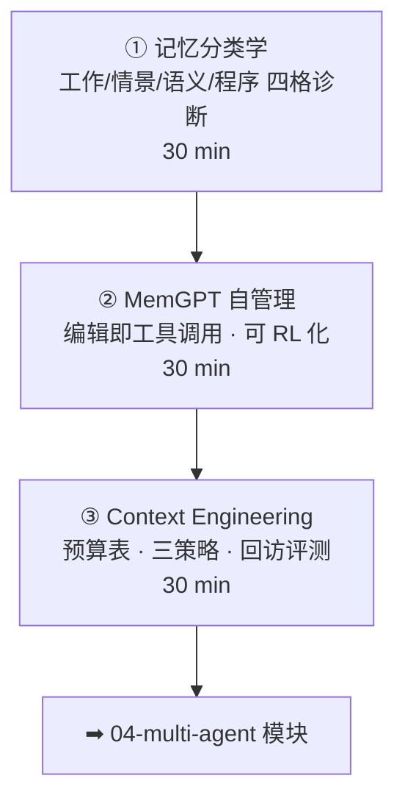

# 02-3 · 记忆与长程任务（Memory & Long-Horizon）

> 对应 [ROADMAP Phase 3](../../ROADMAP.md) Week 4。三讲：记忆分类学 → MemGPT 自管理 → Context Engineering。
> 核心命题：**窗口是稀缺资源，记忆是管理系统；记忆操作是动作——因此是 agentic RL 的下一个战场。**

## 课程地图

## 讲次表

| 讲 | 目录 | 你将学会 | 对应论文 |
|---|---|---|---|
| ① | [01-memory-taxonomy](01-memory-taxonomy/index.md) | 四格诊断你的系统；操作即动作 | LongMemEval |
| ② | [02-memgpt-self-editing](02-memgpt-self-editing/index.md) | OS 隐喻；与 RAG 的分界 | MemGPT · Voyager |
| ③ | [03-context-engineering](03-context-engineering/index.md) | 窗口预算；三策略取舍；回访测试 | LongMemEval · RAPTOR |

## 出口测试

- [ ] 用四格表诊断你系统并写出下一迭代项
- [ ] 设计一套长程记忆回访测试（埋点 → 干扰 → 命中率）
- [ ] 说清「记忆操作可 RL 化」的完整链路与奖励来源

通过 → [04-multi-agent 课程地图](../04-multi-agent/README.md)
