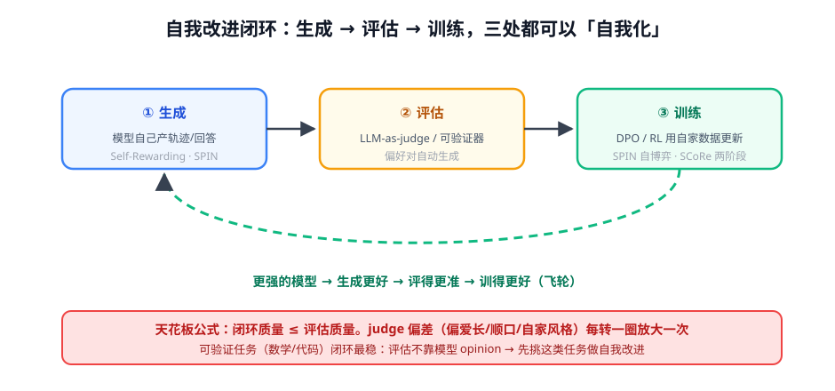

# 第 1 讲 · 自我改进闭环：让模型自己教自己

> [!NOTE]
> ⏱ 40 分钟 ｜ 前置：[偏好对齐 · 第 2 讲 DPO](../../../01-post-training/02-preference-alignment/02-dpo-derivation/index.md) ｜ 下一讲：[02 · 编排模式](../02-orchestration-patterns/index.md)
> 🔤 卡在符号？→ [符号速查表](../../../00-foundations/symbol-reference.md)
>
> 学完你能回答：**Self-Rewarding / SPIN / SCoRe 分别落在闭环哪一环？为什么评估环节是天花板？**

---

## 1. 一张图看懂

## 2. 三个代表，三种「自我化」的位置

| 工作 | 自我化的环节 | 机制一句话 |
|---|---|---|
| Self-Rewarding LM | ②评估 | 模型用 LLM-as-judge 给自己的输出打分造偏好对 → DPO 迭代 |
| SPIN | ①+② | 自博弈：正样本=人写数据，负样本=**模型上一版自己生成的**——学会分辨自己与人类 |
| SCoRe | ①+③ | 两阶段 RL 直接优化「自我修正」行为，专门治 SFT 学不会修正的分布偏移 |

## 3. 各自的关键洞见（面试最爱）

- **Self-Rewarding**：RM 也是一种 prompt 能力——强模型 judge 已够用 → 干脆用它当自己的 RM，省掉独立 RM 训练
- **SPIN 为什么会收敛停止**：当模型生成的已经和人类数据无法区分时，自博弈失去信号——它只能逼近示范分布，不能超越（再次呼应 SFT 上限）
- **SCoRe 为什么 SFT 教不会自我修正**：SFT 数据里看不到「模型真实的错误分布」；用 RL 在模型自己的错误上训练 + 两阶段正则防坍缩（第一阶段先学「不乱改」，第二阶段再学「改得对」）

> [!IMPORTANT]
> 闭环的第一性判断：**评估环节靠不靠模型 opinion？**
> - 靠（judge 打分）→ 天花板 = judge 水平，每轮放大偏差
> - 不靠（可验证器：单测/编译/答案匹配）→ 闭环最稳，可以放心多转几圈
> 这正是 RLVR 优先的另一个理由。

## 4. 对你的工作意味着什么

- 最小闭环起步（两周量级）：攒 1-2 万条业务回答 → 强模型 judge 造偏好对 → DPO → 新模型再生成 → 迭代 2-3 轮，监控 judge 与人评的一致性是否衰减
- **每转一圈都要人评校准**：一致性跌破阈值就停，回补人工标注
- SCoRe 的启示：想训「发现错误自己改」的能力，训练数据必须包含模型自己的真实错误（从线上日志来），而不是人造错误

## 5. 自测

① SPIN 的正负样本分别是什么？为什么最终会停？

正=人类示范，负=模型旧版自己的生成。当模型输出与人类数据不可分时判别信号消失——只能逼近示范分布。

② SCoRe 第一阶段 RL 的目的？

先在「给定错误答案去修正」的任务上把行为稳住（防第二阶段跑飞），解决 SFT 的分布偏移——第二阶段才放开让模型自己犯自己改。

③ 把「闭环质量 ≤ 评估质量」翻译成工程检查。

上线自我改进前先测 judge 与人评的一致率（如 200 条抽检）；一致率不达标的维度，改用可验证器或人标，不许带病迭代。

## 6. 原始资料

见 [raw/RESOURCES.md](raw/RESOURCES.md)。
