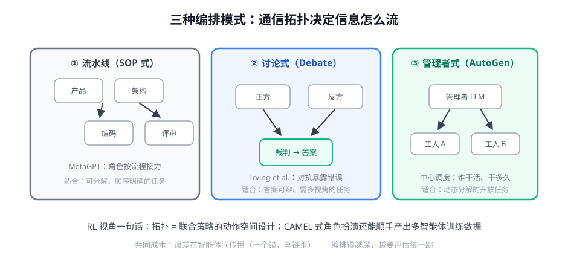

# 第 2 讲 · 编排模式：多智能体的三种拓扑

> [!NOTE]
> ⏱ 30 分钟 ｜ 前置：[第 1 讲 自我改进闭环](../01-self-improvement-loop/index.md) ｜ 下一讲：[03 · 训练还是编排](../03-train-vs-orchestrate/index.md)
> 🔤 卡在符号？→ [符号速查表](../../../00-foundations/symbol-reference.md)
>
> 学完你能回答：**三种拓扑各自的信息流与适用任务？「通信即动作空间」是什么意思？**

---

## 1. 一张图看懂

## 2. 三模式对账表

| 模式 | 信息流 | 优势 | 失败模式 |
|---|---|---|---|
| ① 流水线（MetaGPT） | 固定顺序接力 | 可预测、易调试、SOP 即规范 | 上游错→全链错；僵化 |
| ② 讨论式（Debate） | 多方对抗→裁判收敛 | 多视角暴露盲点；有对齐理论价值 | 同质化（互相附和）、成本×轮数 |
| ③ 管理者式（AutoGen） | 中心调度动态派活 | 灵活、可扩展、任务自适应 | 调度本身成单点瓶颈 |

## 3. RL 视角的三个观察

1. **拓扑 = 动作空间设计**：谁和谁通信、消息带什么，就是在定义联合策略的接口——和工具描述一样，「接口质量先于算法」
2. **CAMEL 的副产品路线**：两个角色互演产出大量多智能体对话——最早的「编排当数据引擎」
3. **辩论的对齐价值**：可辩任务上，让两个模型互查比单模型自评更难被一次幻觉骗过（但都要付 N 倍成本）

> [!IMPORTANT]
> 共同的失败根因只有一个：**误差传播**。多智能体不减少错误，只重组错误——每一跳都要有自己的评估/校验，否则拓扑越复杂越脆弱。

## 4. 对你的工作意味着什么

- 先问任务结构：能写成 SOP → 流水线（简单可控）；开放动态 → 管理者式；结论需要反复检验 → 讨论式
- 每一跳加「结构化交接物」（schema 化的输出）而不是自由文本——既降传播误差，也为未来训练准备数据格式
- 多智能体的每跳延迟与成本是单 agent 的 N 倍起：先用单 agent + 好工具打满，再考虑拆多智能体

## 5. 自测

① 「通信即动作空间」翻译成大白话。

多智能体系统里，每个 agent 能「对谁、说什么」就是它能做的动作——设计通信协议就是在设计训练接口。

② 辩论式为什么在同质模型上会失效？

同源模型偏见相同、互附和（sycophancy），对抗退化为表演；需要视角/提示/模型多样性。

③ 你业务哪个流程适合流水线化？判据是什么？

判据：步骤可枚举、顺序稳定、每步有明确交付物与校验方式（如 数据抽取→清洗→生成报告）。

## 6. 原始资料

见 [raw/RESOURCES.md](raw/RESOURCES.md)。
