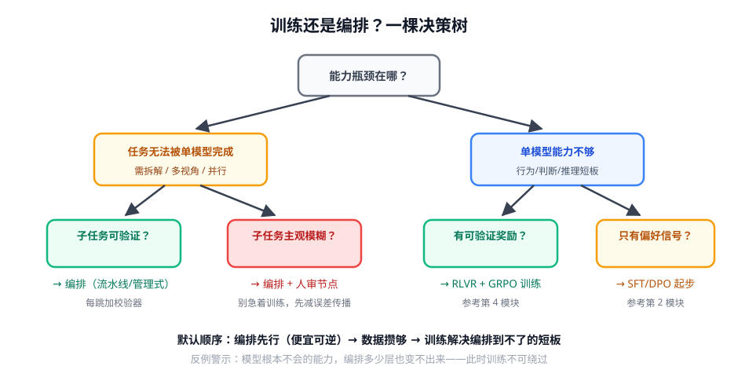

# 第 3 讲 · 训练还是编排：收官判断框架

> [!NOTE]
> ⏱ 30 分钟 ｜ 前置：本模块前两讲 + 全库 Phase 1-3 ｜ 下一站：[ROADMAP Phase 4 · 前沿追踪](../../../ROADMAP.md)
> 🔤 卡在符号？→ [符号速查表](../../../00-foundations/symbol-reference.md)
>
> 这是整个 Agent 算法课程线的收官讲：给你一个可以反复用的决策框架。

---

## 1. 一张决策树

## 2. 框架背后的三条公理

| 公理 | 含义 | 推论 |
|---|---|---|
| 编排便宜且可逆 | 改 prompt/拓扑几分钟生效 | 先编排，让数据在运行中自然积累 |
| 训练贵但到达编排到不了的地方 | 参数化能力可泛化到没见过的输入 | 攒够「真实轨迹+结果」数据后上训练 |
| 评估先于一切 | 没有 eval 的训练与编排都不可信 | 每个决策分支的第一步都是建评测 |

> [!IMPORTANT]
> 最常犯的反向错误：**用训练解决编排问题**（模型行为差→上 RL），结果发现是 prompt 冲突/工具描述烂/上下文被截断。
> 训练前的三问：评测体系有了吗？错误分析定位到模型本身了吗？SFT/DPO 级的便宜手段试过了吗？

## 3. 全课程收束：你现在的武器库

| 问题 | 模块 |
|---|---|
| 塑造基本行为与格式 | 01 SFT（模仿） |
| 「哪个更好」的判断力 | 02 偏好对齐（DPO 家族） |
| 奖励信号可靠化 | 03 奖励模型 + RLVR |
| 真正的优化引擎 | 04 LLM RL（GRPO 系） |
| 长思维链与推理 | 05 推理模型（R1 范式） |
| 多轮/工具/长程的 RL | AG 02 Agentic RL |
| 记忆与上下文 | AG 03 |
| 自我改进与多智能体 | AG 04（本模块） |

## 4. 自测（也是整个 Phase 3 的出口测）

① 用决策树分析你手头业务：瓶颈在哪格？下一步动作是什么？

参考路径：先错误分析定位瓶颈 → 按分支选择 → 无论如何先建/加固评测集，再动手。

② 什么信号说明「该从编排转向训练」？

编排迭代收益见顶（prompt 改无可改）、错误分析显示是模型内在短板（而非上下文/工具问题）、且已积累足够的真实轨迹+结果数据。

③ 把本课程一句话收束。

后训练算法的全部内容 = 「用奖励把行为塑形到参数里」：SFT 给形状，偏好给判断，RL 给上限，agent 给场景。

## 7. 原始资料

见 [raw/RESOURCES.md](raw/RESOURCES.md)。
