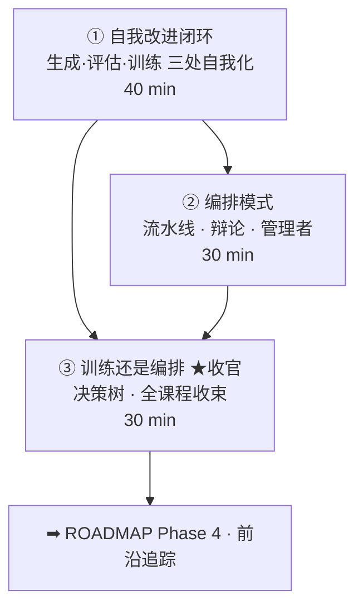

# 02-4 · 多智能体与自我改进（Multi-Agent & Self-Improvement）

> 对应 [ROADMAP Phase 3](../../ROADMAP.md) Week 5。三讲：自我改进闭环 → 编排模式 → 训练还是编排（全课程收官）。
> 核心命题：**系统能否自己变强（闭环三要素的自我化）；多智能体先于多智能体训练的是编排判断力。**

## 课程地图

## 讲次表

| 讲 | 目录 | 你将学会 | 对应论文 |
|---|---|---|---|
| ① | [01-self-improvement-loop](01-self-improvement-loop/index.md) | 闭环三要素；评估是天花板 | Self-Rewarding · SPIN · SCoRe |
| ② | [02-orchestration-patterns](02-orchestration-patterns/index.md) | 三拓扑对账；误差传播 | AutoGen · MetaGPT · CAMEL |
| ③ | [03-train-vs-orchestrate](03-train-vs-orchestrate/index.md) | 决策框架；全课程武器库收束 | （框架讲） |

## 出口测试（= Phase 3 出口）

- [ ] 画出你业务的自我改进闭环，标注评估环节的风险与校准方案
- [ ] 说清 SCoRe 为什么两阶段、Self-Rewarding 的天花板公式
- [ ] 用决策树给出你业务的下一步（训练 or 编排）并写出理由
- [ ] 整体里程碑：一份可对外讲的 agentic RL 训练方案设计文档
